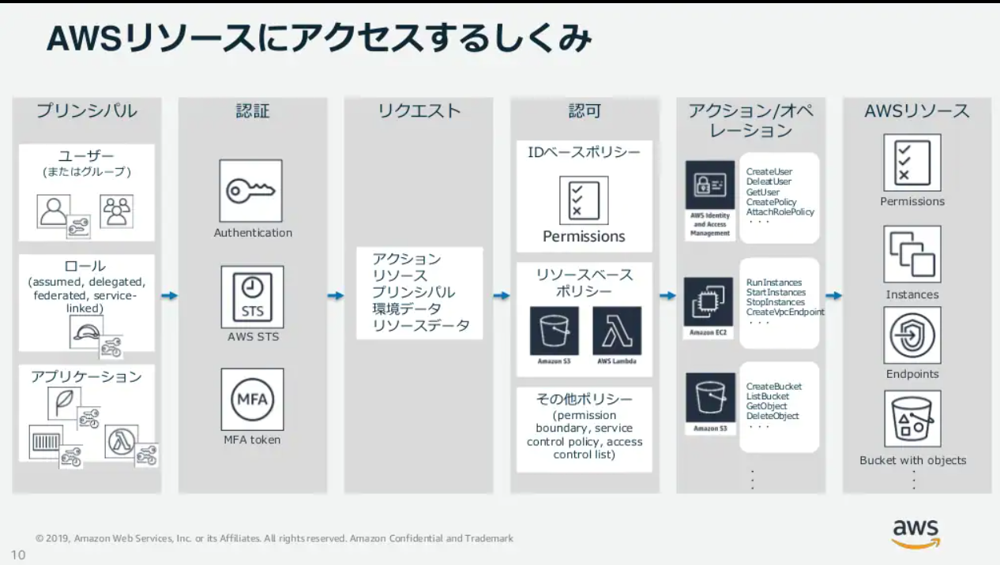
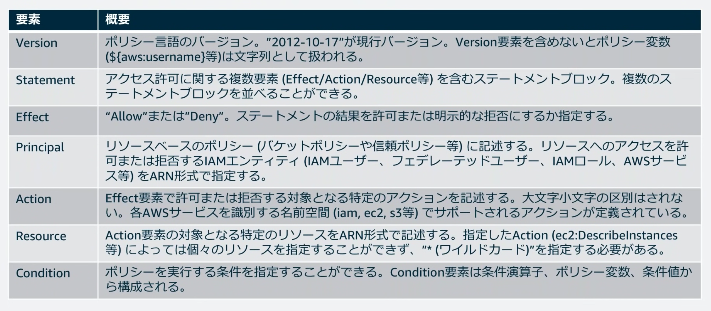
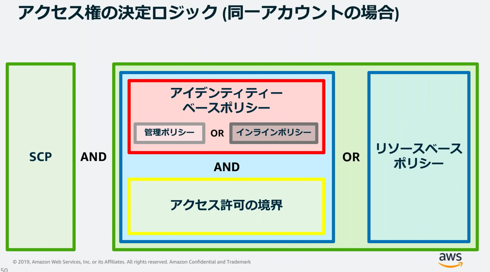
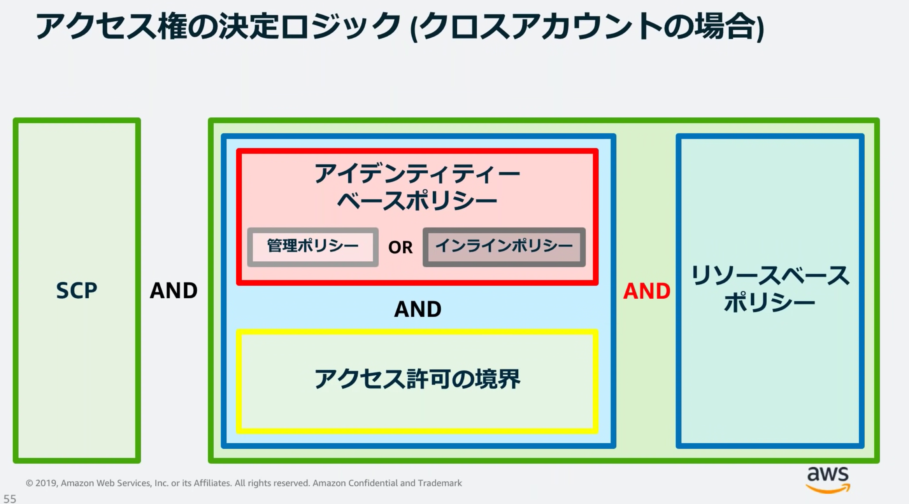

# 課題1

## Table of Contents
<!-- START doctoc -->
<!-- END doctoc -->

## IAMユーザとは

- [IAMユーザー](#iamユーザー)を参照

## グループとは

- [IAMグループ](#iamグループ)を参照

## ポリシーとは

- [ポリシー](#ポリシー)を参照

## ロールとは

- [IAMロール](#iamロール)を参照

## IAMに関する整理

### IAMとは

- AWSリソースをセキュアに操作するために、認証・認可の仕組みを提供するマネージドサービス
  - 各AWSリソースに対して、別々のアクセス権限をユーザーごとに付与できる
  - 多要素認証によるセキュリティの強化
  - 一時的な認証トークンを用いた権限の委任
  - 他のIDプロバイダーで認証されたユーザーにAWSリソースへの一時的アクセス
  - 世界中のAWSリージョンで同じアイデンティティと権限を利用可能
    - データ変更は結果整合性を保ちながら全リージョンに伝播
      - **そのため、変更した結果が反映されるまで多少時間がかかる**
  - AWS IAM自体の利用は無料



### IAMのベストプラクティス - IDと認証情報の管理 - 

#### 1.AWSアカウントのルートユーザーアクセスキーをロックする

##### ルートユーザー

- AWSアカウントを作成すると、作成されるアカウント
  - そのアカウントの全てのAWSサービスとリソースに完全なアクセス権をもつ
  - **IAMで設定するアクセスポリシーではアクセス許可を制限できない**
  - **そのため、極力ルートユーザーを使用しないこと！！**
    - AWSでは、アドミン権限=ルートユーザーというわけではなく、IAMユーザーにアドミン権限をつけることもできる
    - ただし、ルートユーザーしかできない操作もある

##### アクセスキー

- AWSアカウントのルートユーザーまたはIAMユーザーの長期的な認証情報
  - 手動で消すまで有効
  - 安全なローテションのため、最大2つのアクセスキーを持つことができる
- ルートユーザーのアクセスキーは削除する！
  - 他人に開示しない！
  - 現時点で、アカウントを作成した時、アクセスキーはそもそも作成されないようになっている

#### 2.個々のIAMユーザーを作成する

- このメリット
  - 認証情報を個別に変更できる
  - アクセス許可をいつでも変更、無効化できる
  - Amazon CloudTrailログからアクションを追跡できる

##### IAMユーザー

- AWSで作成するエンティティ（ユーザーまたはアプリケーション）
- 名前と認証情報で構成される
- IAMユーザーを識別する方法

|#||
|----|----------------|
|1|ユーザーの「フレンドリ名」（ユーザー作成時に指定）|
|2|ユーザーのARN（Amazon Resource Name）（リソースポリシーのPrincipal要素で指定）<br> `arn:aws:iam:0123456789012:user/Alice`|
|3|ユーザーの一意の識別子（フレンドリ名を再利用したい時などに権限のエスカレーションを避けることができる）|

- 認証情報（IAMユーザーがAWSにサインインする方法）
  - コンソールパスワード
  - アクセスキー
    - プログラムからアクセスするときに必要な値

#### 3.ユーザーの強力なパスワードポリシーを設定

- 強力なパスワードポリシーを設定する

#### 4.アクセスキーを共有しない！

- 複数人がAWSリソースへのアクセス権を共有したい場合でも、アクセスキーは共有せず、アプリケーションごとにIAMユーザーを作成すること

- アクセスキーの保管場所に注意
  - ソースコードに埋め込んだり、設計書に記載するのは危険！

#### 5.特権ユーザーに対してMFA（Multi-Factor Authentication）を有効化する

- ルートユーザーや強い権限を保持しているユーザーは、MFAを有効化すること
- MFAデバイスには、ソフトウェア（Google Authenticatorなど）とハードウェアがある
  - このデバイス自体の管理も厳重に！

### IAMのベストプラクティス - アクセス権限の管理 - 

#### 1.AWS管理ポリシーを使用したアクセス許可の使用開始

##### ポリシー

- IAMアイデンティティやAWSリソースに関連づけることによってアクセス許可を定義することができるオブジェクト
- アクセスコントロールポリシー以外は、JSON形式で定義可能

```json
{
    "Version": "2012-10-17",
    "Statement": [
        {
            "Sid": "VisualEditor0",
            "Effect": "Allow",
            "Action": [
                "cloudwatch:*",
                "cloudtrail:*",
                "config:*"
            ],
            "Resource": "*"
        }
    ]
}
```

- ポリシーの種類
  - アイデンティティベースのポリシー
    - 一番よく使われる
    - 管理ポリシー
      - 再利用可能なポリシー
      - バージョニングとロールバック可能
      - 種類
        - AWS管理ポリシー
          - AWSにより、事前定義された管理ポリシー
          - 編集不可（AWS自身により更新される）
          - 種類
            - AWSによる管理
              - e.g. AmazonEC2FullAccess
            - ジョブ管理
              - e.g. AdministratorAccess
        - カスタム管理ポリシー
    - インラインポリシー
      - IAMエンティティに直接埋め込むので、再利用できない
  - リソースベースのポリシー
  - パーミッションバウンダリー
  - アクセスコントロールポリシー
  - セッションポリシー

#### 2.インラインポリシーではなくカスタマー管理ポリシーを使用する

- カスタマー管理ポリシー
  - カスタマー管理ポリシーは特定のアカウントでのみ使用可能
  - AWS管理ポリシーでは要件を満たせない場合に使用
- インラインポリシー
  - 1つのIAMエンティティに直接埋め込まれている点が、カスタマー管理ポリシーと異なる
  - そのため、二重管理などが発生しがち
  - 当初はカスタマー管理ポリシーがなかったが、今はカスタマー管理ポリシーがあるので、そちらの方が管理もしやすい

#### 3.追加セキュリティに対するポリシー条件を使用する



- 特に重要なのが、**PARC（Principal / Action / Resource / Condition）**

- Principal
  - AWSリソースへのアクセスが許可/拒否されるIAMエンティティを指定
  - リソースベースポリシーで使用するもの
  - IAMグループでの指定は不可

```json
"Principal": {"AWS": "arn:aws:iam:123456789012:/root"}
```

- Action
  - 許可/拒否される特定のアクションを指定

```json
"Action": ["sqs:SendMessage", "sqs:ReceiveMessage"]
```

- Resource
  - ステートメントで取り扱う一連のオブジェクトを指定

```json
"Resouce": "arm:aws:iam:123456789012/:queue1"
```

- Condition
  - ポリシーが有効になるタイミングを指定
  - 形式：`"Condition": {<条件演算子>:{<条件キー>:<条件値>}}`

```json
"Condition": {"StringEquals": {"aws:username": "johndoe"}}
```
- ポリシーを作成する様々なツール
  - ビジュアルエディター機能
  - [AWS Policy Generator](https://awspolicygen.s3.amazonaws.com/policygen.html)

#### 4.最小権限を付与する





- 最小限のアクセス権限から開始して、必要に応じてアクセス権限を追加するのが安全

#### 5.IAMユーザーへのアクセス許可を割り当てるためにグループを使用する

##### IAMグループ

- IAMユーザーの集合
- IAMグループやIAMロールをIAMグループに所属させることは不可能
- IAMユーザーは、複数のIAMグループに所属できる（最大10）
- グループは、IAMが増えてきたときにポリシーを簡単に管理するための仕組み
  - アイデンティティを示すものではないので、Principal要素にはグループは指定できない

### IAMのベストプラクティス - 権限の委任 -

#### 1.Amazon EC2インスタンスで実行するアプリケーションに対し、ロールを使用する

- ロールなしで使用すると、EC2側に認証情報を持たせることになってしまう
  - それを避けるため、IAMロールを使うことで、漏洩リスくを低減できる
  - また、AWSが自動的にローテーションもしてくれる

##### IAMロール

- AWSサービスやアプリケーションなどのエンティティに対してAWSリソースの操作権限を付与するための仕組み
  - IAMユーザーやグループには紐づかない！
- 認証方法
  - 一時的なセキュリティ認証情報を利用
- 複数のユーザーがロールを引き受け可能

- ポリシーとロールの違い
  - ロールの実態は、ポリシーをグループ化したもの
  - ポリシーは、IAMアイデンティティやAWSリソースに設定できる権限

#### 2.ロールを使用したアクセス許可の委任

- 別のAWSアカウントのユーザーが、認証情報を共有せずに、自分のAWSアカウントのリソースにアクセスを制御可能にすることが可能

### 参考

- [IAM でのセキュリティのベストプラクティス](https://docs.aws.amazon.com/ja_jp/IAM/latest/UserGuide/best-practices.html)
- [AWSサービス別資料](https://aws.amazon.com/jp/aws-jp-introduction/aws-jp-webinar-service-cut/)
- [【AWS Black Belt Online Seminar】AWS Identity and Access Management (AWS IAM) Part1](https://www.youtube.com/watch?v=K7F5yTThynw)
- [【AWS Black Belt Online Seminar】AWS Identity and Access Management (AWS IAM) Part2](https://www.youtube.com/watch?v=qrZKKF6V6Dc)
- [AWSのIAMロールとポリシーの違い](https://qiita.com/montama/items/90bb8a3973d101be4690)