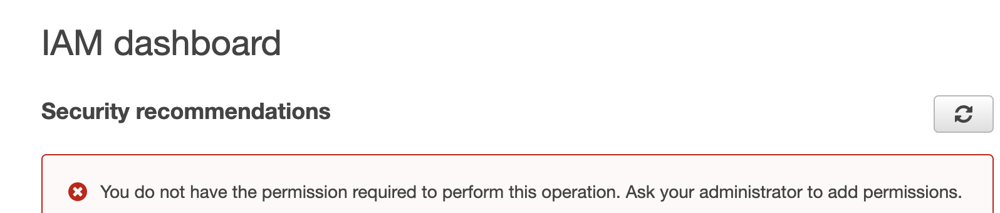
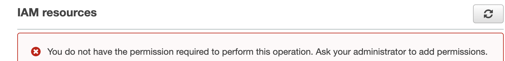

# 課題2

## Table of Contents
<!-- START doctoc generated TOC please keep comment here to allow auto update -->
<!-- DON'T EDIT THIS SECTION, INSTEAD RE-RUN doctoc TO UPDATE -->
<details>
<summary>Details</summary>

- [なぜ毎回ルートユーザとしてアクセスするのではなく、管理者権限のIAMユーザでログインした方が良いのでしょうか？](#%E3%81%AA%E3%81%9C%E6%AF%8E%E5%9B%9E%E3%83%AB%E3%83%BC%E3%83%88%E3%83%A6%E3%83%BC%E3%82%B6%E3%81%A8%E3%81%97%E3%81%A6%E3%82%A2%E3%82%AF%E3%82%BB%E3%82%B9%E3%81%99%E3%82%8B%E3%81%AE%E3%81%A7%E3%81%AF%E3%81%AA%E3%81%8F%E7%AE%A1%E7%90%86%E8%80%85%E6%A8%A9%E9%99%90%E3%81%AEiam%E3%83%A6%E3%83%BC%E3%82%B6%E3%81%A7%E3%83%AD%E3%82%B0%E3%82%A4%E3%83%B3%E3%81%97%E3%81%9F%E6%96%B9%E3%81%8C%E8%89%AF%E3%81%84%E3%81%AE%E3%81%A7%E3%81%97%E3%82%87%E3%81%86%E3%81%8B)
- [PowerUserAcesssポリシーを付与したIAMユーザーで、IAMのダッシュボードを開くと、何が表示されるか？](#poweruseracesss%E3%83%9D%E3%83%AA%E3%82%B7%E3%83%BC%E3%82%92%E4%BB%98%E4%B8%8E%E3%81%97%E3%81%9Fiam%E3%83%A6%E3%83%BC%E3%82%B6%E3%83%BC%E3%81%A7iam%E3%81%AE%E3%83%80%E3%83%83%E3%82%B7%E3%83%A5%E3%83%9C%E3%83%BC%E3%83%89%E3%82%92%E9%96%8B%E3%81%8F%E3%81%A8%E4%BD%95%E3%81%8C%E8%A1%A8%E7%A4%BA%E3%81%95%E3%82%8C%E3%82%8B%E3%81%8B)
- [AdministratorAccessポリシーを直接ユーザに付与する方法と、グループに付与してユーザを所属させる方法を紹介しました。どのような理由で、どちらの方が適切だと感じますか？](#administratoraccess%E3%83%9D%E3%83%AA%E3%82%B7%E3%83%BC%E3%82%92%E7%9B%B4%E6%8E%A5%E3%83%A6%E3%83%BC%E3%82%B6%E3%81%AB%E4%BB%98%E4%B8%8E%E3%81%99%E3%82%8B%E6%96%B9%E6%B3%95%E3%81%A8%E3%82%B0%E3%83%AB%E3%83%BC%E3%83%97%E3%81%AB%E4%BB%98%E4%B8%8E%E3%81%97%E3%81%A6%E3%83%A6%E3%83%BC%E3%82%B6%E3%82%92%E6%89%80%E5%B1%9E%E3%81%95%E3%81%9B%E3%82%8B%E6%96%B9%E6%B3%95%E3%82%92%E7%B4%B9%E4%BB%8B%E3%81%97%E3%81%BE%E3%81%97%E3%81%9F%E3%81%A9%E3%81%AE%E3%82%88%E3%81%86%E3%81%AA%E7%90%86%E7%94%B1%E3%81%A7%E3%81%A9%E3%81%A1%E3%82%89%E3%81%AE%E6%96%B9%E3%81%8C%E9%81%A9%E5%88%87%E3%81%A0%E3%81%A8%E6%84%9F%E3%81%98%E3%81%BE%E3%81%99%E3%81%8B)
- [EC2インスタンスにSSH接続してS3バケットの中身を一覧表示するaws cliコマンドを実行するとどうなるか](#ec2%E3%82%A4%E3%83%B3%E3%82%B9%E3%82%BF%E3%83%B3%E3%82%B9%E3%81%ABssh%E6%8E%A5%E7%B6%9A%E3%81%97%E3%81%A6s3%E3%83%90%E3%82%B1%E3%83%83%E3%83%88%E3%81%AE%E4%B8%AD%E8%BA%AB%E3%82%92%E4%B8%80%E8%A6%A7%E8%A1%A8%E7%A4%BA%E3%81%99%E3%82%8Baws-cli%E3%82%B3%E3%83%9E%E3%83%B3%E3%83%89%E3%82%92%E5%AE%9F%E8%A1%8C%E3%81%99%E3%82%8B%E3%81%A8%E3%81%A9%E3%81%86%E3%81%AA%E3%82%8B%E3%81%8B)
- [上記のS3バケットに対してのみ、バケットに保存されているオブジェクトを一覧表示する操作を許可するロールをEC2インスタンスに付与する](#%E4%B8%8A%E8%A8%98%E3%81%AEs3%E3%83%90%E3%82%B1%E3%83%83%E3%83%88%E3%81%AB%E5%AF%BE%E3%81%97%E3%81%A6%E3%81%AE%E3%81%BF%E3%83%90%E3%82%B1%E3%83%83%E3%83%88%E3%81%AB%E4%BF%9D%E5%AD%98%E3%81%95%E3%82%8C%E3%81%A6%E3%81%84%E3%82%8B%E3%82%AA%E3%83%96%E3%82%B8%E3%82%A7%E3%82%AF%E3%83%88%E3%82%92%E4%B8%80%E8%A6%A7%E8%A1%A8%E7%A4%BA%E3%81%99%E3%82%8B%E6%93%8D%E4%BD%9C%E3%82%92%E8%A8%B1%E5%8F%AF%E3%81%99%E3%82%8B%E3%83%AD%E3%83%BC%E3%83%AB%E3%82%92ec2%E3%82%A4%E3%83%B3%E3%82%B9%E3%82%BF%E3%83%B3%E3%82%B9%E3%81%AB%E4%BB%98%E4%B8%8E%E3%81%99%E3%82%8B)
- [EC2インスタンスにロールを付与するべきか直接ポリシーを付与するべきか、迷われることがあるかもしれません。どのような理由で、どちらの方が適切だと感じますか？](#ec2%E3%82%A4%E3%83%B3%E3%82%B9%E3%82%BF%E3%83%B3%E3%82%B9%E3%81%AB%E3%83%AD%E3%83%BC%E3%83%AB%E3%82%92%E4%BB%98%E4%B8%8E%E3%81%99%E3%82%8B%E3%81%B9%E3%81%8D%E3%81%8B%E7%9B%B4%E6%8E%A5%E3%83%9D%E3%83%AA%E3%82%B7%E3%83%BC%E3%82%92%E4%BB%98%E4%B8%8E%E3%81%99%E3%82%8B%E3%81%B9%E3%81%8D%E3%81%8B%E8%BF%B7%E3%82%8F%E3%82%8C%E3%82%8B%E3%81%93%E3%81%A8%E3%81%8C%E3%81%82%E3%82%8B%E3%81%8B%E3%82%82%E3%81%97%E3%82%8C%E3%81%BE%E3%81%9B%E3%82%93%E3%81%A9%E3%81%AE%E3%82%88%E3%81%86%E3%81%AA%E7%90%86%E7%94%B1%E3%81%A7%E3%81%A9%E3%81%A1%E3%82%89%E3%81%AE%E6%96%B9%E3%81%8C%E9%81%A9%E5%88%87%E3%81%A0%E3%81%A8%E6%84%9F%E3%81%98%E3%81%BE%E3%81%99%E3%81%8B)
- [参考](#%E5%8F%82%E8%80%83)

</details>
<!-- END doctoc generated TOC please keep comment here to allow auto update -->

## なぜ毎回ルートユーザとしてアクセスするのではなく、管理者権限のIAMユーザでログインした方が良いのでしょうか？

- ルートユーザーは、権限が強く、AWSアカウントの全てのAWSサービスとリソースに完全なアクセス権限を持っている。その上、IAMユーザーのようにアクセスポリシーを設定することもできないため、流出した時のリストが非常に高い。
- IAMユーザーは、アクセスポリシーを設定することで、アクセス権限を制御することができるため、こちらを使うべき

## PowerUserAcesssポリシーを付与したIAMユーザーで、IAMのダッシュボードを開くと、何が表示されるか？

- > Provides full access to AWS services and resources, but does not allow management of Users and groups.

- IAMユーザーに関する操作は不可能、という警告が表示される





## AdministratorAccessポリシーを直接ユーザに付与する方法と、グループに付与してユーザを所属させる方法を紹介しました。どのような理由で、どちらの方が適切だと感じますか？

- 後者「グループに付与してユーザを所属させる」の方が適切と考える
  - 同じポリシーを付与したいユーザーが複数存在する場合に、ユーザーを作成する度に毎回ポリシーを設定するのは手間がかかる。既に特定のポリシーを定義したグループに追加する方が容易に作成できる。
  - 直接ユーザーにポリシーを紐づけていると、そのユーザーが削除されるとどのようなポリシーを設定していたかという情報も同じく失われてしまうが、グループに紐づけているだけであれば、その情報は失われずまた再利用可能となる

## EC2インスタンスにSSH接続してS3バケットの中身を一覧表示するaws cliコマンドを実行するとどうなるか

```bash
$ aws s3 ls s3://prahatest
Unable to locate credentials. You can configure credentials by running "aws configure".
```

- エラーが発生

## 上記のS3バケットに対してのみ、バケットに保存されているオブジェクトを一覧表示する操作を許可するロールをEC2インスタンスに付与する

1. 上記のようなロールを作成する
2. そのロールをEC2インスタンスに付与する
3. `aws s3 ls s3://prahatest`を実行する

- 確認結果
  - prahatestバケットへのアクセスのみ許可している状態のため、prahatest2バケットへのアクセスではエラーが発生する
  - prahatestバケットには、`prahatest`というファイルをアップロードしているため、オブジェクト一覧としてそのファイル名が表示される

```bash
$ aws s3 ls s3://prahatest
2021-12-05 06:11:46          9 prahatest

$ aws s3 ls s3://prahatest2
An error occurred (AccessDenied) when calling the ListObjectsV2 operation: Access Denied
```

## EC2インスタンスにロールを付与するべきか直接ポリシーを付与するべきか、迷われることがあるかもしれません。どのような理由で、どちらの方が適切だと感じますか？

- ロールを付与すべきと考える
  - ロールは、複数のポリシーを保持することができる。同じポリシーをアタッチしたいEC2が複数存在する場合、毎回ポリシーを各EC2インスタンすに対して設定する必要があり、手間がかかる
  - またEC2インスタンスが削除された場合、どのようなポリシーが設定されていたのかという情報も同時に失われてしまうが、ロールとして複数のポリシーをまとめていた場合、そのロール単位で再利用することができる

## 参考

- [Amazon EC2 インスタンスに、Amazon S3 バケットへのアクセス権を付与するにはどうすればよいですか?](https://aws.amazon.com/jp/premiumsupport/knowledge-center/ec2-instance-access-s3-bucket/)