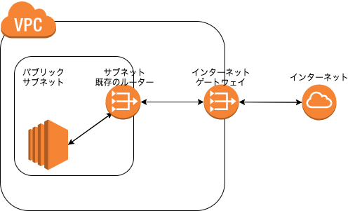
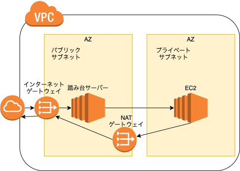
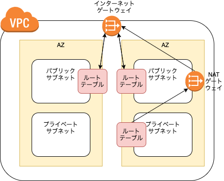
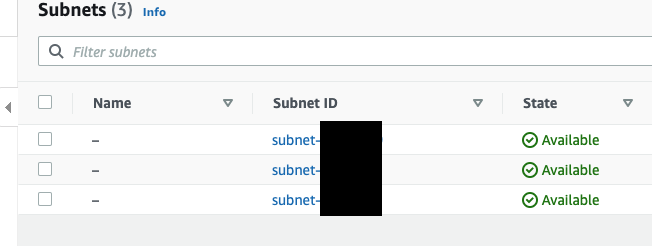
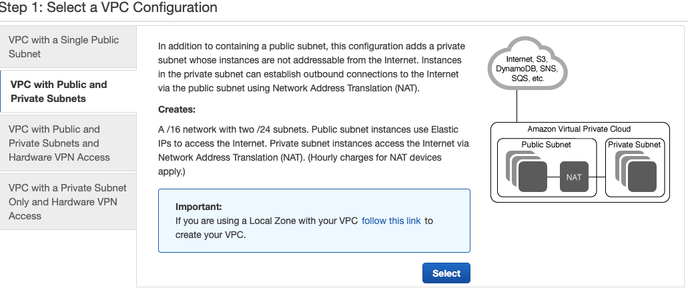
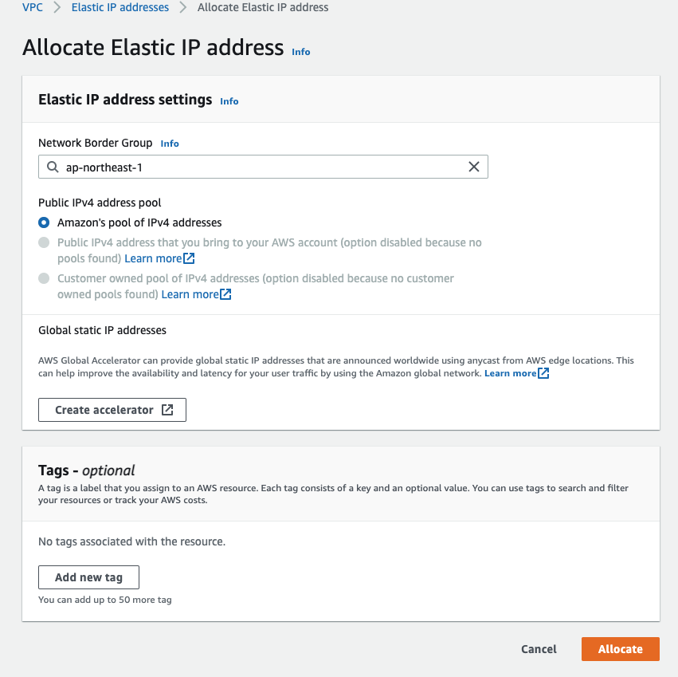
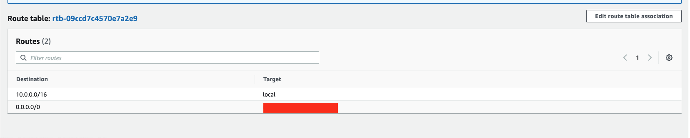
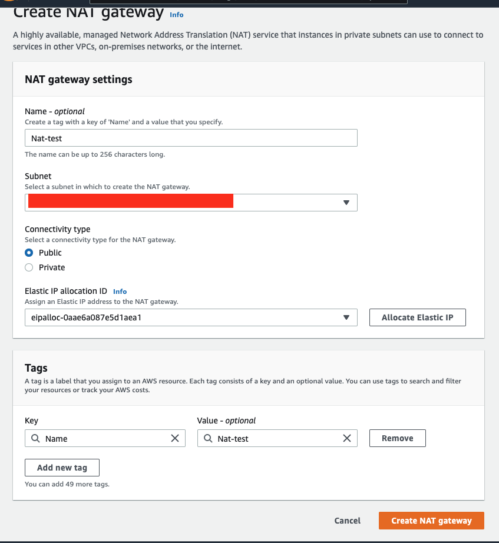
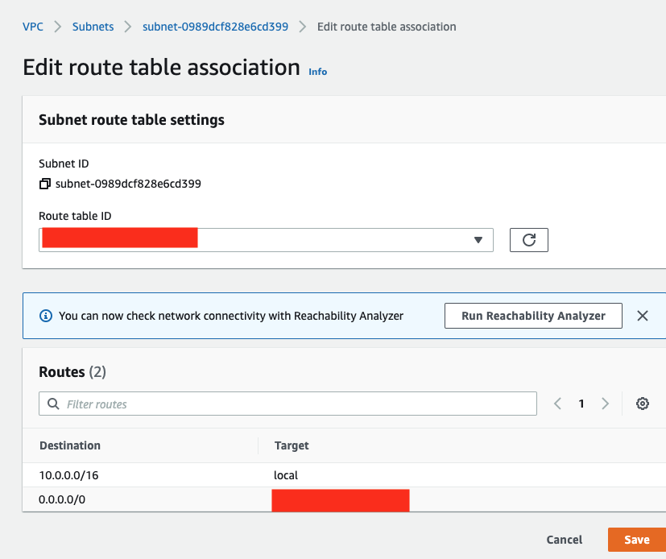

# 課題1

## Table of Contents
<!-- START doctoc -->
<!-- END doctoc -->

## プライベートサブネットとパブリックサブネットの違い

- インターネットゲートウェイがあるものがパブリックサブネットとなる

- NATゲートウェイ
  - グローバルIPアドレスとプライベートIPアドレスを対応づけるのが、NATという機器またはソフトウェア
  - 1対1で変換する
- IPマスカレード
  - 複数のプライベートIPアドレスをグローバルIPアドレスに変換する

## VPCにプライベートサブネットとパブリックサブネットをマルチAZで構築してみてください

- 構成

- 東京リージョンでは、3つのAZがあるため、デフォルトで3つのサブネットが作成されている
- どれもパブリック

1. VPCの作成

- ElasticIPの割り当て
  - ElasticIPは使わないと、料金が発生する！

2. パブリックサブネットの作成

- ルートテーブルの関連付けを編集

3. プライベートサブネットの作成

- NATゲートウェイの作成

- NATゲートウェイをサブネットに設定
  - ルートの編集

## マルチAZやVPCに関する整理

### マルチAZとは

- AWSはサーバーとデータセンターを世界各国においており、その地理的分類がリージョン
- 各リージョンは複数のアベイラビリティーゾーン（AZ）に、それぞれ独立した設備を配置している。
- マルチAZ構成は、冗長化にもなる
  - 冗長化
    - 万が一、システムやサーバーに問題があった場合、稼働し続けられるように対策しておくこと

### VPC（Amazon Virtual Private Cloud）とは

- AWSアカウント専用の仮想ネットワークで、AWSで提供されているリソースのみおくことができる
  - EC2やRDSは、作成時にVPCを選択肢しないと作成できない

### サブネットとは

- サブネットとは、大きなネットワークを小さく分割したネットワーク
  - ネットワークを切り分けることで、直接配信できる範囲を狭め、ファイアウォールを設定してセキュリティの境界を作る
  - AWSの場合は、そのサブネットをどこのAZに配置するのかを設定する

## 参考

- [アベイラビリティーゾーンを使用した静的安定性](https://aws.amazon.com/jp/builders-library/static-stability-using-availability-zones/)
- [[初級編] なぜ「AWS で負荷分散は３AZ にまたがるのがベストプラクティス」と言われるのか 可用性の面から考えてみた](https://dev.classmethod.jp/articles/202008-three-az-load-balancing/)