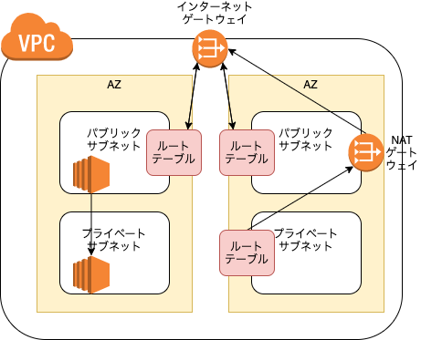
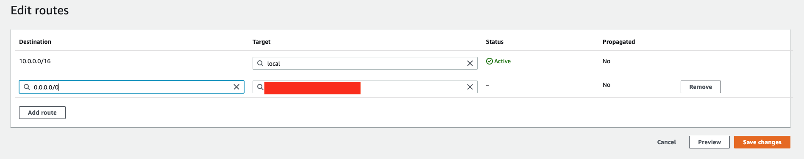
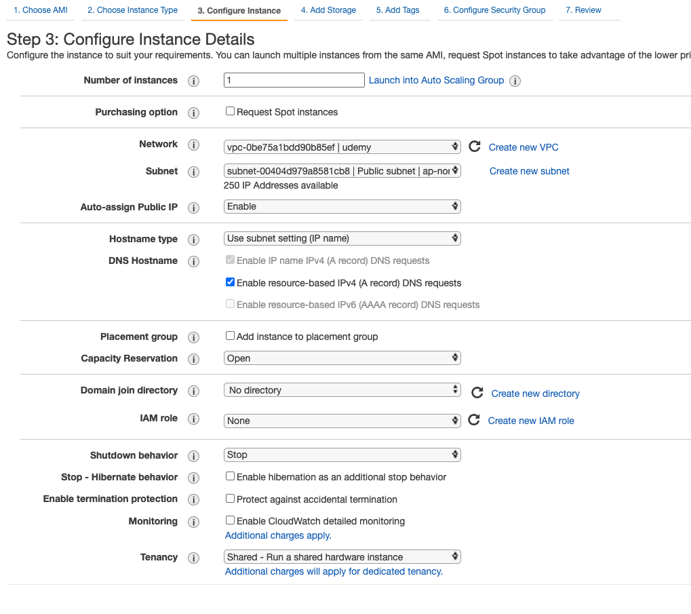
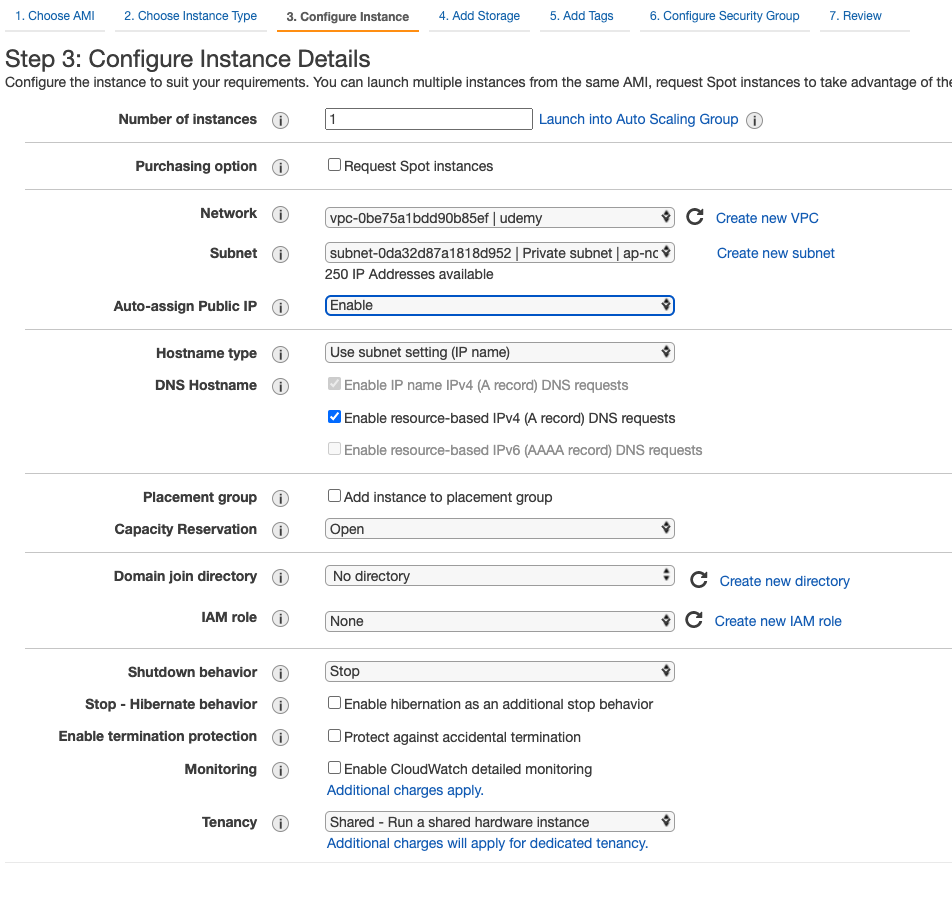

# 課題1

## Table of Contents
<!-- START doctoc -->
<!-- END doctoc -->

## プライベートサブネットとパブリックサブネットの違い

- インターネットゲートウェイがあるものがパブリックサブネットとなる


- NATゲートウェイ
  - グローバルIPアドレスとプライベートIPアドレスを対応づけるのが、NATという機器またはソフトウェア
  - 1対1で変換する
- IPマスカレード
  - 複数のプライベートIPアドレスをグローバルIPアドレスに変換する


## VPCにプライベートサブネットとパブリックサブネットをマルチAZで構築してみてください

- 構成



- 東京リージョンでは、3つのAZがあるため、デフォルトで3つのサブネットが作成されている
- どれもパブリック


## パブリックサブネットにSSH可能なEC2インスタンスを立てて、アクセスしてみてください

1. VPCの作成


- ElasticIPの割り当て
  - ElasticIPは使わないと、料金が発生する！
  - これを設定しないと、IPアドレスがログインのたびに変わる（それで問題ない場合は割り当てる必要はない）


2. パブリックサブネットの作成

- ルートテーブルの関連付けを編集


3. プライベートサブネットの作成

- NATゲートウェイの作成


- NATゲートウェイをサブネットに設定
  - ルートの編集



4. パブリックサブネットにEC2を配置



5. プライベートサブネットにEC2を配置



## プライベートサブネットにもEC2インスタンスを立てて、パブリックサブネットのEC2インスタンスからのみプライベートサブネットのEC２インスタンスにSSHでアクセスできるように

```shell
$  ssh -i ~/.ssh/vpc-test-2.pem ec2-user@<パブリックサブネットにあるEC2インスタンスのパブリックIPアドレス>
Last login: Mon Mar 21 08:03:02 2022 from kd106154006243.au-net.ne.jp

       __|  __|_  )
       _|  (     /   Amazon Linux 2 AMI
      ___|\___|___|

https://aws.amazon.com/amazon-linux-2/
2 package(s) needed for security, out of 8 available
Run "sudo yum update" to apply all updates.
[ec2-user@ip-10-0-0-236 ~]$ ssh -i ~/.ssh/vpc-test-2.pem ec2-user@<プライベートサブネットにあるEC2インスタンスのプライベートIPアドレス>
Last login: Mon Mar 21 08:04:15 2022 from ip-10-0-0-236.ap-northeast-1.compute.internal

       __|  __|_  )
       _|  (     /   Amazon Linux 2 AMI
      ___|\___|___|

https://aws.amazon.com/amazon-linux-2/
[ec2-user@ip-10-0-1-194 ~]$ ls
```

## プライベートサブネットにVPCの外からアクセスできないことを確認

```shell
$  ssh -i ~/.ssh/vpc-test-2.pem ec2-user@<プライベートサブネットのE2インスタンスのプライベートIPアドレス>
ssh: connect to host <プライベートサブネットのE2インスタンスのプライベートIPアドレス> port 22: Operation timed out
```

## マルチAZやVPCに関する整理

### マルチAZとは

- AWSはサーバーとデータセンターを世界各国においており、その地理的分類がリージョン
- 各リージョンは複数のアベイラビリティーゾーン（AZ）に、それぞれ独立した設備を配置している。
- マルチAZ構成は、冗長化にもなる
  - 冗長化
    - 万が一、システムやサーバーに問題があった場合、稼働し続けられるように対策しておくこと

### VPC（Amazon Virtual Private Cloud）とは

- AWSアカウント専用の仮想ネットワークで、AWSで提供されているリソースのみおくことができる
  - EC2やRDSは、作成時にVPCを選択肢しないと作成できない

### サブネットとは

- サブネットとは、大きなネットワークを小さく分割したネットワーク
  - ネットワークを切り分けることで、直接配信できる範囲を狭め、ファイアウォールを設定してセキュリティの境界を作る
  - AWSの場合は、そのサブネットをどこのAZに配置するのかを設定する

## 参考

- [アベイラビリティーゾーンを使用した静的安定性](https://aws.amazon.com/jp/builders-library/static-stability-using-availability-zones/)
- [[初級編] なぜ「AWS で負荷分散は３AZ にまたがるのがベストプラクティス」と言われるのか 可用性の面から考えてみた](https://dev.classmethod.jp/articles/202008-three-az-load-balancing/)
- [踏み台サーバ経由の多段SSH接続をローカル端末の秘密鍵のみで実施する](https://dev.classmethod.jp/articles/bastion-multi-stage-ssh-only-local-pem/)
- [scpで踏み台サーバーに秘密鍵をコピーするのに躓く](https://dev.classmethod.jp/articles/scp-for-bigginer/)
- [AWS勉強会(1) / 踏み台サーバとネットワークの作成](https://qiita.com/zaki-lknr/items/4586cc2f992908068bd2)
- [軽快なscpか高機能なsftp、sshサーバに向いているのは？](https://atmarkit.itmedia.co.jp/ait/articles/0606/27/news135_2.html)