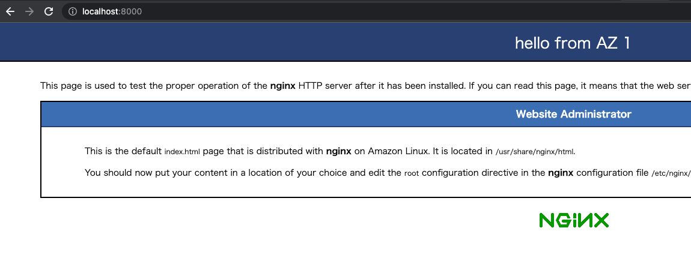

# 課題1

## Table of Contents
<!-- START doctoc -->
<!-- END doctoc -->

## それぞれのAZのプラベートサブネットにEC2インスタンスを構築

- 「マルチAZに跨るVPCを構築する」の課題に加え、追加で2個のEC2インスタンスを立てる

- パブリックサブネットのEC2


- プライベートサブネットのEC2
  - スクショなし（撮り忘れた）

- 最終的な構成


## それぞれのEC2にNginxを導入

1. Security GroupのInbound rulesに、`HTTP`のルールを追加
   
   - パブリックサブネットのEC2だけではなく、プライベートサブネットのEC2にもこのルールがないとSSHポートフォワーディンぐしてもlocalhostでアクセスできない）


1. NGINXのインストール

- インストール
  
`sudo amazon-linux-extras install nginx1`

- バックアップ

`sudo cp -a /etc/nginx/nginx.conf /etc/nginx/nginx.conf.back`

- nginxの起動

`sudo systemctl start nginx`

- インスタンス起動時にnginxも起動するように設定

`sudo systemctl enable nginx`

- 起動していることの確認

`sudo systemctl status nginx`
## それぞれのEC2インスタンスから別々のHTMLページを返すように

1. デフォルトのnginxのページが表示されることを確認する

- 以下のコマンドを実行し、SSHポートフォワーディングを行う
  - パブリックサブネット上の踏み台サーバーを経由して、プライベートサブネットにあるWebサーバー（nginx）にアクセスするため
  
`ssh -i <パブリックサブネットにあるEC2の秘密鍵のパス> -fN -L 8888:<プライベートサブネットにあるEC2のプライベートIPアドレス>:80 ec2-user@<パブリックサブネットにあるEC2のパブリックIPアドレス>`


1. デフォルトの`index.html`の中身を書き換える

```shell
# デフォルトのhtmlが配置されているディレクトリへ移動
cd /usr/share/nginx/html
# root権限で開く（sudoなしだと読み込み専用になってしまったため）
sudo vi index.html
```

```diff
+ <h1>Welcome to <strong>nginx</strong> on Amazon Linux!</h1>
- <h1>hello from AZ 1</h1>
```

3. ブラウザから確認する

- SSHポートフォワーディングを行う

`ssh -i <パブリックサブネットにあるEC2の秘密鍵のパス> -fN -L 8000:<プライベートサブネットにあるEC2のプライベートIPアドレス>:80 ec2-user@<パブリックサブネットにあるEC2のパブリックIPアドレス>`

- ブラウザで`http://localhsot:8000`へアクセス



- ブラウザで`http://localhost:4000`へアクセス（こちらのEC2やnginx導入手順は省略。結果のみ記録）


## いずれかのパブリックサブネットにALB（アプリケーションロードバランサー）を設置して、ALB経由でブラウザからnginxで設定したページにアクセスできるように

1. ALBを作成する


## その他の整理

### Nginx（エンジンエックス）とは

- Webサーバー
- Apacheに次ぐシェア
- 特徴
  - 高速
  - 大量処理が得意
  - Webサイトを向上させる機能が豊富
  - 設定は意外と簡単
- デメリット
  - 大量の動的コンテンツの処理に不向き
  - 機能追加がする時の情報がApacheに比べ不足している
  - 初心者向けの設定情報が少ない

### ALB（Application Load Balancing）とは

- > Elastic Load Balancing は、受信したトラフィックを複数のアベイラビリティーゾーンの複数のターゲット (EC2 インスタンス、コンテナ、IP アドレスなど) に自動的に分散させます。登録されているターゲットの状態をモニタリングし、正常なターゲットにのみトラフィックをルーティングします。Elastic Load Balancing は、受信トラフィックの時間的な変化に応じて、ロードバランサーをスケーリングします。また、大半のワークロードに合わせて自動的にスケーリングできます。


## 参考

- [プライベートサブネット内のWebサーバにブラウザでアクセスする方法](https://zenn.dev/tmasuyama1114/articles/25aec930b9cd66)
- [SSHを制してインフラを制する。ローカルポートフォワードを使いこなす](https://blog.mosuke.tech/entry/2014/12/31/170545/)
- [Application Load Balancer とは?](https://docs.aws.amazon.com/ja_jp/elasticloadbalancing/latest/application/introduction.html)
- [[AWS Black Belt Online Seminar] Elastic Load Balancing (ELB)](https://d1.awsstatic.com/webinars/jp/pdf/services/20191029_AWS-Blackbelt_ELB.pdf)