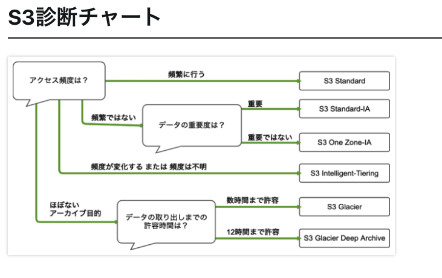
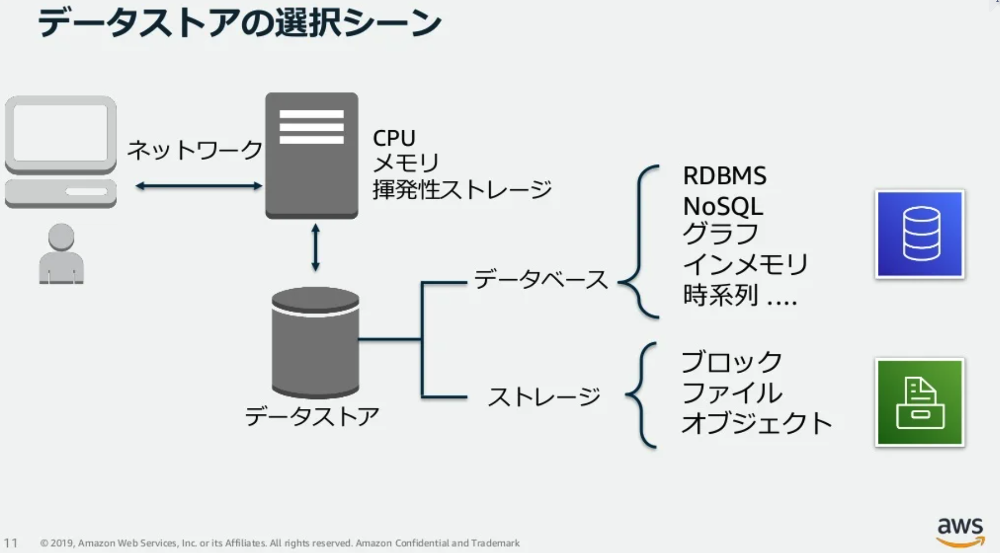
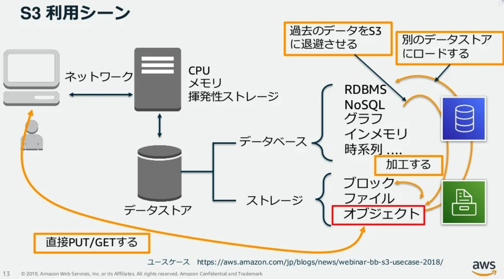

# 課題1（ストレージクラス）

## Table of Contents
<!-- START doctoc generated TOC please keep comment here to allow auto update -->
<!-- DON'T EDIT THIS SECTION, INSTEAD RE-RUN doctoc TO UPDATE -->

Details

  - [どのような時に、どのストレージクラスを選択するべきでしょうか？](#%E3%81%A9%E3%81%AE%E3%82%88%E3%81%86%E3%81%AA%E6%99%82%E3%81%AB%E3%81%A9%E3%81%AE%E3%82%B9%E3%83%88%E3%83%AC%E3%83%BC%E3%82%B8%E3%82%AF%E3%83%A9%E3%82%B9%E3%82%92%E9%81%B8%E6%8A%9E%E3%81%99%E3%82%8B%E3%81%B9%E3%81%8D%E3%81%A7%E3%81%97%E3%82%87%E3%81%86%E3%81%8B)
  - [ほとんどアクセスされないバケットを作成する場合はどのストレージクラスの選定が良いでしょうか？](#%E3%81%BB%E3%81%A8%E3%82%93%E3%81%A9%E3%82%A2%E3%82%AF%E3%82%BB%E3%82%B9%E3%81%95%E3%82%8C%E3%81%AA%E3%81%84%E3%83%90%E3%82%B1%E3%83%83%E3%83%88%E3%82%92%E4%BD%9C%E6%88%90%E3%81%99%E3%82%8B%E5%A0%B4%E5%90%88%E3%81%AF%E3%81%A9%E3%81%AE%E3%82%B9%E3%83%88%E3%83%AC%E3%83%BC%E3%82%B8%E3%82%AF%E3%83%A9%E3%82%B9%E3%81%AE%E9%81%B8%E5%AE%9A%E3%81%8C%E8%89%AF%E3%81%84%E3%81%A7%E3%81%97%E3%82%87%E3%81%86%E3%81%8B)
  - [ライフサイクルとは何でしょうか？](#%E3%83%A9%E3%82%A4%E3%83%95%E3%82%B5%E3%82%A4%E3%82%AF%E3%83%AB%E3%81%A8%E3%81%AF%E4%BD%95%E3%81%A7%E3%81%97%E3%82%87%E3%81%86%E3%81%8B)
  - [S3にアップロードされる画像は登録以降ほとんど使われないんだけど、一応監査のために取っておく必要があるんだよね。作成から30日経ったら、もっと安いストレージクラスに移動するようにしておいて！](#s3%E3%81%AB%E3%82%A2%E3%83%83%E3%83%97%E3%83%AD%E3%83%BC%E3%83%89%E3%81%95%E3%82%8C%E3%82%8B%E7%94%BB%E5%83%8F%E3%81%AF%E7%99%BB%E9%8C%B2%E4%BB%A5%E9%99%8D%E3%81%BB%E3%81%A8%E3%82%93%E3%81%A9%E4%BD%BF%E3%82%8F%E3%82%8C%E3%81%AA%E3%81%84%E3%82%93%E3%81%A0%E3%81%91%E3%81%A9%E4%B8%80%E5%BF%9C%E7%9B%A3%E6%9F%BB%E3%81%AE%E3%81%9F%E3%82%81%E3%81%AB%E5%8F%96%E3%81%A3%E3%81%A6%E3%81%8A%E3%81%8F%E5%BF%85%E8%A6%81%E3%81%8C%E3%81%82%E3%82%8B%E3%82%93%E3%81%A0%E3%82%88%E3%81%AD%E4%BD%9C%E6%88%90%E3%81%8B%E3%82%8930%E6%97%A5%E7%B5%8C%E3%81%A3%E3%81%9F%E3%82%89%E3%82%82%E3%81%A3%E3%81%A8%E5%AE%89%E3%81%84%E3%82%B9%E3%83%88%E3%83%AC%E3%83%BC%E3%82%B8%E3%82%AF%E3%83%A9%E3%82%B9%E3%81%AB%E7%A7%BB%E5%8B%95%E3%81%99%E3%82%8B%E3%82%88%E3%81%86%E3%81%AB%E3%81%97%E3%81%A6%E3%81%8A%E3%81%84%E3%81%A6)
  - [このログファイルを作成から90日経ったら自動的に消えるように](#%E3%81%93%E3%81%AE%E3%83%AD%E3%82%B0%E3%83%95%E3%82%A1%E3%82%A4%E3%83%AB%E3%82%92%E4%BD%9C%E6%88%90%E3%81%8B%E3%82%8990%E6%97%A5%E7%B5%8C%E3%81%A3%E3%81%9F%E3%82%89%E8%87%AA%E5%8B%95%E7%9A%84%E3%81%AB%E6%B6%88%E3%81%88%E3%82%8B%E3%82%88%E3%81%86%E3%81%AB)
- [S3とは](#s3%E3%81%A8%E3%81%AF)
- [参考](#%E5%8F%82%E8%80%83)

<!-- END doctoc generated TOC please keep comment here to allow auto update -->

### どのような時に、どのストレージクラスを選択するべきでしょうか？

|ストレージクラス|利用シーン|
|-------------|-----------------------------|
|S3 Intelligent-Tiering|アクセスパターンが不明または変化するデータに対して自動的にコストを削減する|
|S3 Standard|アクセス頻度の高いデータ向け|
|S3 Standard-Infrequent Access (S3 Standard-IA) および S3 One Zone-Infrequent Access (S3 One Zone-IA)|アクセス頻度の低いデータ向け|
|S3 Glacier Instant Retrieval|即時アクセスを必要とするアーカイブデータ向け|
|S3 Glacier Flexible Retrieval (旧 S3 Glacier)|即時アクセスを必要としないアクセス頻度の低い長期データ用|
|Amazon S3 Glacier Deep Archive (S3 Glacier Deep Archive)|クラウド上の最も低コストなストレージで数時間で取り出し可能な長期アーカイブやデジタル保存用|
|S3 Outposts|既存の AWS リージョンで適合できないデータレジデンシーの要件がある場合|

### ほとんどアクセスされないバケットを作成する場合はどのストレージクラスの選定が良いでしょうか？

- S3 Glacier または S3 Glacier Deep Archive が良いと考える
  - 上記の診断チャートや「ほとんどアクセスされない」ということから判断

### ライフサイクルとは何でしょうか？

- 

### S3にアップロードされる画像は登録以降ほとんど使われないんだけど、一応監査のために取っておく必要があるんだよね。作成から30日経ったら、もっと安いストレージクラスに移動するようにしておいて！

### このログファイルを作成から90日経ったら自動的に消えるように

## S3とは

- S3（Amazon Simple Storage Service）
  - ユーザーがデータを安全に、容量制限なく、データ保存が可能な、クラウド時代のオブジェクトストレージ

- データストアの選択

- S3の利用シーン
  - 直接PUT/GETする
  - 加工する
  - 別のデータストアにロードする（e.g. ストレージからデータベースへ）
  - 過去のデータをS3に退避させる

## 参考

- [[AWS Black Belt Online Seminar] Amazon S3/Glacier 資料及び QA 公開](https://aws.amazon.com/jp/blogs/news/webinar-bb-amazon-s3-glacier-2019/)
- [Amanzon S3 ストレージクラスの概要インフォグラフィック](https://aws.amazon.com/jp/s3/storage-classes-infographic/)