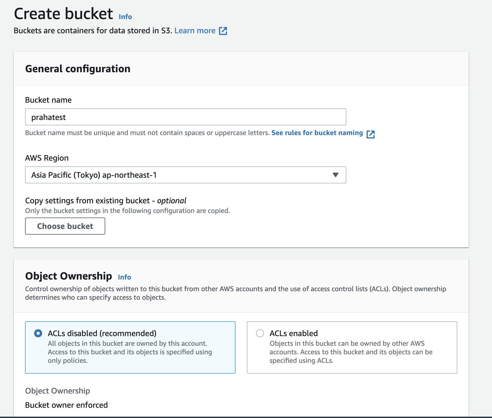
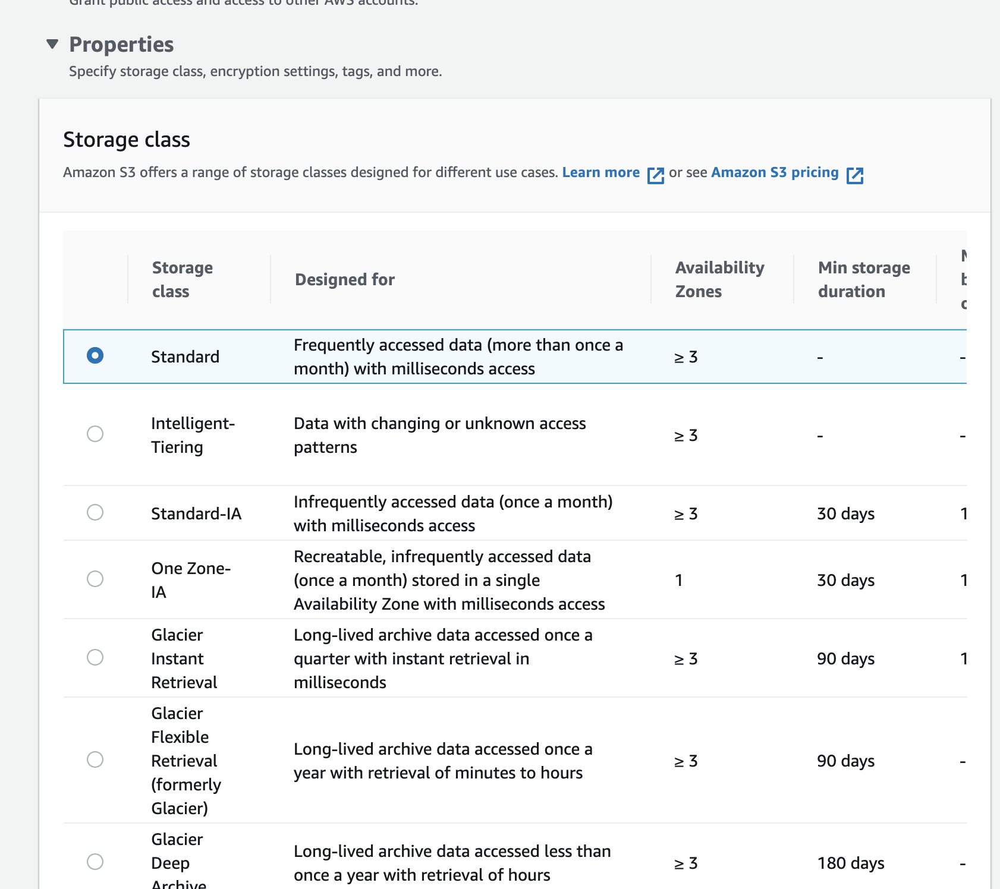
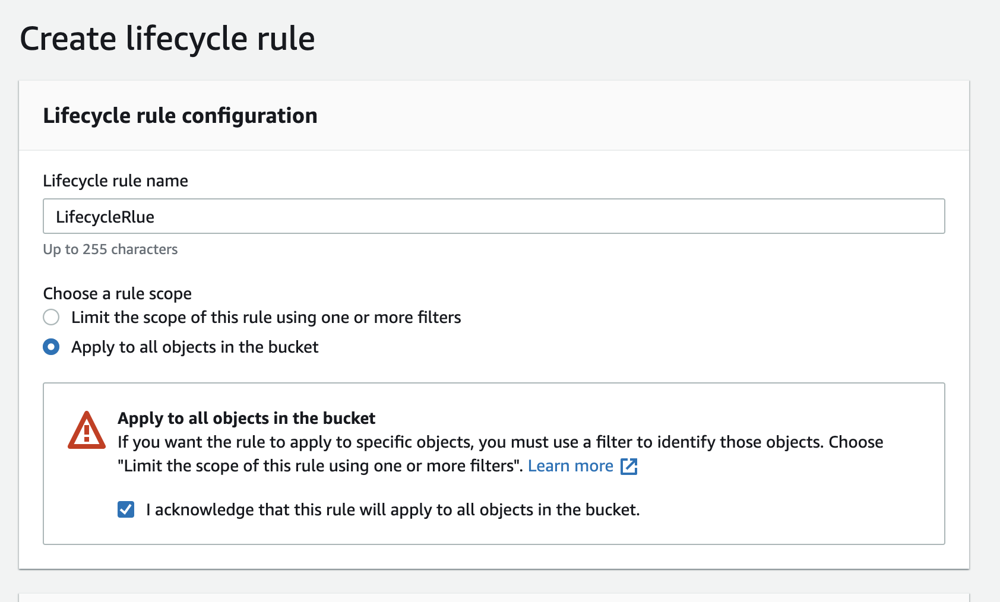
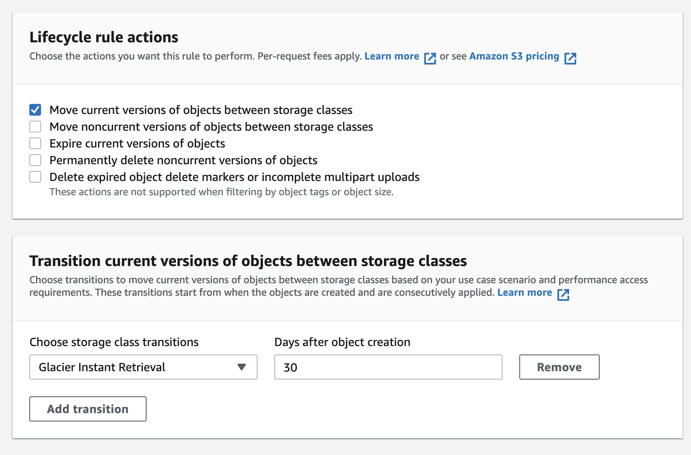
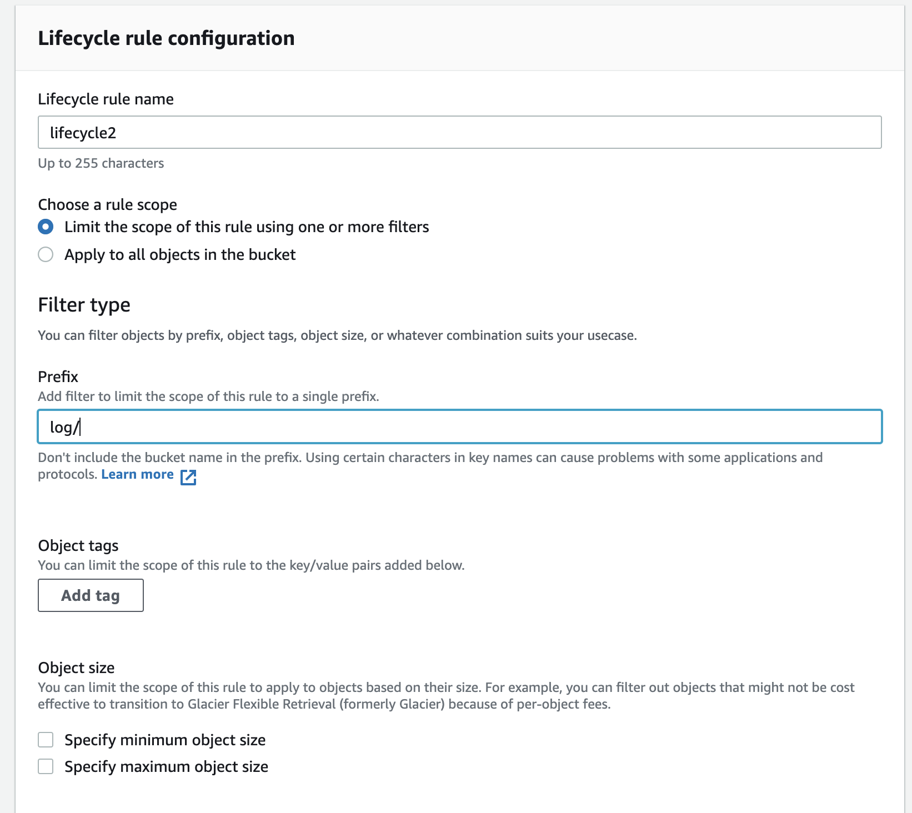
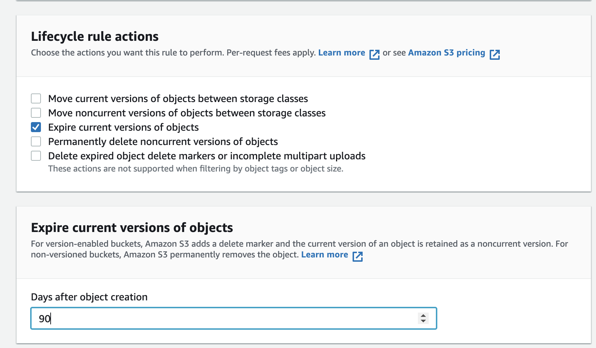

# 課題1（ストレージクラス）

## Table of Contents
<!-- START doctoc -->
<!-- END doctoc -->

### どのような時に、どのストレージクラスを選択するべきでしょうか？

|ストレージクラス|利用シーン|
|-------------|-----------------------------|
|S3 Intelligent-Tiering|アクセスパターンが不明または変化するデータに対して自動的にコストを削減する|
|S3 Standard|アクセス頻度の高いデータ向け|
|S3 Standard-Infrequent Access (S3 Standard-IA) および S3 One Zone-Infrequent Access (S3 One Zone-IA)|アクセス頻度の低いデータ向け|
|S3 Glacier Instant Retrieval|即時アクセスを必要とするアーカイブデータ向け|
|S3 Glacier Flexible Retrieval (旧 S3 Glacier)|即時アクセスを必要としないアクセス頻度の低い長期データ用|
|Amazon S3 Glacier Deep Archive (S3 Glacier Deep Archive)|クラウド上の最も低コストなストレージで数時間で取り出し可能な長期アーカイブやデジタル保存用|
|S3 Outposts|既存の AWS リージョンで適合できないデータレジデンシーの要件がある場合|

- 以下は少し古い

### ほとんどアクセスされないバケットを作成する場合はどのストレージクラスの選定が良いでしょうか？

- S3 Glacier または S3 Glacier Deep Archive が良いと考える
  - 上記の診断チャートや「ほとんどアクセスされない」ということから判断

### ライフサイクルとは何でしょうか？

- オブジェクトのグループに適用するアクションを定義するルールのセット
- 以下の2種類がある

|種類|概要|
|----|------------------|
|Transitions actions|別のストレージクラスにオブジェクトを移行するタイミングを定義|
|有効期限切れアクション|オブジェクトの有効期限を定義|

### S3にアップロードされる画像は登録以降ほとんど使われないんだけど、一応監査のために取っておく必要がある。作成から30日経ったら、もっと安いストレージクラスに移動するように

1. S3スタンダードに画像を保存する

2. S3スタンダードに配置した画像を、30日後にS3 Glacierに移動するライフサイクルを設定する

### このログファイルを作成から90日経ったら自動的に消えるように

- `top`コマンドの出力結果を記録したtxtを準備し、S3スタンダードのlogフォルダに配置する

- 90日経ったら、削除されるようにライフサイクルのルールを設定する
- 

## S3とは

- S3（Amazon Simple Storage Service）
  - ユーザーがデータを安全に、容量制限なく、データ保存が可能な、クラウド時代のオブジェクトストレージ

- データストアの選択

- S3の利用シーン
  - 直接PUT/GETする
  - 加工する
  - 別のデータストアにロードする（e.g. ストレージからデータベースへ）
  - 過去のデータをS3に退避させる

## 参考

- [[AWS Black Belt Online Seminar] Amazon S3/Glacier 資料及び QA 公開](https://aws.amazon.com/jp/blogs/news/webinar-bb-amazon-s3-glacier-2019/)
- [Amanzon S3 ストレージクラスの概要インフォグラフィック](https://aws.amazon.com/jp/s3/storage-classes-infographic/)
- [ストレージのライフサイクルの管理](https://docs.aws.amazon.com/ja_jp/AmazonS3/latest/userguide/object-lifecycle-mgmt.html)
- [例 3: オブジェクトの有効期間全体にわたってストレージクラスの層を下げる](https://docs.aws.amazon.com/ja_jp/AmazonS3/latest/userguide/lifecycle-configuration-examples.html#lifecycle-config-conceptual-ex3)
- [Amazon S3 ライフサイクルを使用したオブジェクトの移行](https://docs.aws.amazon.com/ja_jp/AmazonS3/latest/userguide/lifecycle-transition-general-considerations.html#lifecycle-general-considerations-transition-sc)
- [絵で見て 3分でおさらいする Amazon S3 のバージョニングとライフサイクル](https://dev.classmethod.jp/articles/3minutes-s3-versioning-lifecycle/)
- [Amazon S3のストレージクラスを変更してくれるライフサイクルルールを設定してみた。](https://dev.classmethod.jp/articles/lim-s3-lifecycle-rules/)
- [S3ライフサイクルルールで古いオブジェクトを自動削除する](https://nakada-r.com/2021/01/s3-lifecycle/#toc2)