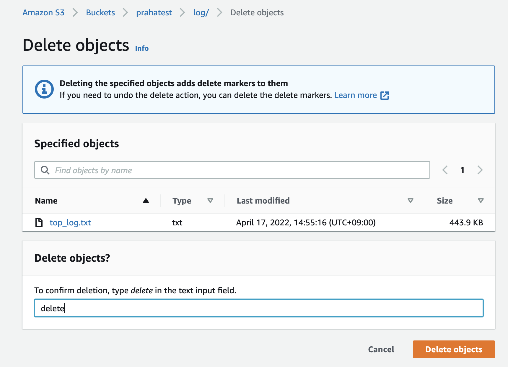

# 課題1（バックアップ）

## Table of Contents
<!-- START doctoc generated TOC please keep comment here to allow auto update -->
<!-- DON'T EDIT THIS SECTION, INSTEAD RE-RUN doctoc TO UPDATE -->

<!-- END doctoc generated TOC please keep comment here to allow auto update -->

### S3における「バージョニング」と「レプリケーション」の違い

- バージョニング
  - 同じバケット内でオブジェクトの複数のバリアントを保持する手段のこと
  - バケットに保存されたすべてのバージョンを、保存、取得、復元することができる
  - バージョニングを使用すれば、意図しないユーザーアクションからもアプリケーション障害からも、より簡単に復旧できる
- レプリケーション
  - Amazon S3 バケット間でオブジェクトを自動で非同期的にコピーできる

### レプリケーション

- 2つのリージョンにバケットを作り、クロスリージョンレプリケーションを設定してください
  - 課題1で作成したap-northeast-1（tokyo）に作成したバケットを使用する→バージョニングを有効化する
  - それとは別に、ap-northeast -2（seol）にバケットを作成する

  - レプリケーションルールを作成する

- レプリケーション元のパケットにオブジェクトを新規作成してください
  - `replica`フォルダを作成し、`top_log2.txt`をアップロード

- レプリケーション先のバケットにオブジェクトがコピーされていることを確認してください

### バージョニング

- バージョニングを有効にしたS3バケットを作成し、任意のファイルを保存
  - 課題1でアップロードした、top_log.txtを使用する

- 保存したオブジェクトを削除

- 「Show versions」にチェックを入れると、Delete markerがついていることがわかる

- バージョニング機能を活かして、削除してしまったファイルを復元

## 参考
- [S3 バケットでのバージョニングの使用](https://docs.aws.amazon.com/ja_jp/AmazonS3/latest/userguide/Versioning.html)
- [オブジェクトのレプリケーション](https://docs.aws.amazon.com/ja_jp/AmazonS3/latest/userguide/replication.html)
- [削除マーカーの使用](https://docs.aws.amazon.com/ja_jp/AmazonS3/latest/userguide/DeleteMarker.html)