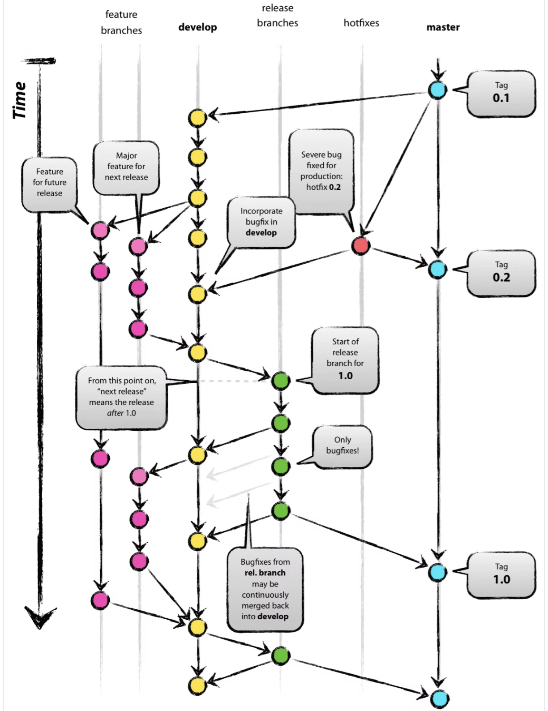

# 課題1

## Table of Contents
<!-- START doctoc -->
<!-- END doctoc -->

## GitHub FlowとGitflowを図解してください

- GitHub Flow

- Gitflow

## GitflowとGitHub Flowのメリット・デメリット

|ブランチ戦略|メリット|デメリット|
|-------------|-------------------------|------------------------|
|Gitflow|・大規模開発、リリース頻度が月ごとのような場合で、リリース管理を厳密を行ないたい時に向いている|・ブランチの種類が多く複雑なため、管理に手間がかかる（フローを理解して管理できる仕組みがないと、破綻してしまう）|
|GitHub Flow|・ブランチの種類が少なく、シンプルで理解しやすいため、操作ミスが起きにくい。 ・本番環境へのデプロイ頻度が高い（毎日とか）場合に向いている|・iOSアプリケーションのようにリリース作業（主に審査→最大2週間ほど）が必要で開発中状態とリリース状態に差が生まれる期間が長いアプリケーション開発の場合はあまり向かないのではと思う|

## 参考

- [リポジトリ（GitLab）入門](https://zenn.dev/ryo_4947123/books/497459787cb294/viewer/branchstrategy)
- [Git-flowって何？](https://qiita.com/KosukeSone/items/514dd24828b485c69a05)
- [[日本語訳]A successful Git branching model](https://qiita.com/homhom44/items/9f13c646fa2619ae63d0)