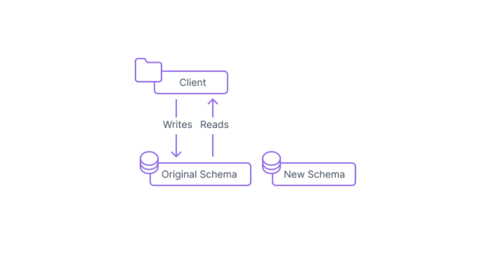
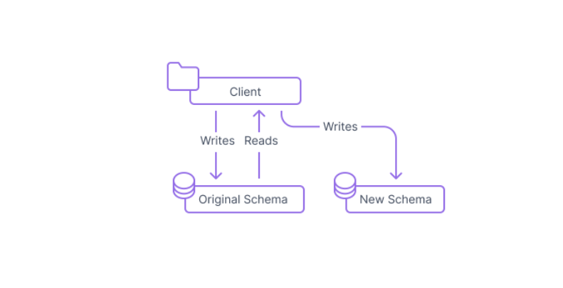
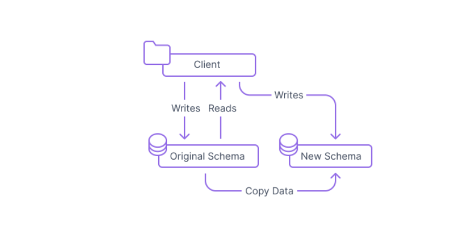
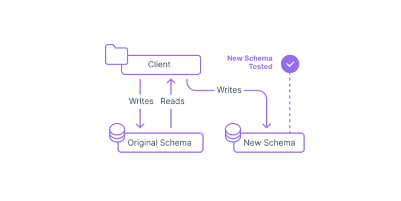
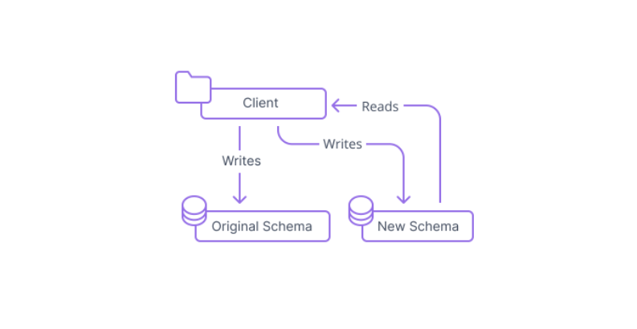
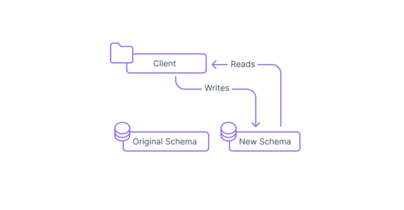
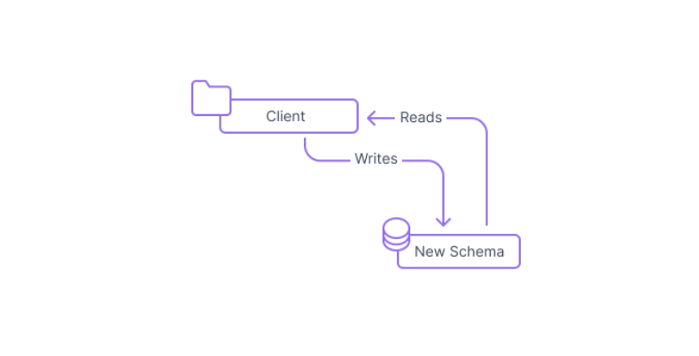

# 課題1

## Table of Contents
<!-- START doctoc -->
<!-- END doctoc -->

## expand and contract patternとは

- データベース管理者とソフトウェア開発者が、稼働時間に影響を与えることなく、古いデータ構造から新しいデータ構造へデータを移行するためのプロセス
- プロセス
  1. 新しいスキーマを構築してデプロイ
  
  2. インターフェースを展開する
    - 読み込みは元のスキーマを見る
    - 書き込み操作をすると、元のスキーマと新しいスキーマの両方を見る
  
  3. 既存のデータを新しいスキーマに移行する
    - 既存の値をコピーするだけでいい場合もあれば、2つのスキーマの違いを考慮して、データを変更する場合もある
  
  4. 新しいインターフェースをテストする
    - 本番クライアントはまだ元のスキーマを正として使用する
  
  5. 読み取りを新しいインターフェースから行うよう変更
  
  6. 書き込みも新しいインターフェースから行うよう変更
  
  7. システムから元のスキーマを削除する
  

## 開発環境でマイグレーションを実施した時は問題なかったのに、本番環境で実施したら失敗することが時々あります。特に既存テーブルのカラムにNOT NULL制約を追加する時によく起きるのですが、何故でしょうか？この失敗を避けるためには、どのような対策が有効でしょうか？

- なぜか？
  - `NOT NULL`制約をかけたいカラムに`NULL`の値が入っている場合、エラーが発生する
- 対策
  - 制約を追加する前に、`NULL`の値を別の値へ変更してから、マイグレーションを行う

## 参考

- [Using the expand and contract pattern for schema changes](https://www.prisma.io/dataguide/types/relational/expand-and-contract-pattern)
- [NOT NULL制約追加時のinvalid use of NULL valueを解消する](https://www.tech-blog.startup-technology.com/2020/45eab0643a96ca9278d2/)
- [rails db:migrate 時にエラーが発生しました。](https://teratail.com/questions/250175?rss=all)