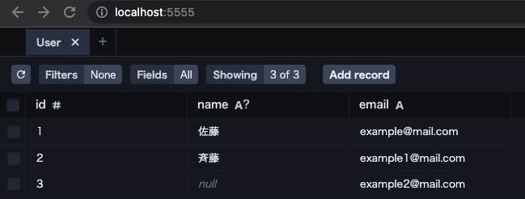
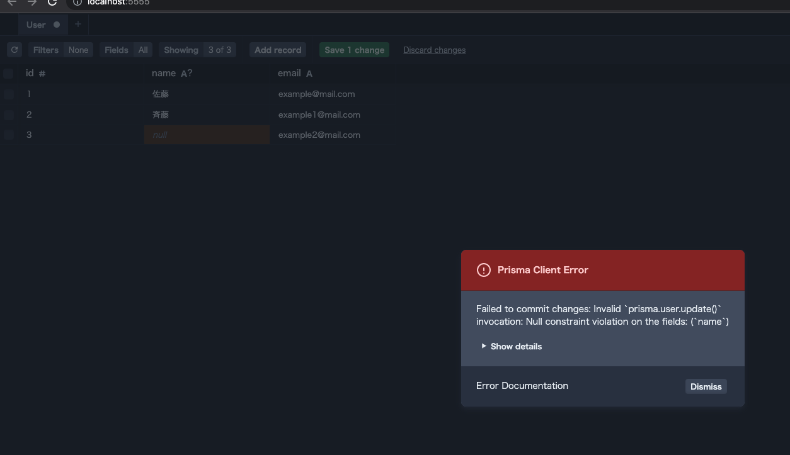

# 課題2
## Table of Contents
<!-- START doctoc -->
<!-- END doctoc -->

### マイグレーション準備

- 特大課題がまだ終わっていないので、課題１の例を取って作成する

- 変更前データは以下の通り



- 変更内容
  - `name`カラムに`NOT NULL`制約を追加する
- まず課題1の質問にあったように、デフォルト値を変える前にマイグレーションを実行する
  - `npx prisma migrate dev --name add_not_null_lim
itation_to_name`
  - 想定通り、エラーが発生する

```shell
$  npx prisma migrate dev --name add_not_null_lim
itation_to_name 
Prisma schema loaded from prisma/schema.prisma
Datasource "db": SQLite database "dev.db" at "file:./dev.db"


Error: 
⚠️ We found changes that cannot be executed:

  • Step 0 Made the column `name` on table `User` required, but there are 1 existing NULL values.

You can use prisma migrate dev --create-only to create the migration file, and manually modify it to address the underlying issue(s).
Then run prisma migrate dev to apply it and verify it works.
```

## マイグレーションの作業手順書
### マイグレーション手順書

#### 作業環境

- 作業者名：xxx
- 作業目的：`User`テーブルの`name`カラムに、`NOT NULL`制約を追加する
- 作業日時：yyyy/MM/dd hh:mm - hh:mm
- 対象システム：xxx

#### 作業前の注意事項

- 各手順を実行前、実行後にSlackで報告すること
- コマンドやクエリを実行した際は、スクリーンショットまたはテキストをコピーして保存しておくこと

#### 作業手順

1. 以下のコマンドを実行して、SQLiteにアクセスする

`SQLiteにアクセスするコマンド`

2. 以下のコマンドを実行して、`User`テーブルのデータのバックアップを取得する
   - サービス稼働時間を考慮して別日までに完了させておくのもあり

`バックアップを取得するコマンド`

3. 以下のクエリを実行し、想定通りの結果となることを確認する
   - 目的：マイグレーション後に問題が起きた場合に、マイグレーション前から問題があったのか原因の切り分けを容易にするため
   - 以下のクエリを実行する

`実行するクエリ`

4. 以下のクエリを実行し、`User`テーブルのテーブル定義を確認する
   - 以下のクエリを実行する

`実行するクエリ`

   - `name`カラムに`NOT NULL`制約がついていないことを確認する

5. `./prisma-workshop-main/prisma/`ディレクトリに`schema.prisma`ファイルが存在することを確認する

6. 以下のクエリを実行して、カラムに`NULL`の値がある場合、` `（空文字）に置換する

`実行するクエリ（今回はprisma studioから直でデータを書き換え）`

7. 以下のコマンドを実行し、`name`カラムに`NOT NULL`制約を追加する
  
  `npx prisma migrate dev --name add_not_null_limitation_to_name`

8. 以下クエリを実行し、想定通りの結果となることを確認する

`実行するクエリ`

#### 発生しうる問題

- 問題：7のコマンド実行時に、以下のエラーが発生
  - 対策：`name`カラムに`NULL`値が存在しているため、6の実行結果を確認する。実行していない場合は実行する。

```shell
Step 0 Made the column `name` on table `User` required, but there are 1 existing NULL values
```

### マイグレーションの実施

- マイグレーションを実行する
  - マイグレーション手順書通りではなく、一部省略している
  - 以下は、7を実施したときのログ

```shell
$  npx prisma migrate dev --name add_not_null_limitation_to_name
Prisma schema loaded from prisma/schema.prisma
Datasource "db": SQLite database "dev.db" at "file:./dev.db"

Applying migration `20220508060653_add_not_null_limitation_to_name`

The following migration(s) have been created and applied from new schema changes:

migrations/
  └─ 20220508060653_add_not_null_limitation_to_name/
    └─ migration.sql

Your database is now in sync with your schema.

✔ Generated Prisma Client (3.11.0 | library) to .
/node_modules/@prisma/client in 580ms
```

- `name`カラムに`NOT NULL`制約がかかったため、`NULL`が設定できなくなった



### 上記以外に、どのような情報を手順書に残しておくと良いか?

- 作業環境
- 関連する構成図
- エスカレーション先
- フォールバック手順
  
## 参考

- [【システム運用】本番作業の心得](https://teruyalog.com/production-work-knowledge/)
- [本番作業の作業手順書の書き方](https://note.com/rhayahi/n/nf3d98e0fd1fe)
- [【社内資料公開】運用手順書を作る時のポイントについて書いてみた](https://dev.classmethod.jp/articles/cm-operation-manual-howto/)