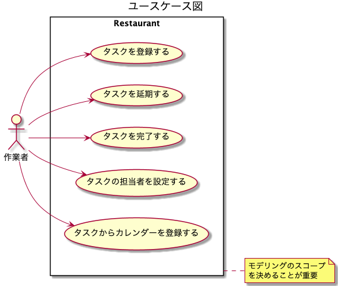

# 課題1

## Table of Contents
<!-- START doctoc generated TOC please keep comment here to allow auto update -->
<!-- DON'T EDIT THIS SECTION, INSTEAD RE-RUN doctoc TO UPDATE -->
<details>
<summary>Details</summary>

- [質問1](#%E8%B3%AA%E5%95%8F1)
  - [回答](#%E5%9B%9E%E7%AD%94)
- [ドメイン駆動設計についての整理](#%E3%83%89%E3%83%A1%E3%82%A4%E3%83%B3%E9%A7%86%E5%8B%95%E8%A8%AD%E8%A8%88%E3%81%AB%E3%81%A4%E3%81%84%E3%81%A6%E3%81%AE%E6%95%B4%E7%90%86)
  - [DDD概要](#ddd%E6%A6%82%E8%A6%81)
  - [モデリングから実装まで](#%E3%83%A2%E3%83%87%E3%83%AA%E3%83%B3%E3%82%B0%E3%81%8B%E3%82%89%E5%AE%9F%E8%A3%85%E3%81%BE%E3%81%A7)
  - [DDD固有のモデリング手法](#ddd%E5%9B%BA%E6%9C%89%E3%81%AE%E3%83%A2%E3%83%87%E3%83%AA%E3%83%B3%E3%82%B0%E6%89%8B%E6%B3%95)
  - [ドメイン層の実装](#%E3%83%89%E3%83%A1%E3%82%A4%E3%83%B3%E5%B1%A4%E3%81%AE%E5%AE%9F%E8%A3%85)
  - [ユースケース層の実装](#%E3%83%A6%E3%83%BC%E3%82%B9%E3%82%B1%E3%83%BC%E3%82%B9%E5%B1%A4%E3%81%AE%E5%AE%9F%E8%A3%85)
  - [CQRS](#cqrs)
  - [プレゼンテーション層の実装](#%E3%83%97%E3%83%AC%E3%82%BC%E3%83%B3%E3%83%86%E3%83%BC%E3%82%B7%E3%83%A7%E3%83%B3%E5%B1%A4%E3%81%AE%E5%AE%9F%E8%A3%85)
  - [アーキテクチャ全般、ライブラリなど](#%E3%82%A2%E3%83%BC%E3%82%AD%E3%83%86%E3%82%AF%E3%83%81%E3%83%A3%E5%85%A8%E8%88%AC%E3%83%A9%E3%82%A4%E3%83%96%E3%83%A9%E3%83%AA%E3%81%AA%E3%81%A9)
  - [例外処理についての整理](#%E4%BE%8B%E5%A4%96%E5%87%A6%E7%90%86%E3%81%AB%E3%81%A4%E3%81%84%E3%81%A6%E3%81%AE%E6%95%B4%E7%90%86)
- [参考](#%E5%8F%82%E8%80%83)

</details>
<!-- END doctoc generated TOC please keep comment here to allow auto update -->

## 質問1

> 用語の解説をしてください

### 回答

- [ドメイン駆動設計についての整理](#ドメイン駆動設計についての整理)を参照

## ドメイン駆動設計についての整理

- 以下を読んだまとめを行う
  - （書籍）ドメイン駆動設計 モデリング/実装ガイド

### DDD概要

- DDDとは
  - ソフトウェア開発手法の1つ
    - ソフトウェア開発の目的
      - ある領域に存在する特定の問題を解決するため
      - ドメイン：その領域をさす
- モデル
  |モデル|概要|
  |---|---|
  |ドメインモデル|ドメインの問題を解決するためのモデル|
  |データモデル|データの永続化方法を決める（永続化方法の効率化という問題解決を行う）ためのモデル|
  - 良いモデル
    - 問題を解決できるモデル
    - 良いモデルを作る方法
      - ドメインエキスパートと会話する
        - ドメインエキスパート
          - アプリケーションで問題解決しようとする採用管理領域に詳しい人
      - 運用して得られた発見をモデルに還元する
        - リリースして運用してみたら意外な改善点が合ったなど、その発見をモデルに反映する
        - 最初からモデルは完成せず、徐々に改善していくもの
        - モデルを更新したら、コードも頻繁に変更する
          - 極力、モデルとコードの表現をオブジェクト指向を使って近づける
          - 軽量DDD
            - 頻繁な変更に耐えうる拡張性の高い設計のベストプラクティスのパターンのみを取り入れること
        - 重要な単語

        |単語|概要|
        |----|----------------|
        |ユビキタス言語|発見したモデルの言葉を全ての場所で使うという指針<br>開発者だけではなく、ビジネス側の人とも同じ言葉を使う。<br>会話でも、ドキュメントでも、コードでも。<br>方法は3つあるが、日本語と英語の対応を決めて変換するのが日本では多い。|
        |境界づけられたコンテキスト||
- 取り組む上で重要なこと
  - 課題ドリブン
    - ルールで決められているからこう、ではなく、目的を明確化して認識合わせをすることが重要
  - 小さく初めて小さく失敗する

### モデリングから実装まで

- ユースケース図の作成
  - ユーザの要求に対するシステムの振る舞いを定義する図
  - ユースケースを具体化しないとどのようなモデルを作成すれば良いか判断できないため
  - スコープを決める目的
    - 議論の範囲を狭めて限られた時間で成果を出せるようにするため



- ドメインモデル図
  - 簡易化したクラス図
    - ルール/制約
      - オブジェクトの生成や更新時に守らなければいけないルール
    - 集約
      - 表現方法
        - 集約内の参照はインスタンス参照となる
        - 集約外の参照はID参照となる
- ドメイン層オブジェクト設計の基本方針
  - ドメインモデルの知識を対応するオブジェクトに書く
    - ドメイン知識（ルール/制約）を表現する実装を、ドメイン層のオブジェクトに寄せていく
  - 常に正しいインスタンスしか存在させない
    - その方法
      |方法|概要|
      |-------|------------------|
      |生成条件の強制|全てのインスタンスはコンストラクタ、もしくはファクトリーメソッドを経由して生成される。<br>デフォルトコンストラクタを放置せず、意味のあるメソッドだけ存在するようにする|
      |ミューテーション条件の強制|全ての内部状態の変更が正しいようにする。<br>全ての項目に対するセッターをpublicにすると他のusecaseクラスで自由に不整合なデータを作成できてしまう。また仕様を追いかけるのに、多くのクラスをコード参照から追う必要がある。|

### DDD固有のモデリング手法

- 集約
  - 必ず守りたい強い整合性をもったオブジェクトのまとまり
  - ドメインモデリングでは、全てのオブジェクトはいずれかの集約に所属するようにする
    - 集約のオブジェクトを扱うときの親となるオブジェクトを集約ごとに1決め、そのオブジェクトを「集約ルート」と呼ぶ
  - 設計、実装時のルール
    - 強い整合性確保が必要なものを1つの集約にする
    - トランザクションを必ず1つにする
      - 1つの集約のオブジェクトは、必ず集約単位でリポジトリから取得し、集約単位でリポジトリに渡す
      - 目的
        - 集約内のオブジェクトの整合性が崩れるのを防ぐ
  - 集約の境界
    - 整合性を確保する必要性の強さ
      - 複数の集約の間での整合性を確保しないわけではないが、実装上のコストや難易度が上がるため、その必要性の強さに基づいて判断する
    - トランザクションの範囲の適切さ
      - 集約の範囲を大きくすると、データベースに対して必要以上に大きなロックをとるため、問題が発生する
- 境界づけられたコンテキスト
  - モデルの共有
    - 発見したモデルの言葉を全ての場所で使うという指針、に従い、関係者すべてで統一したモデルを作成することは、システムが大規模になると難しい
    - 上記の解決策として、モデルが適用される範囲を明示的に定義し、それぞれの中でモデル、言語の統一を目指す
      - 例えば、商品といった時に、販売部がイメージする商品と、配送部がイメージする商品は、異なるので、それは別のコンテキストと言える
    - シンプルなのは、「1アプリケーション1コンテキスト」
      - 1つのコンテキストごとに、1つのオニオンアーキテクチャなどに沿った実装をする
        - つまりマイクロサービスになる
        - **だが、実際は実装上のコストが大きいため、これをアレンジする必要がある**
      - コンテキスト同士の通信方法
        |通信方法|概要|
        |-------|----------------|
        |同期通信|ネットワーク経由のダイレクトコール（REST APIなど）|
        |非同期通信|メッセージキューを利用したイベント通信（AWS SQS）|
    - 1コンテキスト1アプリケーション以外の場合
      - パッケージなどで分割して表現する

### ドメイン層の実装

- ドメインモデルを表現するもの（ドメインオブジェクト）

|種類|概要|
|-----------|---------------------|
|エンティティ（モノ）|同一判定を識別子で行う（例えば社員のモデルの場合は、社員番号など）<br>エンティティは可変。|
|値オブジェクト（モノ）|同一判定を保持する値で行う（例えばお金で考えると、2つの10円玉があった場合、その2つを区別する必要はない場合は値オブジェクト）<br>また、値オブジェクト自体は不変。10円玉は製造されたらその価値が100円になったりすることはない。|
|ドメインサービス|モデルをオブジェクトとして表現すると無理があるもの、の表現に使う<br>極力エンティティと値オブジェクトで実装して、どうしても避けられない場合に使う！|
|ドメインイベント（コト）|ドメインエキスパートが気に掛ける、何かの出来事。<br>集約の中で実装することが多そう。。|

- ドメインオブジェクトを利用するもの

|種類|概要|
|-----------|---------------------|
|リポジトリ|集約単位で永続化層へのアクセスを提供する。<br>リポジトリは集約ごとに1つ。リポジトリから子オブジェクトを直接返したり、子オブジェクト用のリポジトリを別途定義したりしてはいけない。<br>インターフェースはドメイン層、その実装クラスがインフラ層になる。<br>Listのように扱うことがポイント。Listに持たせないようなドメイン知識（制約やルール）を持っているのであれば別のクラスへ委譲すべき。<br>そうすることでテストも容易になる|
|ファクトリー|オブジェクトの生成ロジックが複雑な場合や、他の集約を参照する必要がある場合、生成の責務を持ったオブジェクトを独立させる。<br>ドメインサービスの一種でもある。|
|ドメインサービス||

- 上記以外のパターンを使うことも問題ない
  - ドメイン層は、以下が重要であり、それが実現できれば上記のパターンに限る必要はない
    - ドメイン知識を表現する
    - モデルを直接表現するオブジェクトをかく

- 複数集約間の整合性確保

|確保する方法|概要|メリット|デメリット|
|----------|---------------|------|-----|
|ユースケース層のイベントで確保|ユースケースクラスの1メソッドの中で複数集約のオブジェクトをそれぞれのリポジトリを使って永続化する|実装は簡単|別のユースケースクラスのメソッドで整合性を破る処理を書くことが可能になってしまう|
|ドメインイベントを用いて結果整合性で確保|ドメイン層のオブジェクトの操作に対してイベントを発火させ、別集約の操作を呼び出す方法|確実に整合性を確保できる|技術的に実装が複雑になる|

### ユースケース層の実装

- ユースケース
  - ドメイン層のクラスが公開しているメソッドを組み合わせて、ユースケースを実現する
    - ドメインオブジェクトの生成や状態の変更、リポジトリを使用した永続化を行う
    - ドメイン知識をドメイン層のクラスに実装できると、ユースケースクラスには抽象度が高い、ユースケース記述のような実装が残る

```java
public class TaskPostponeUseCase {
  @Autowired
  private TaskRepository taskRepository;
  
  @Transactional
  public void postpone(Long taskId) {
    Task task = taskRepository.findById(taskId);
    // ドメインオブジェクトの状態の変更 
    task.postpone()
    // リポジトリを使用した永続化
    taskRepository.save(task)
  }
}
```

- ユースケースからの戻り値クラス
  - ユースケース層からプレゼンテーション層に返す値の型には、以下があるが、1の方が有利

|方法|メリット|デメリット|
|--------------|--------|------------|
|専用の戻り値クラス（書籍ではDTO（Data Transfer Object）と呼ばれる）に詰め替えて返す|ドメインオブジェクトに、プレゼンテーションに関する処理が混入するのを防げる|ドメインオブジェクトからの詰め替えコストが発生する|
|ドメイン層のクラス（ドメインオブジェクト）をそのまま返す|ドメインオブジェクトを詰め替える必要がない|表示に関わるメソッドをついドメインオブジェクトに置いてしまいがちになる|

- ユースケースの分割の粒度
  - 1クラス1パブリックメソッド
  - 共通の処理が欲しくなった場合は、プライベートメソッドではなく、その責務を負ったクラスとして切り出し、複数のユースケースクラスで共有する
  - 一般的にコントローラーと呼ばれるクラスが定義される

### CQRS

- CQRS（Command Query Responsibility Segregation コマンドクエリ責務分離）
  - ユースケース層に定義する内容
  - 参照に使用するモデルと更新に使用するモデルを分離する
    - 更新系モデル
      - ドメインオブジェクト（エンティティ、値オブジェクト）をそのまま利用する
    - 参照系モデル
      - 特定のユースケースに特化した値の型を定義する
      - その値を取得するためのサービスも独自に定義

```java
// 特定のユースケースに特化した値の型を定義
public class TaskDto {
  private String taskId;
  private String taskName;
  private String userName;
  private String labelName;
}
// その値を取得するためのサービスも独自に定義
// 以下のインターフェースは、ユースケース層に定義
// 具体的な実装は、インフラ層に定義
public interface TaskQueryService {
  public List<TaskDto> fetchByUser(UserId userId);
}
```

- メリット
  - 複数の秀略にまたがるデータを取得するさいのコードがシンプルになり、保守性が高まる
  - クエリパフォーマンスが上がり、チューにングしやすくなる
  - 複数集約の条件で絞り込んでのページングができるようになる
- デメリット
  - ドメインオブジェクトのデータが参照されている場所が追いにくくなる
  - アーキテクチャ自体が複雑になり、理解にコストがかかる

- 型（DTO）を定義するのがユースケース層である理由
  - 最適な参照モデルは個別のユースケースに依存したものだから
  - また戻り値の型は、完全に一致しない限り使いまわすべきではない
    - どこで何を使っているのかがわからなくなり、肥大化して保守性が落ちてしまうため

- 更新系との整合性を確保する方法
  - 業務上重要な部分に関しては、更新処理との結合テストを書くと良い
    - 例えば承認処理と参照処理の2つのユースケースがある場合、承認処理に続けて参照処理のユースケースを呼び出すテストをかく

### プレゼンテーション層の実装

- クライアントとアプリケーションの入出力を実現する
  - クライアントとユースケース層の間に位置し、リクエスト/レスポンスの変換を行う

### アーキテクチャ全般、ライブラリなど

- 例外処理
  - 言語によっても異なる

  |種類|ケース|処理の仕方|
  |---------|------------|-------|
  |想定外の例外|サーバー側の処理で500台のレスポンスを返すような場合<br>他の外部リソース（DBやファイル、外部サービスなど）との入出力で、接続エラーや値の読み込みエラーなど<br>データの整合性が想定外に崩れている場合（データAがあればBが帰るはずなのに、結果が0件になってしまったなど）|ユーザは通常ユースケースとしての回避策がないため、内部エラー時の共通レスポンスを返す|
  |想定通常のユースケースで発生しうる例外|クライアント側の問題で、400台のレスポンスを返す場合<br>例えばバリデーションエラーなど<br>|内容に応じて、例外を投げるレイヤーが異なるため、それぞれのレイヤーに応じたバリデーションを行い、異常があればそのレイヤーで定義している例外を投げる|

  - 想定通常のユースケースで発生しうる例外の対応方法（レイヤー別）

  |レイヤー|例外|
  |----------|---------|
  |プレゼンテーション層|API仕様としてリクエストパラメータの必須/任意、最大文字数などの制限を満たしていなかった場合|
  |ドメイン層|ドメイン知識（ルール/制約）をチェックし、違反した場合にドメイン層で定義する例外を投げる。<br>ユースケース層は、ドメイン層から受け取った例外を受けて呼び出し元にどう返すかの判断を行う|
  |ユースケース層|あらかじめ想定する異常系の処理パターンだった場合に、ユースケース層で定義する例外を投げる<br>ユースケースないの分岐で例外を投げる場合と、ドメイン層の例外をキャッチして投げる場合がある|

- バリデーション内容の重複
  - ドメイン層とプレゼンテーション層で同じ内容のバリデーションをしたくなる場合がある
  - どの層でバリデーションをすべきかは一長一短のため、一概にどちらが良いとは決められない。プロジェクトに置いて考慮して決定することになる
  - 実践ドメイン駆動設計、では「ユーザーインターフェイスにおけるバリデーションは、ドメインモデルでのバリデーションとは別の種類のものだ。<中略> ユーザーインターフェイスではあくまでも粗いレベルでのバリデーションにとどめ、業務に関する深い知識はモデルの中だけで表現するようにしたい」とある
  - texta.fm第二回によると、バラバラにバリデーションエラーが見つかる度にエラーを返却するのではなく、なるべく浅いレイヤーで**まとめて**返却すべき

|バリデーションを行う層|行うべきバリデーション|メリット|デメリット|
|-----------------|-------------------|------------------|----------|
|ドメイン層|ドメインのルールや制約に関するバリデーションを行う <br>　データの整合性の保証にあたるため、他の層のバリデーションよりも優先すべき|データの整合性を保証できる|特になし？|
|プレゼンテーション層|APIの仕様として外部にリクエストの仕様を公開したい場合 <br> 特にAPIドキュメントからコントローラを自動生成したい場合|プレゼンテーション層でルールを明示的に管理できる|同じ内容のバリデーションがドメイン層と重複し、仕様変更時に修正が漏れるリスクが発生する|
|フロントエンドモジュール|-|サーバーへの通信を抑えることができる（それによるUX向上）|バリデーションの実装がサーバーサイドと重複し、仕様変更時に修正が漏れるリスクがある（記載はなかったが）|


- パッケージ
  - レイヤーをパッケージのルートの回想で分けるのが良い
    - 設計の一番初めでは、設計対象の処理がどのレイヤーの責務に属するかということ
  - 複数の箇所で共有されるオブジェクトは、該当するレイヤーのパッケージ以下に`shared`などの意図が明確な名前をパッケージを作り、そこにまとめる

- フレームワークへの依存（Webだけでなくネイティブアプリの実装でも同じことが言えると思う）
  - 全てのレイヤーにおいて、完全に依存を排除するのは難しいため、レイヤーごとにポリシーを決めるのが現実的

  |レイヤー|Webフレームワークへの依存|
  |----------|---------|
  |ドメイン層|一切依存しないようにすべき<br>リポジトリなどの他のインスタンスを使用する場合に、DIライブラリへの依存が発生する場合は、コストよりもメリットが大きいため、許容範囲と考えれる。|
  |ユースケース層|部分的な依存が発生する<br>|
  |プレゼンテーション層|必然的にフレームワークへの依存が発生するが、責務上仕方ない。<br>このレイヤーにフレームワーク固有の実装を閉じ込めることが重要|

- ORマッパー
  - Active Record型のような、テーブルと対応したクラスをそのままドメイン層のクラスとして使ってはいけない
    - 以下のようなデメリットがある
      - 全ての項目にセッターがあるため、更新処理に制御をかけられなくなる
      - テーブルとオブジェクトが切り離せなくなるため、オブジェクトとテーブルの設計に望ましくない制約がかかる
    - そのまま利用せずに、そのようなクラスはインフラ層のリポジトリの実装クラスに閉じ込め、DBデータを取得した結果をドメイン層のクラスに詰め替える処理をする

- 言語
  - 静的型付け言語が向いている
  - 動的型付け言語でも、タイプヒントと静的解析の組み合わせで補完することができる

### 例外処理についての整理

- 例外処理（文字数のバリデーションなど）はどの層で実装すべきか、を検討するために調べたことを整理する

- 

## 参考

- （書籍）ドメイン駆動設計 モデリング/実装ガイド
- [little-hands/ddd-q-and-a](https://github.com/little-hands/ddd-q-and-a)
- [DDD基礎解説：Entity、ValueObjectってなんなんだ](https://little-hands.hatenablog.com/entry/2018/12/09/entity-value-object)
- [お前らがModelと呼ぶアレをなんと呼ぶべきか。近辺の用語(EntityとかVOとかDTOとか)について整理しつつ考える](https://qiita.com/takasek/items/70ab5a61756ee620aee6)
- [『実践ドメイン駆動設計』に基づいてTypeScriptで設計した話](https://qiita.com/Umibows/items/4146b4147e2340686744)
- [iOS/Androidアプリへドメイン駆動設計（DDD）を導入してCleanArchitectureを目指す [導入編]](https://qiita.com/KazaKago/items/7c58d05ec388821d7b52)
- [sergdort/CleanArchitectureRxSwift](https://github.com/sergdort/CleanArchitectureRxSwift)
- [ドメイン駆動設計のエンティティとクリーンアーキテクチャのエンティティ](https://nrslib.com/clean-ddd-entity/#outline__3)
- [クリーンアーキテクチャ完全に理解した](https://gist.github.com/mpppk/609d592f25cab9312654b39f1b357c60)
- [Swift/iosで開発するドメイン駆動~DDD(風)なモダンなアーキテクチャ](https://qiita.com/ko2ic/items/6ac7321189e8c3ac1665)
- [Consumer-driven Coupling: Patterns and Anti-patterns](https://medium.com/nick-tune-tech-strategy-blog/consumer-driven-coupling-patterns-and-anti-patterns-697fabc07756)
- [Antipatterns in Domain Driven Design](https://completedeveloperpodcast.com/antipatterns-in-domain-driven-design/?utm_source=rss&utm_medium=rss&utm_campaign=antipatterns-in-domain-driven-design)→元気な時に聞きたい、読みたい
- [Clean Authentication with Typescript+Inversify+DDD](https://www.youtube.com/watch?v=CB9ejEsmTZY)