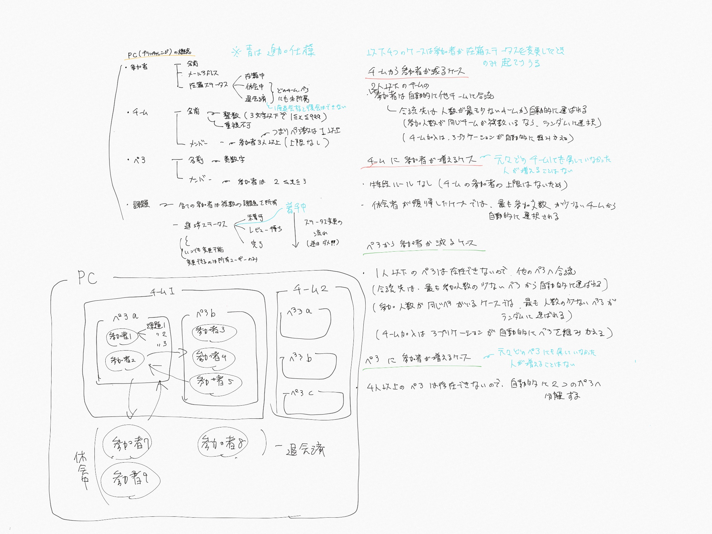
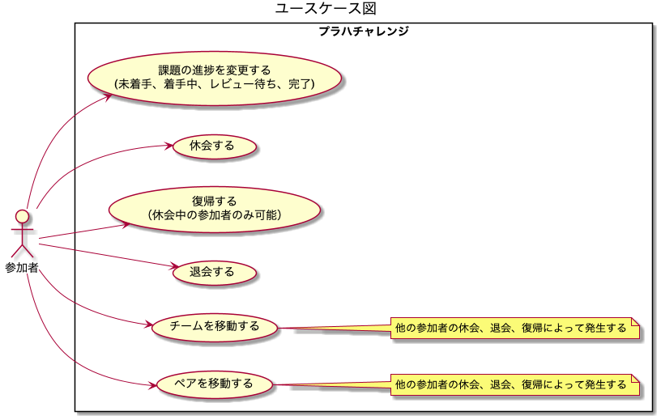
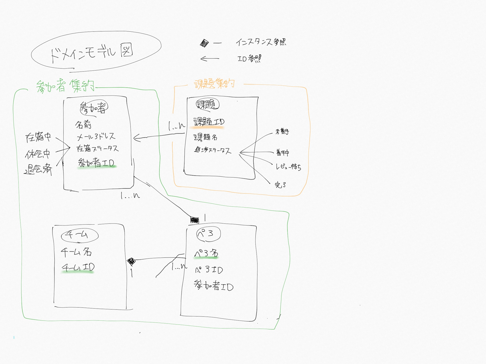
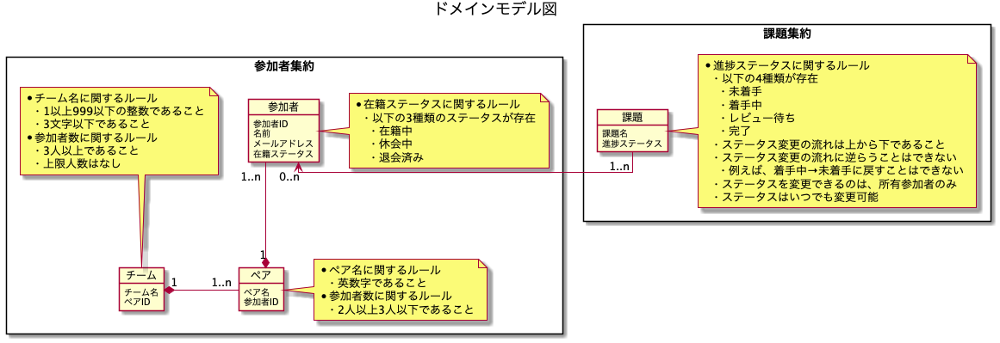
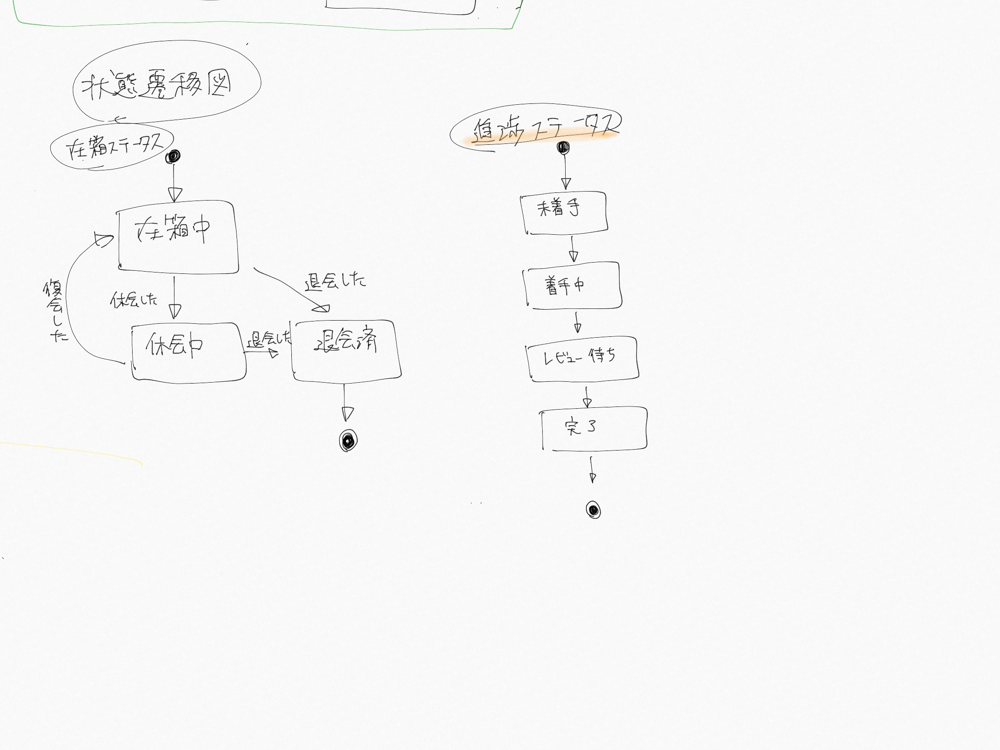
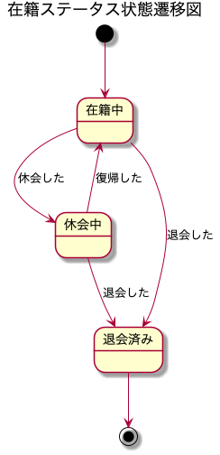
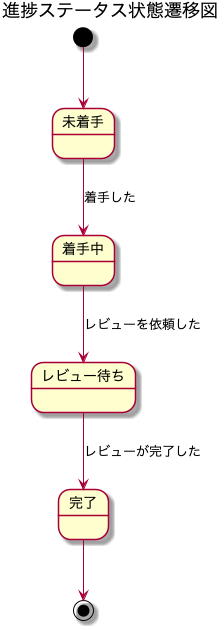

# 課題1

## Table of Contents
<!-- START doctoc generated TOC please keep comment here to allow auto update -->
<!-- DON'T EDIT THIS SECTION, INSTEAD RE-RUN doctoc TO UPDATE -->

Details

  - [プラハチャレンジの概念を表現するモデル図を作成してください](#%E3%83%97%E3%83%A9%E3%83%8F%E3%83%81%E3%83%A3%E3%83%AC%E3%83%B3%E3%82%B8%E3%81%AE%E6%A6%82%E5%BF%B5%E3%82%92%E8%A1%A8%E7%8F%BE%E3%81%99%E3%82%8B%E3%83%A2%E3%83%87%E3%83%AB%E5%9B%B3%E3%82%92%E4%BD%9C%E6%88%90%E3%81%97%E3%81%A6%E3%81%8F%E3%81%A0%E3%81%95%E3%81%84)
- [課題2](#%E8%AA%B2%E9%A1%8C2)

<!-- END doctoc generated TOC please keep comment here to allow auto update -->

## プラハチャレンジの概念を表現するモデル図を作成してください

- 今回解決すべき問題
  - プラハチャレンジの進捗を管理する

- 以下は概念やルールの理解のためにまとめたメモ

- 追加仕様（課題には記載がないが、こちらで決めた補足）
  - 課題のステータスには、「着手中」も存在し、未着手とレビュー待ちの間に当たる
  - 参加者、チームやペアの構成変更、または退会休会を行うことはあっても、元々チームやペアにいなかった人物が参加者として新たに加わることはないものとする
  - チームやペアの構成変更が起きるトリガーは、参加者が在籍ステータスを変更した場合のみとする
  - 一度退会した参加者は、復帰することはできない
  - 参加者のメールアドレスは、メールアドレスの形式に従ったものしか登録できない
- 仕様に関する疑問
  - 課題の進捗ステータスには、着手中のような課題に取り組んでいるがまだレビューには回せない状態が存在するはずだが、それはなくても問題ないのか？
    - 補足仕様として追加する

- ユビキタス言語
  - ドメインエキスパートやソフトウェア開発者を含めたチーム全体で作り上げる共有言語のこと
  - 都度改善予定

|用語（日本語）|用語（英語）|意味|
|------------|--------------|---------------------|
|参加者|participant|プラハチャレンジの参加者（メンターや運営は除く）|
|チーム|team|参加者が必ず属している。|
|ペア|pair|参加者が必ず属している。必ずチームに属する。|
|課題|issue|プラハチャレンジで用意されている課題。参加者が所有している。|
|進捗ステータス|progression status|課題の進捗。|
|未着手|not started|課題にまだ取り組んでいない状況。|
|着手中|working|課題に取り組んでいる最中の状況。|
|レビュー待ち|waiting for review|課題に取り組み終わり、ペアのレビューを待っている状況。|
|完了|completed|課題に取り組み終わり、ペアによるレビューが完了した状況。|
|在籍ステータス|registration status|参加者のプラハチャレンジへの在籍状況。|
|在籍中|enroll|プラハチャレンジに参加している状況。|
|休会中|recess|プラハチャレンジへの参加を一時中断している状況。|
|退会済み|withdrawal|プラハチャレンジへの参加を完全に辞めた状況。|
|復帰|return|休会していた参加者がプラハチャレンジに復帰すること。|

- ユースケース図
  - ユーザの要求に対する振る舞いを定義する図
  - スコープを決める必要がある
    - 今回は課題に記載されていることのみが与えられたドメインに関する知識と想定し、そこに記載されている内容は全てスコープ内とする

- モデル図
  - 簡易化したクラス図のようなもの
    - オブジェクトの代表的な属性をかくが、メソッドまで描かなくて良い
    - ルール/成約を吹き出しに書き出す
      - オブジェクトの生成や更新時に守らなければいけないルール
    - オブジェクト同士の関連を示す
    - 多重度を定義する
    - 理解を促進するために、具体例を書いても良い
  - 集約
    - 必ず守りたい強い整合性をもったオブジェクトのまとまり
    - 全てのオブジェクトはいずれかの集約に属する！
    - 必ず集約単位でリポジトリから取得し、集約単位でリポジトリに渡す
    - **モデリング時に決め切ろうと考えず、実装してからまたモデルに戻って試行錯誤するくらいで良い！**

- ドメイン
  - 値オブジェクト
    - > オブジェクトの属性を変更する必要があるからという理由でエンティティを作ろうとしているのなら、まずはそれが本当に正しいモデルなのかどうかを疑ってみよう。属性の変更ではなく、オブジェクトの置き換えでも対応できるのではないだろうか？（実践ドメイン駆動設計より）
    - > 今自分が設計している概念が、他のオブジェクトとは区別して一意に識別すべきエンティティなのか、あるいは値の等価性を確認できればそれで十分なのかを考えてみよう
      - > 等価性を判断するには、二つのオブジェクトの型と、それぞれの属性を比較する。型が等しく、かつすべての属性も等しければ、二つの値は同じものだとみなす。

- ドラフト

- 状態遷移図

- ドラフト

# 課題2

- 実装は以下のリポジトリ
  - [kamimi01/implementing-ddd](https://github.com/kamimi01/implementing-ddd)