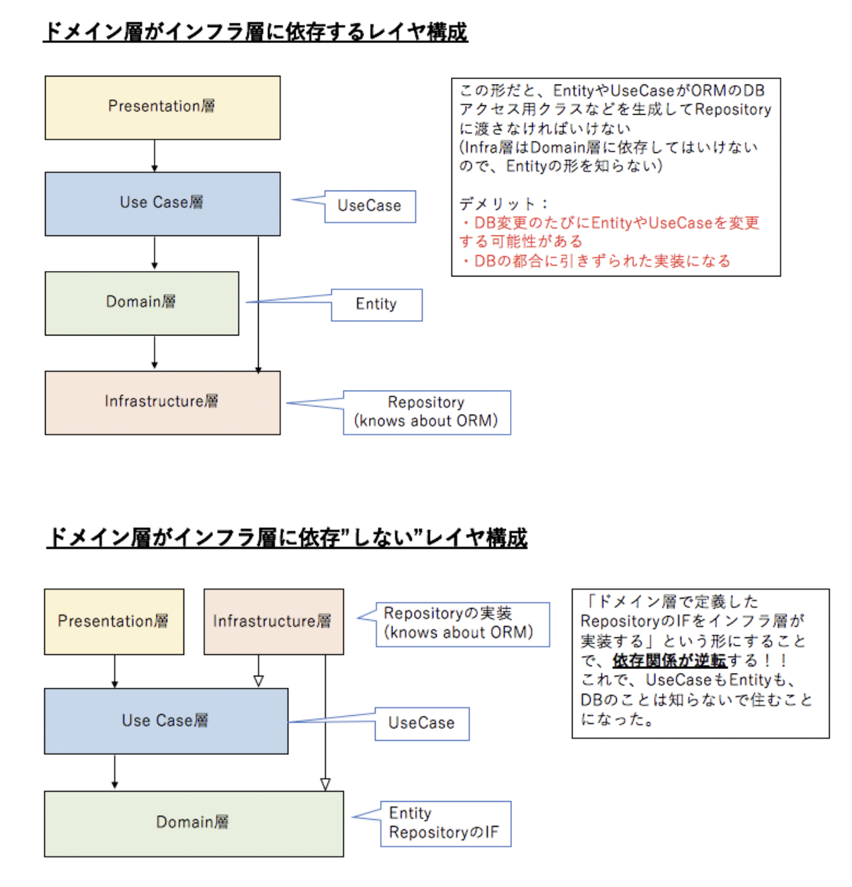

# 課題1

## Table of Contents
<!-- START doctoc generated TOC please keep comment here to allow auto update -->
<!-- DON'T EDIT THIS SECTION, INSTEAD RE-RUN doctoc TO UPDATE -->

Details

- [質問1](#%E8%B3%AA%E5%95%8F1)
  - [回答](#%E5%9B%9E%E7%AD%94)
- [質問2](#%E8%B3%AA%E5%95%8F2)
  - [回答](#%E5%9B%9E%E7%AD%94-1)
- [質問3](#%E8%B3%AA%E5%95%8F3)
  - [回答](#%E5%9B%9E%E7%AD%94-2)
- [参考](#%E5%8F%82%E8%80%83)

<!-- END doctoc generated TOC please keep comment here to allow auto update -->

## 質問1

> オニオンアーキテクチャを図解する

### 回答

- 円で表した場合

- フラットに表した場合

|Onion Architectureにおける用語|概要|備考|
|---------------|------------------------|------------|
|ドメインモデル（ドメイン層）|・もっとも中心に位置し、自分自身に依存する  ・ビジネスのエンティティとそのエンティティの振る舞いを表す ・処理の方法に依存しないビジネスロジックであり、データ構造やメソッドの集合体||
|ドメインサービス（ドメイン層）|・アプリケーション固有のビジネスロジックを実現する（構築対象のアプリケーションに対してのみ有効な処理） ・モデル層によって定義された振る舞いを契約として実行する|・契約による設計  ・もしそちらが事前条件を満たした状態で私を呼ぶと約束してくださるならば、お返しに事後条件を満たす状態を最終的に実現することをお約束します|
|アプリケーションサービス（ユースケース層）|・外部のインフラとドメイン層の橋渡しの役割をする  ・ドメイン層は、ビジネス的な機能を満たすためにデータや機能を必要とすることが良くあるが、ドメイン層は直接的にはデータや機能には依存しない  ・代わりにアプリケーション層が、ドメインサービス層に定義された契約に依存する必要がある||
|インフラストラクチャ（インフラストラクチャ層）|・外部のサービスをさす ・例えば、データベース、ファイルシステム、API、その他のWebサービスなど||
|ユーザーインターフェース（プレゼンテーション層）|・ユーザーがどのように開発されたコードと関わるか ・この層は、アプリケーションサービス層とやりとりする リポジトリの実装クラスがある（リポジトリのインターフェースはドメイン層にある）||

- 疑問
  - Onion Architectureで出てくるワードとClean Architectureで出てくるワードの対応関係を理解できているのか不安。上記のイメージで合っているのだろうか。
    - オニオンアーキテクチャとクリーンアーキテクチャで出てくる言葉は必ずしも一致しない！（例えばエンティティといっても定義が異なる）対応関係を明らかにするにはクリーンアーキテクチャの学習ももう少ししないとなんとも言えない。。

## 質問2

> ドメインモデル層は他のどの層にも依存していませんが、そのメリットは何か？

### 回答

- どの層にも依存していないため、例えばドメインモデル層にあるデータや構造体を扱う、データベースやユーザーインターフェースなど外側の層で扱うサービスが変更された場合でも、ドメインモデル層には影響を及ぼさないこと。

## 質問3

> 層をまたいだ依存関係が発生する場合、インターフェースへの依存のみ許可するメリットは何か

### 回答

- 実際の実装ではなく、インターフェースに依存することで以下のメリットがある
  - テストの際に、インターフェースに依存さえしていればモックに差し替えてテストすることが可能になる
  - 実装の実装が変わっても（例えば使用するデータベースが変わるなど）、インターフェースに依存している先には変更の影響を及ぼさないこと

- インターフェースの種類

|No|目的|メリット|備考|
|---------|--------------|-------------|---------|
|1|疎結合を目的としたインターフェイス|・クラスへの変更を弱くして変更に強くなる ・クラスへの結合が弱いので機能追加が容易になる|理想は1クラスにつき、1インターフェース|
|2|クラスの機能を保証することを目的としたインターフェイス|・実装するクラスにメソッドの実装を強制できるため、特定の機能があることを保証できる|
|3|クラスへの安全なアクセスを提供することを目的としたインターフェイス||・引数名にReadOnlyを含めるなどして、アクセス可能な方法を明示するなど|

## 質問4

> 「依存性の逆転」がオニオンアーキテクチャにおいてどのように使われているのか?

### 回答

- 以下2箇所で使用されている
  - インフラ層とドメイン層の関係
  - インフラ層とユースケース層の関係
    - インターフェースをドメイン層に定義し、インフラ層ではそのインターフェースに沿った実装クラスを持つことで、ドメイン層やユースケース層が、具体的な実装を知る必要がなくなり、拡張性に強くなる

## 質問5

> 特定のユーザにしかリソースの追加や更新を許さないようなアクセス制限機能を実装したい場合、どの層に記述するのが適切でしょうか？

### 回答

- ドメイン層に記述する
  - 「特定のユーザにしかリソースの追加や更新を許さないようなアクセス制限機能」は、今回のユースケースが、リソースの追加や更新を行うためにリソースにアクセスするというユースケースだとすると、アクセスの制限は、ドメインにおけるルールや制限に該当すると考えられるため。また、アクセス可能なユーザを特定するためには、データベースなどなんらかのデータストアへのアクセスが必要であり、クライアント側で制限をかけられる機能ではないと考えられるため、プレゼンテーション層ではないと考える。

## 質問6

> 使用するデータベースを変更する場合、どの層を変更する必要があるでしょうか？

### 回答

- インフラ層を変更する
  - インフラ層ではドメイン層で定義されたインターフェースに沿った実際の実装を行っている層であるため。インターフェースを定義している側は、実際にどのデータベースを使用しているかは隠蔽された状態のため、今回の変更の影響を受けない。

## 参考

- [[DDD]ドメイン駆動 + オニオンアーキテクチャ概略](https://qiita.com/little_hand_s/items/2040fba15d90b93fc124)
- [kamimi01/iOSArchitectureStudy](https://github.com/kamimi01/iOSArchitectureStudy#onion-architecture)
- [契約による設計の紹介](https://developer.hatenastaff.com/entry/2016/09/01/163542)
- [Software Architecture — The Onion Architecture](https://medium.com/@shivendraodean/software-architecture-the-onion-architecture-1b235bec1dec)
- [Onion Architecture](https://dev.to/barrymcauley/onion-architecture-3fgl)
- （書籍）Clean Architecture 達人に学ぶソフトウェアの構造と設計 p189
- [実装クリーンアーキテクチャ](https://qiita.com/nrslib/items/a5f902c4defc83bd46b8)
- [【C#】インターフェイスの利点が理解できない人は「インターフェイスには３つのタイプがある」ことを理解しよう](https://qiita.com/yutorisan/items/d28386f168f2f3ab166d)