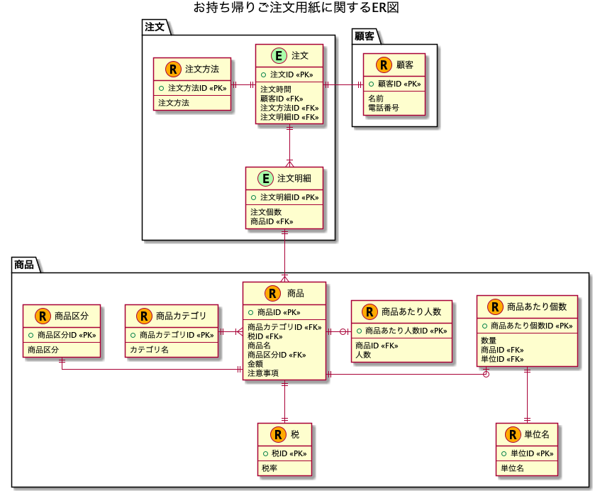

# 課題1

## Table of Contents
<!-- START doctoc generated TOC please keep comment here to allow auto update -->
<!-- DON'T EDIT THIS SECTION, INSTEAD RE-RUN doctoc TO UPDATE -->

Details

- [質問](#%E8%B3%AA%E5%95%8F)
  - [回答](#%E5%9B%9E%E7%AD%94)
- [DB設計に関する整理](#db%E8%A8%AD%E8%A8%88%E3%81%AB%E9%96%A2%E3%81%99%E3%82%8B%E6%95%B4%E7%90%86)
  - [3つのポイント](#3%E3%81%A4%E3%81%AE%E3%83%9D%E3%82%A4%E3%83%B3%E3%83%88)
  - [DB設計の手順](#db%E8%A8%AD%E8%A8%88%E3%81%AE%E6%89%8B%E9%A0%86)
- [参考](#%E5%8F%82%E8%80%83)

<!-- END doctoc generated TOC please keep comment here to allow auto update -->

## 質問

> [こちら](https://github.com/praha-inc/praha-challenge-templates/blob/master/db/design/sushi.png?raw=true)のDBスキーマを設計し、論理モデルを作成してください。

### 回答

- ER図は以下の通り

- [こちら](https://docs.google.com/spreadsheets/d/1VY8wkXNHNpTPu-Bk3SVmADeX53uuP2y5sYRT9e5X5-8/edit?usp=sharing)に項目整理のメモがあります

- 懸念点
  - さびあり抜きを、1つの商品ごとに管理することができない
    - 例えば、セットメニューの「はな」を3つ注文して、1つはさび抜き、残りはさびありといったことができない
    - そういった要望は業務上対応しないか、全てさび抜きで注文してもらいわさびを別添えにするなど、何かしら業務上での考慮が必要。

## DB設計に関する整理

### 3つのポイント

1. 箱（エンティティ）の見出し方

- エンティティとは
  - 何かの集合（Set）のこと
  - 管理対象とも呼ばれる
- エンティティの分類
  - 「モノ」に関する記録：リソース（資源）系エンティティ
  - 「出来事」に関する記録：イベント系エンティティ

2. 主キーの設定

- コードとキーの違い
  - 顧客コードといった値は一見ユニークに見えるが、以下の理由で主キーにすることは推奨されない
    - コード体系は、ユーザーがレコードに容易に到達するためのユーザーインターフェース
    - コード体系は、システムの都合ではなくビジネスの都合によって決定されるもの

3. 重複の削除（いわゆる正規化）

### DB設計の手順

1. 大まかにブロック分けを行う（業務単位か部門単位）
   - 細かすぎず、大まかすぎずに
   - 大抵の場合、組織は業務上の役割の分類で括られている
     - 例えば部門であれば、営業・購買・生産・経理
     - 例えば業務であれば、販売管理・購買管理・生産管理
   - 大規模システムの場合、計画系と実績系の区別が重要
   - もっと小規模なら、ユースケースのアクターに合わせた形で切り分けることも可能
2. それぞれのブロックごとにイベント系を洗い出す（この時点では、正規化を意識しない）
   - 動詞で言えるものがイベント系
     - タイムスタンプを打てるものがイベント系になる（いつ、が属性として設定できるもの。計画系だと「~する予定」という風表現できる）
   - まずは正規化ではなく、ざっくりと大きなエンティティを書き出すことを意識する
3. イベント系に対する正規化を行って、リソース系を洗い出す
   - イベント系エンティティの正規化を行う
   - これを行うと、リソース系のエンティティが見えてくる
4. リソース系に対する分類の洗い出しを行って、リソース系の正規化を行う
   - 例えば顧客の分類として、法人顧客と個人顧客といったサブセットがある場合、サブセットとして1つのエンティティにしておくほうが良い
     - 区分で見分けようとすると、プログラムの側に負担を強いるため
   - この手順の際に、JOIN処理の多発などは気にしない！
     - それは後から考えて、まずは論理的なデータ構造の把握に注力する
5. ブロック間でリソース系の統合を行い、さらに正規化を行う
   - ブロック間でのリソース系エンティティの統合を行う
   - 関連エンティティが出てきた場合は、基本的にはm:m構造で繋ぐようにする
6. 導出系の整理をして、最終的な正規化を行う
   - 導出ルールの整理を行って、冗長性の排除を行う
   - 項目ごとのチェックをして、冗長項目を排除する
   - 時系列の推移についても検討する

- 手順のまとめ
  - いきなり全体像を見ようとすると手がつけられなくなる
  - まずはイベント系を中心に考える
  - リソース系は分類という概念を意識する
  - リソース系は部門間ですり合わせる必要があるので調整能力を鍛える
  - 最初から性能は考えすぎないようにする

## 参考

- 楽々ERDレッスン(書籍)
  - 練習用メモは[こちら](https://docs.google.com/spreadsheets/d/1w-UScZv0XnthxsMruUcHH6D8JsE7QIqKQ1bGpodrHI8/edit?usp=sharing)
  - 第3部_第1回のER図は以下です。書籍の通りにやってみた+少し追加でエンティティを増やしています。

