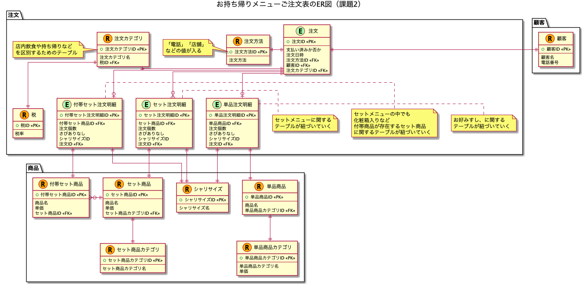

# 課題2

## Table of Contents
<!-- START doctoc generated TOC please keep comment here to allow auto update -->
<!-- DON'T EDIT THIS SECTION, INSTEAD RE-RUN doctoc TO UPDATE -->

Details

- [質問1](#%E8%B3%AA%E5%95%8F1)
  - [回答](#%E5%9B%9E%E7%AD%94)
- [質問2](#%E8%B3%AA%E5%95%8F2)
  - [回答](#%E5%9B%9E%E7%AD%94-1)

<!-- END doctoc generated TOC please keep comment here to allow auto update -->

## 質問1

> シャリの大小も選べるようになりました。どのようにテーブル設計をするべきでしょうか？

### 回答

- ER図は以下の通り

- 懸念点
  - シャリの大きさによって、単価が異なる場合、設計を見直す必要がある
    - くら寿司のシャリプチは、シャリが小さくても安くはなっていなかった記憶

## 質問2

> セット商品の売り上げとは別に、寿司ネタが毎月何個売れているのか知る必要が生じました。どのようにテーブル設計をするべきでしょうか?

### 回答

- 寿司ネタに関する注文は、課題1のER図の時点でセット商品とは区分けしていたため、寿司ネタの毎月の売り上げを集計することは可能。
  - 寿司ネタの毎月の売り上げの集計に必要な項目
    - 注文 . 注文日時
    - 単品注文明細 . 注文個数
