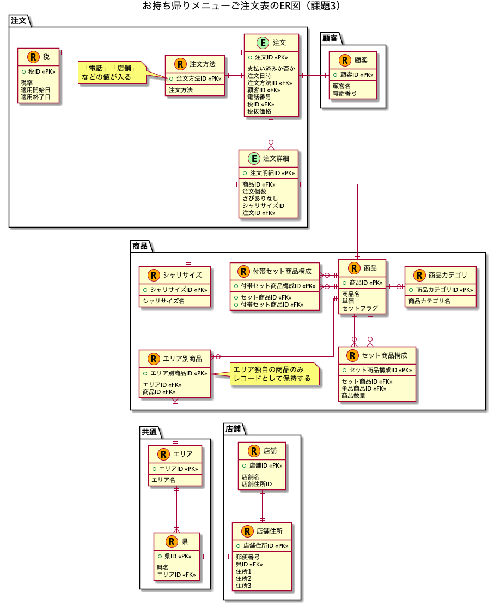

# 課題3

## Table of Contents
<!-- START doctoc generated TOC please keep comment here to allow auto update -->
<!-- DON'T EDIT THIS SECTION, INSTEAD RE-RUN doctoc TO UPDATE -->

Details

- [質問1](#%E8%B3%AA%E5%95%8F1)
  - [回答](#%E5%9B%9E%E7%AD%94)
- [質問2](#%E8%B3%AA%E5%95%8F2)
  - [回答](#%E5%9B%9E%E7%AD%94-1)

<!-- END doctoc generated TOC please keep comment here to allow auto update -->

## 質問1

- 課題2に追加して、以下の仕様が追加された場合、どのように設計をすれば良いでしょうか？
  - （前提）この寿司屋は、全国に店舗を持っている
  - お好みすしに関しては、注文可能な寿司が店舗のエリア（西日本エリア/九州・沖縄エリア/東日本エリアの3つが存在）によって異なっている（つまり全てのお好みすしのメニューがどの地域でも注文できるわけではない）
  - 参考
    - [くら寿司の単品メニューのお持ち帰り](https://www.kurasushi.co.jp/takeout/)をイメージ。

### 回答

- ER図は以下の通り

- 懸念点
  - 店舗ごとに注文できる単品商品が異なる場合、設計を見直す必要がある

## 質問2

- 自分が考えた追加仕様をペアと交換して、お互いの仕様を満たすようにテーブルを設計し直してください

### 回答

