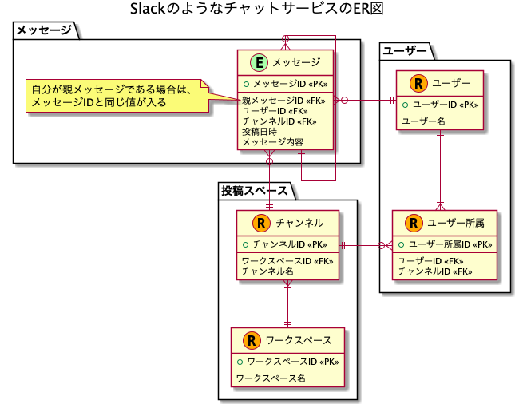

# 課題1

## Table of Contents
<!-- START doctoc generated TOC please keep comment here to allow auto update -->
<!-- DON'T EDIT THIS SECTION, INSTEAD RE-RUN doctoc TO UPDATE -->

Details

- [質問1](#%E8%B3%AA%E5%95%8F1)
  - [回答](#%E5%9B%9E%E7%AD%94)

<!-- END doctoc generated TOC please keep comment here to allow auto update -->

## 質問1

> Slackのようなチャットサービスのメッセージを保存するための論理モデルを設計して、UML図を作成してください

### 回答

- ER図は以下の通り

- 検討時のメモは[こちら](https://docs.google.com/spreadsheets/d/1VY8wkXNHNpTPu-Bk3SVmADeX53uuP2y5sYRT9e5X5-8/edit?usp=sharing)

- 懸念点