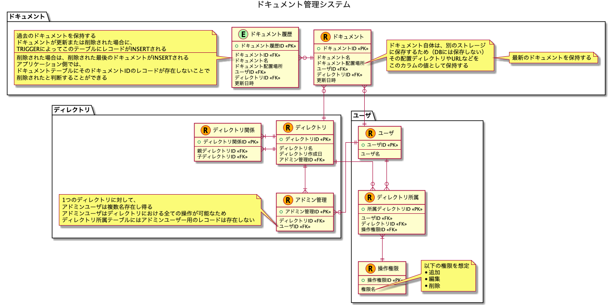

# 課題1

## Table of Contents
<!-- START doctoc -->
<!-- END doctoc -->

## 質問1

> Confluenceやesa、kibelaと言ったドキュメント管理システムのデータベース設計をしてみましょう

### 回答

- 検討したメモは[こちら](https://docs.google.com/spreadsheets/d/1VY8wkXNHNpTPu-Bk3SVmADeX53uuP2y5sYRT9e5X5-8/edit?usp=sharing)

- 懸念点
  - 今回はドキュメントのバージョン管理は考慮しない設計とした（だがバージョン管理はほとんどのドキュメント管理システムで必要に思うので、後々取り込みたい）
  - 今回はユーザーの権限（このディレクトリやドキュメントに対しては、このユーザーは閲覧のみ許可されているなど）は考慮していない