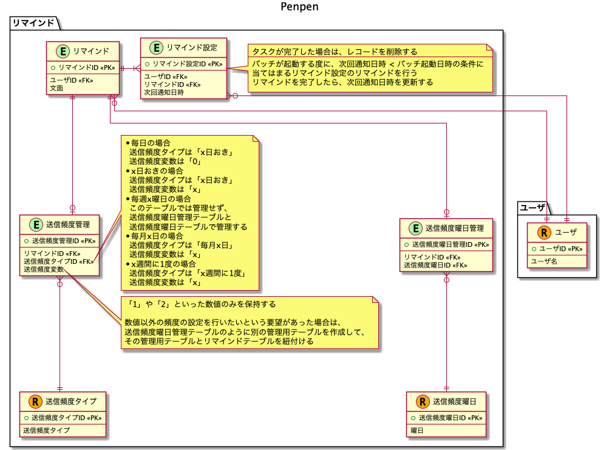

# 課題1

## Table of Contents
<!-- START doctoc -->
<!-- END doctoc -->

## 質問1

> リマインダーアプリ[Penpen](https://penpen.netlify.app/)のデータベース設計を行いましょう

### 回答

検討用のメモは[こちら](https://docs.google.com/spreadsheets/d/1VY8wkXNHNpTPu-Bk3SVmADeX53uuP2y5sYRT9e5X5-8/edit?usp=sharing)

- 考慮していない点
  - 送信頻度に対して、リマインド設定者が設定可能な変数は1つのみとしている。2つ以上変数が存在する場合、送信頻度変数のカラムがもう1つ必要になるため、その場合はリマインドテーブルのテーブル定義変更を行う必要がある。
