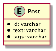

# 課題1

## Table of Contents
<!-- START doctoc -->
<!-- END doctoc -->

## 質問1

> 以下の設計のテーブルだとどのような問題が生じるでしょうか？

```sql
TABLE Post {
id: varchar
text: varchar
tags: varchar   -- ("tagA,tagB,tagC"といった値が入る)
}
```



### 回答

- 業務的な制限が発生する
  - varcharの場合、文字数の制限があるので、紐付けすることができるタグの数に制限がある
- クエリが複雑になることにより、開発コストが高くなる
  - 特定のアカウントに関連する製品の検索クエリが複雑になる
    - 1カラムに複数の値が格納されているため、等価による比較ができないため、正規表現などを使用したパターンマッチングが必要となる
  - 特定の製品に関連するアカウントの検索クエリが複雑になる
    - JOINを行う必要があるが、それが手間となってしまう
  - 特定の製品に関連するアカウントの更新クエリが複雑になる
  - 挿入されるデータに対する妥当性の検証が困難となってしまう
    - 今回のtagsの場合は、例えば最大文字数を4に設定するなどすれば、少なくとも`tags999`のような値の挿入を防ぐことができるが、1つのカラムに複数の値をいれる構造にしている場合、文字数は少なくとも4よりは長くする必要があるため、そういった妥当性の検証が困難となる
  - 区切り文字の選択
    - 1つのカラムに文字列を複数格納する場合、個々の入力値にも区切り文字が含まれている可能性がある。その場合、その区切り文字が個々の値の入力値の一部なのか、それとも値ごとを区切るための文字なのかがわからなくなってしまう