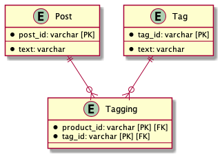

# 課題2

## Table of Contents
<!-- START doctoc generated TOC please keep comment here to allow auto update -->
<!-- DON'T EDIT THIS SECTION, INSTEAD RE-RUN doctoc TO UPDATE -->

Details

- [質問1](#%E8%B3%AA%E5%95%8F1)
  - [回答](#%E5%9B%9E%E7%AD%94)

<!-- END doctoc generated TOC please keep comment here to allow auto update -->

## 質問1

> 課題1の問題を解決するためのよりよりスキーマ設計を考える

### 回答

- Tagテーブルを新規作成し、`post_id`を外部キーとして保持する

