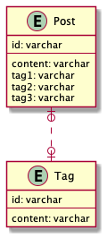

# 課題1

## Table of Contents
<!-- START doctoc -->
<!-- END doctoc -->

## 質問1

> 以下のテーブル定義の場合、どんな問題が生じるでしょうか？

```
TABLE Post {
id: varchar
content: varchar
tag1: varchar
tag2: varchar
tag3: varchar
}

TABLE Tag {
id: varchar
content: varchar
}
```



### 回答

- 以下の問題が生じる可能性がある（SQLアンチパターンでは、「マルチカラムアトリビュート」）
  - 値の検索を行うためのクエリが複雑になる
    - 特定のタグが付けられたPostを検索しようとすると、3列全てを取得する必要がある
  - 値の追加と削除を行うためのクエリが複雑になる
    - タグを追加しようとした場合、空いているtagxのカラム（tag1,2,3のうちNULLが格納されているカラム）を特定した上で、値を格納する必要がある
  - 一意性を保証することが困難になる
    - 複数の値に同じ値を防ぐことが困難になる
  - 値が増加した場合の処理が困難になる
    - tagを4つ以上格納しようとした場合、テーブル定義を変更する必要があるが、それにより、以下3つの問題が生じる
      - 既にデータが格納されているテーブル構造を変更するには、同時に接続している他のクライアントからのアクセスを防ぐためにテーブルをロックする必要がある
      - DBMSによっては、テーブル構造を変更する場合に、まず新規テーブルを定義し、既存テーブルからデータをコピーして、最後に既存テーブルを削除するという処理を行う必要があり、対象テーブルに多くのデータがある場合に、データ転送に時間がかかる
      - カラムの追加により、このテーブルを使用する全てのアプリケーションのSQL文を修正する必要がある

## 参考

- SQLアンチパターン（書籍）