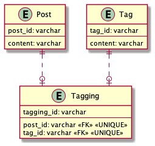

# 課題2

## Table of Contents
<!-- START doctoc -->
<!-- END doctoc -->

## 質問1

> どのようにテーブル設計を見直すことができるでしょうか？

### 回答

- PostとTagを紐付ける従属テーブル（Tagging）を作成する
  - Taggingテーブルにはサロゲートキーを準備する。
  - post_idとtag_idの組み合わせが一意となるように、UNIQUE制約を付与する

## 参考

- [UNIQUE制約(ユニーク制約を設定する)](https://www.dbonline.jp/mysql/table/index9.html)