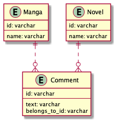

# 課題 1

## Table of Contents

<!-- START doctoc generated TOC please keep comment here to allow auto update -->
<!-- DON'T EDIT THIS SECTION, INSTEAD RE-RUN doctoc TO UPDATE -->
<details>
<summary>Details</summary>

- [質問](#%E8%B3%AA%E5%95%8F)
  - [回答](#%E5%9B%9E%E7%AD%94)

</details>
<!-- END doctoc generated TOC please keep comment here to allow auto update -->

## 質問

> 以下のテーブル定義の場合、どんな問題が生じるでしょうか？

```
(漫画)
TABLE Manga {
id: varchar
name: varchar
}

(小説)
TABLE Novel {
id: varchar
name: varchar
}

(コメント)
TABLE Comment {
id: varchar
text: varchar
belongs_to_id: varchar (ここにはManga.Id、あるいはNovel.Idが入る)
}
```



### 回答

- 解決策の1つとして、以下のようなポリモーフィック関連を定義することがあげられる。

```uml
' 漫画と小説テーブルは変化ないため省略

' コメント
entity Comment {
  id: varchar
  text: varchar
  comment_type: varchar（'manga'または'novel'が入る）
  belongs_to_id: varchar
}
```

- この場合、以下のような問題が生じる
  - `Comment.belongs_to_id`は、`Manga.id`または`Novel.id`の値と一致している必要があるが、外部キーはテーブル1つのみしか指定できないので、一致していることを保証できない
  - `Comment.comment_type`は、`manga`または`novel`のようなデータベースに存在するテーブル名に対応している必要があるが、それを保証することができない
  - CommentがMangaとNovelの両方に関連づけられている場合、クエリが複雑になる（2つの親テーブルを外部結合する必要があり、結合した際にNULLが発生する）