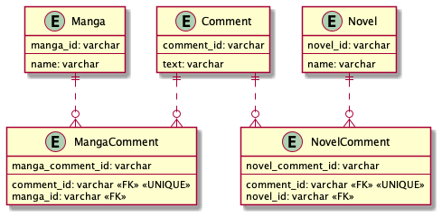
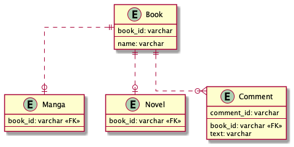

# 課題2

## Table of Contents
<!-- START doctoc -->
<!-- END doctoc -->

## 質問

> どのようにテーブル設計を見直すことができるでしょうか？

### 回答

- 複数の親テーブルそれぞれに対応した交差テーブルを作成する
  - `Comment.belongs_to_id`が不要となり、メタデータがデータの整合性を保証してくれるため、関連づけの管理をアプリケーションコードに依存せずにすみ、間違いの生じる余地が少なくなる
  - `MangaComment.comment_id`と`NovelComment.comment_id`にUNIQUE制約を付与することで交差テーブルの1レコードのみからコメントが参照されることを保証できる。ただし、`MangaComment`テーブルと`NovelComment`テーブルの両方から1レコードずつ参照され、結果的に1つのコメントが2テーブルに関連づけられることを防げていない。これはアプリケーションコードの方で対処が必要。

- 共通の親テーブルを作成する
  - MangaとNovelの共通の基底型として、`Book`テーブルを作成する
  - MangaテーブルやNovelテーブルと、基底テーブルのBookテーブルの主キー値は同じため、Mangaテーブルを直接Commentsテーブルに結合、Novelテーブルを直接Commentsテーブルに結合することが可能。
  - このように外部キーによるデータ整合性制約に依存することができる

