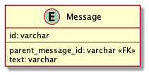

# 課題1

## Table of Contents
<!-- START doctoc -->
<!-- END doctoc -->

## 質問1

> 以下の設計のテーブルだとどのような問題が生じるでしょうか？

```
TABLE Message {
id: varchar
parent_message_id: varchar
text: varchar
FOREIGN KEY (parent_message_id) REFERENCES Message(id)
}
```



### 回答

- 以下のような問題が生じる可能性がある（SQLアンチパターンでは「ナイーブツリー」の隣接リストに該当）
  - SELECTが困難
    - Messageのツリーのうち、2つより多い階層を取得しようとする場合に、クエリで取得できる階層に限界がある（そのため取得したい階層の全レコードを一度取得し、アプリケーション側で階層構造を再構築する方法もあるが、それは非効率）
  - DELETEが困難
    - サブツリー全体を削除したい場合、全ての子孫を特定するために、複数回クエリを実行する必要がある。（`ON DELETE CASCODE`修飾子を利用することで、サブツリーの削除は自動化できるが、ノードとなっているメッセージの昇格や移動は自動化できない）
  - メリットもある
    - 特定のSELECTに関しては容易である
      - ノードの直近の親と子を簡単に取得できる
    - 列の挿入が簡単
    - （Slackのような階層数が予め制限されている場合には、使用しても良い？）