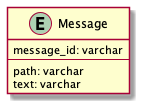
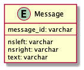
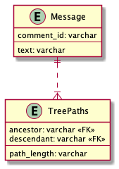

# 課題2

## Table of Contents
<!-- START doctoc -->
<!-- END doctoc -->

## 質問1

> 課題1の問題を解決するためのよりよりスキーマ設計を考える

### 回答

- 経路列挙モデルを使用する
  - 先祖の系譜を表す文字列（以下パス）を各ノードの属性として追加する
  - パスに対してパターン比較（%やLIKEを使用）することで先祖を取得できる
  - デメリット
    - DBにはパスの正確な形成や、パス値の既存ノードへの対応を保証できない（例えば「1/2/3/」という形でスラッシュ区切りでパス値を形成するルールだとしても、「1*2*3*」のように誤った形式で挿入されてしまう可能性を排除できない）ため、それはアプリケーションコード側で保証する必要がある
    - パス値に格納できる長さには限度がある

- 入れ子集合モデルを使用する
  - 非葉ノードを削除すると、削除されたノードの子孫は、削除されたノードの親の直接の子であると自動的にみなされる
  - デメリット
    - 直近の親を取得することが困難
    - ノードの挿入や移動などのツリーの操作が他のモデルよりも複雑になる（nsleftとnsrightの値を再計算する必要があり、その度に更新したいノード以外の関連ノードのUPDATEも必要となる）
    - ノードの挿入が頻繁に求められる場合には、入れ子集合の採用は最適ではない

- 閉包テーブルモデルを使用する

- メモ
  - Slackの場合、隣接リスト、のうちどれを選ぶべきかと言えば、隣接リストまたは閉包テーブルモデルだろうか
    - 隣接リストでは、階層としては2つまでしか取得できないが、Slackでは階層は2つまでに限定されているように見える
    - 経路列挙では、パス値の形式の正しさをアプリケーション側で保証できれば良いが、文字列の検証なので何かミスが発生しやすそう
    - 入れ子集合では、挿入と削除が難しいことが致命的な気がする（入れ子区間モデルで解消できるのかもしれないが未調査..）
    - 閉包テーブルでは、TreePathsのテーブルが大きくなる可能性はあるが、階層に制限があれば問題ない...?（リソースとのトレードオフ）

## 参考

- SQLアンチパターン（書籍）
- [SQLアンチパターン - ナイーブツリー](https://www.slideshare.net/kamekoopa/ss-27728799)