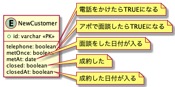

# 課題1

## Table of Contents
<!-- START doctoc generated TOC please keep comment here to allow auto update -->
<!-- DON'T EDIT THIS SECTION, INSTEAD RE-RUN doctoc TO UPDATE -->
<details>
<summary>Details</summary>

- [質問1](#%E8%B3%AA%E5%95%8F1)
  - [回答](#%E5%9B%9E%E7%AD%94)

</details>
<!-- END doctoc generated TOC please keep comment here to allow auto update -->

## 質問1

> 以下の設計だとどのような問題が生じるか？

```
TABLE NewCustomer {
id: varchar
telephone: boolean -- 電話をかけたらTRUEになる
metOnce: boolean -- アポで面談したらTRUEになる
metAt: date -- 面談をした日付が入る
closed: boolean -- 成約した
closedAt: boolean -- 成約した日付が入る
}
```



### 回答

- 営業進捗に新たなステータスが加わった際に、テーブル定義を変更（カラムを追加）する必要がある
- ステータスごとの日付を管理したくなった場合、テーブル定義を変更（カラムを追加）する必要がある（例えば電話した日付を管理したくなった場合など）
- 面談を複数回行うことになった場合、以下の方法が考えられるが、どちらの場合でも問題がある
  - テーブル定義を変更し、2回目以降の面談をした日付を格納するカラムを追加する
    - 面談回数が増えるたびに、テーブル定義変更を行う必要がある
  - metAtを最新の面談日時で更新する
    - 過去に行った面談の日時のデータを保持することができなくなる