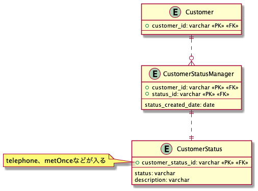

# 課題2

## Table of Contents
<!-- START doctoc -->
<!-- END doctoc -->

## 質問1

> どのようにテーブル設計を見直せばこの問題は解決できるでしょうか？

### 回答

- ステータスを管理するマスターテーブルを設ける
- 顧客のステータスを管理する交差テーブルを設ける

- 疑問
  - このテーブルだと、例えば電話をしたことがないのに成約済みになっている状態を防ぎたい場合などは防ぐことができないが、どうすれば良いか？
    - 今回のステータスは、業務側で定められたステータスであり、今後電話しなくても成約済みになるケースも出てくる可能性があるとすると、特にデータベースレベルで防ぐ必要はなく、アプリケーション側で対処すべき？