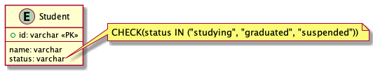

# 課題1

## Table of Contents
<!-- START doctoc generated TOC please keep comment here to allow auto update -->
<!-- DON'T EDIT THIS SECTION, INSTEAD RE-RUN doctoc TO UPDATE -->
<details>
<summary>Details</summary>

- [質問1](#%E8%B3%AA%E5%95%8F1)
  - [回答](#%E5%9B%9E%E7%AD%94)

</details>
<!-- END doctoc generated TOC please keep comment here to allow auto update -->

## 質問1

> 以下の設計だとどのような問題が生じるか？

```
TABLE Student {
id: varchar
name: varchar
status: varchar CHECK(status IN ("studying", "graduated", "suspended"))
}
```



### 回答

- 新たなステータスが加わった際に、テーブル定義を変更（CHECK制約を変更）する必要がある
