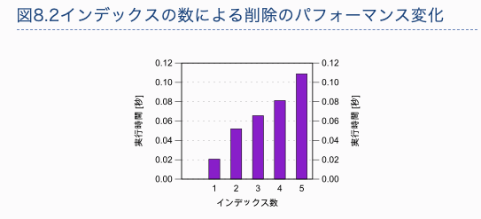

# 課題

## Table of Contents
<!-- START doctoc generated TOC please keep comment here to allow auto update -->
<!-- DON'T EDIT THIS SECTION, INSTEAD RE-RUN doctoc TO UPDATE -->


<!-- END doctoc generated TOC please keep comment here to allow auto update -->

## インデックスを作成した際のINSERTの速度

### インデックス

- 存在するインデックス
  - `employees`テーブルに4つ
  - `salaries`テーブルに3つ

```sql
mysql> show index from employees\G
*************************** 1. row ***************************
        Table: employees
   Non_unique: 0
     Key_name: PRIMARY
 Seq_in_index: 1
  Column_name: emp_no
    Collation: A
  Cardinality: 299866
     Sub_part: NULL
       Packed: NULL
         Null:
   Index_type: BTREE
      Comment:
Index_comment:
*************************** 2. row ***************************
        Table: employees
   Non_unique: 1
     Key_name: idx_birth_date
 Seq_in_index: 1
  Column_name: birth_date
    Collation: A
  Cardinality: 4781
     Sub_part: NULL
       Packed: NULL
         Null:
   Index_type: BTREE
      Comment:
Index_comment:
*************************** 3. row ***************************
        Table: employees
   Non_unique: 1
     Key_name: idx_gender
 Seq_in_index: 1
  Column_name: gender
    Collation: A
  Cardinality: 1
     Sub_part: NULL
       Packed: NULL
         Null:
   Index_type: BTREE
      Comment:
Index_comment:
*************************** 4. row ***************************
        Table: employees
   Non_unique: 1
     Key_name: idx_hire_date
 Seq_in_index: 1
  Column_name: hire_date
    Collation: A
  Cardinality: 4908
     Sub_part: NULL
       Packed: NULL
         Null:
   Index_type: BTREE
      Comment:
Index_comment:
4 rows in set (0.00 sec)

mysql> show index from salaries\G
*************************** 1. row ***************************
        Table: salaries
   Non_unique: 0
     Key_name: PRIMARY
 Seq_in_index: 1
  Column_name: emp_no
    Collation: A
  Cardinality: 0
     Sub_part: NULL
       Packed: NULL
         Null:
   Index_type: BTREE
      Comment:
Index_comment:
*************************** 2. row ***************************
        Table: salaries
   Non_unique: 0
     Key_name: PRIMARY
 Seq_in_index: 2
  Column_name: from_date
    Collation: A
  Cardinality: 0
     Sub_part: NULL
       Packed: NULL
         Null:
   Index_type: BTREE
      Comment:
Index_comment:
*************************** 3. row ***************************
        Table: salaries
   Non_unique: 1
     Key_name: idx_salary
 Seq_in_index: 1
  Column_name: salary
    Collation: A
  Cardinality: 0
     Sub_part: NULL
       Packed: NULL
         Null:
   Index_type: BTREE
      Comment:
Index_comment:
3 rows in set (0.00 sec)
```

### 検証するクエリ

- 以下のテーブルに対して、INSERT文とDELETE文をそれぞれ1つずつ準備し、1回ずつ実行する
  - `employees`
  - `salaries`

```sql
INSERT INTO employees VALUES (5000000, '1999-01-01', 'hiroshi', 'tokumaru', 'M', '1990-02-01'), (5000001, '1999-01-01', 'hiroshi', 'tokumaru', 'M', '1990-02-01'), (5000002, '1999-01-01', 'hiroshi', 'tokumaru', 'M', '1990-02-01'), (5000003, '1999-01-01', 'hiroshi', 'tokumaru', 'M', '1990-02-01'), (5000004, '1999-01-01', 'hiroshi', 'tokumaru', 'M', '1990-02-01'), (5000005, '1999-01-01', 'hiroshi', 'tokumaru', 'M', '1990-02-01'), (5000006, '1999-01-01', 'hiroshi', 'tokumaru', 'M', '1990-02-01'), (5000007, '1999-01-01', 'hiroshi', 'tokumaru', 'M', '1990-02-01'), (5000008, '1999-01-01', 'hiroshi', 'tokumaru', 'M', '1990-02-01'), (5000009, '1999-01-01', 'hiroshi', 'tokumaru', 'M', '1990-02-01');
```

```sql
DELETE FROM employees WHERE birth_date >= '1999-01-01';
```

```sql
INSERT INTO salaries VALUES (5000000, 999999, '2003-01-01', '9999-01-01'), (5000001, 999999, '2003-02-02', '9999-01-01'), (5000002, 999999, '2003-03-03', '9999-01-01'), (5000003, 999999, '2003-04-04', '9999-01-01'), (5000004, 999999, '2003-05-05', '9999-01-01'), (5000005, 999999, '2003-06-06', '9999-01-01'), (5000006, 999999, '2003-07-07', '9999-01-01'), (5000007, 999999, '2003-08-08', '9999-01-01'), (5000008, 999999, '2003-09-09', '9999-01-01'), (5000009, 999999, '2003-10-10', '9999-01-01');
```

```sql
DELETE FROM salaries WHERE salary = 999999;
```

### 検証

#### スロークエリログの確認

- インデックスありの場合
  - 以下はスロークエリログ
    - 検証対象外のクエリのログは除いている
    - また、今回は1回ずつクエリを流していない

```bash
# cat 0771bb71246a-slow.log
mysqld, Version: 5.7.24 (MySQL Community Server (GPL)). started with:
Tcp port: 3306  Unix socket: /var/run/mysqld/mysqld.sock
Time                 Id Command    Argument

# Time: 2021-03-31T12:53:49.097537Z
# User@Host: root[root] @ localhost []  Id:     9
# Query_time: 0.029068  Lock_time: 0.000224 Rows_sent: 0  Rows_examined: 0
SET timestamp=1617195229;
INSERT INTO employees VALUES (5000000, '1999-01-01', 'hiroshi', 'tokumaru', 'M', '1990-02-01'), (5000001, '1999-01-01', 'hiroshi', 'tokumaru', 'M', '1990-02-01'), (5000002, '1999-01-01', 'hiroshi', 'tokumaru', 'M', '1990-02-01'), (5000003, '1999-01-01', 'hiroshi', 'tokumaru', 'M', '1990-02-01'), (5000004, '1999-01-01', 'hiroshi', 'tokumaru', 'M', '1990-02-01'), (5000005, '1999-01-01', 'hiroshi', 'tokumaru', 'M', '1990-02-01'), (5000006, '1999-01-01', 'hiroshi', 'tokumaru', 'M', '1990-02-01'), (5000007, '1999-01-01', 'hiroshi', 'tokumaru', 'M', '1990-02-01'), (5000008, '1999-01-01', 'hiroshi', 'tokumaru', 'M', '1990-02-01'), (5000009, '1999-01-01', 'hiroshi', 'tokumaru', 'M', '1990-02-01');

# Time: 2021-03-31T12:53:57.781839Z
# User@Host: root[root] @ localhost []  Id:     9
# Query_time: 0.018396  Lock_time: 0.000143 Rows_sent: 0  Rows_examined: 0
SET timestamp=1617195237;
INSERT INTO salaries VALUES (5000000, 999999, '2003-01-01', '9999-01-01'), (5000001, 999999, '2003-02-02', '9999-01-01'), (5000002, 999999, '2003-03-03', '9999-01-01'), (5000003, 999999, '2003-04-04', '9999-01-01'), (5000004, 999999, '2003-05-05', '9999-01-01'), (5000005, 999999, '2003-06-06', '9999-01-01'), (5000006, 999999, '2003-07-07', '9999-01-01'), (5000007, 999999, '2003-08-08', '9999-01-01'), (5000008, 999999, '2003-09-09', '9999-01-01'), (5000009, 999999, '2003-10-10', '9999-01-01');

# Time: 2021-03-31T12:54:04.735173Z
# User@Host: root[root] @ localhost []  Id:     9
# Query_time: 0.011441  Lock_time: 0.000126 Rows_sent: 0  Rows_examined: 10
SET timestamp=1617195244;
DELETE FROM employees WHERE birth_date >= '1999-01-01';

# Time: 2021-03-31T12:54:09.725498Z
# User@Host: root[root] @ localhost []  Id:     9
# Query_time: 0.000729  Lock_time: 0.000196 Rows_sent: 0  Rows_examined: 0
SET timestamp=1617195249;
DELETE FROM salaries WHERE salary = 999999;
```

- インデックスなしの場合
  - 課題2で作成したインデックスを削除する

```bash
# cat 0771bb71246a-slow.log
mysqld, Version: 5.7.24 (MySQL Community Server (GPL)). started with:
Tcp port: 3306  Unix socket: /var/run/mysqld/mysqld.sock
Time                 Id Command    Argument

# administrator command: Ping;
# Time: 2021-03-31T12:43:23.976463Z
# User@Host: root[root] @ localhost []  Id:     9
# Query_time: 0.006658  Lock_time: 0.000171 Rows_sent: 0  Rows_examined: 0
use employees;
SET timestamp=1617194603;
INSERT INTO employees VALUES (5000000, '1999-01-01', 'hiroshi', 'tokumaru', 'M', '1990-02-01'), (5000001, '1999-01-01', 'hiroshi', 'tokumaru', 'M', '1990-02-01'), (5000002, '1999-01-01', 'hiroshi', 'tokumaru', 'M', '1990-02-01'), (5000003, '1999-01-01', 'hiroshi', 'tokumaru', 'M', '1990-02-01'), (5000004, '1999-01-01', 'hiroshi', 'tokumaru', 'M', '1990-02-01'), (5000005, '1999-01-01', 'hiroshi', 'tokumaru', 'M', '1990-02-01'), (5000006, '1999-01-01', 'hiroshi', 'tokumaru', 'M', '1990-02-01'), (5000007, '1999-01-01', 'hiroshi', 'tokumaru', 'M', '1990-02-01'), (5000008, '1999-01-01', 'hiroshi', 'tokumaru', 'M', '1990-02-01'), (5000009, '1999-01-01', 'hiroshi', 'tokumaru', 'M', '1990-02-01');

# Time: 2021-03-31T12:43:37.316660Z
# User@Host: root[root] @ localhost []  Id:     9
# Query_time: 0.004211  Lock_time: 0.000209 Rows_sent: 0  Rows_examined: 0
SET timestamp=1617194617;
INSERT INTO salaries VALUES (5000000, 999999, '2003-01-01', '9999-01-01'), (5000001, 999999, '2003-02-02', '9999-01-01'), (5000002, 999999, '2003-03-03', '9999-01-01'), (5000003, 999999, '2003-04-04', '9999-01-01'), (5000004, 999999, '2003-05-05', '9999-01-01'), (5000005, 999999, '2003-06-06', '9999-01-01'), (5000006, 999999, '2003-07-07', '9999-01-01'), (5000007, 999999, '2003-08-08', '9999-01-01'), (5000008, 999999, '2003-09-09', '9999-01-01'), (5000009, 999999, '2003-10-10', '9999-01-01');

# Time: 2021-03-31T12:44:01.452000Z
# User@Host: root[root] @ localhost []  Id:     9
# Query_time: 0.180112  Lock_time: 0.000143 Rows_sent: 0  Rows_examined: 300034
SET timestamp=1617194641;
DELETE FROM employees WHERE birth_date >= '1999-01-01';

# Time: 2021-03-31T12:44:25.561065Z
# User@Host: root[root] @ localhost []  Id:     9
# Query_time: 17.692705  Lock_time: 0.000120 Rows_sent: 0  Rows_examined: 2844047
SET timestamp=1617194665;
DELETE FROM salaries WHERE salary = 999999;
```

#### EXPLAINによる確認

- インデックスありの場合となしの場合の、DELETE文のEXPLAINを実行する

- インデックスありの場合
  - `employees`テーブル
    - type
      - range：インデックスを用いた範囲検索
    - possible_keys：オプティマイザがテーブルのアクセスに利用可能なインデックスの候補として挙げたキーの一覧
    - key：オプティマイザによって選択されたキー
  - `salaries`テーブル
    - type
      - range：インデックスを用いた範囲検索
    - possible_keys：オプティマイザがテーブルのアクセスに利用可能なインデックスの候補として挙げたキーの一覧
    - key：オプティマイザによって選択されたキー

```sql
mysql> explain DELETE FROM employees WHERE birth_date >= '1999-01-01'\G
*************************** 1. row ***************************
           id: 1
  select_type: DELETE
        table: employees
   partitions: NULL
         type: range
possible_keys: idx_birth_date
          key: idx_birth_date
      key_len: 3
          ref: const
         rows: 1
     filtered: 100.00
        Extra: Using where
1 row in set (0.00 sec)

mysql> explain DELETE FROM salaries WHERE salary = 999999\G
*************************** 1. row ***************************
           id: 1
  select_type: DELETE
        table: salaries
   partitions: NULL
         type: range
possible_keys: idx_salary
          key: idx_salary
      key_len: 4
          ref: const
         rows: 1
     filtered: 100.00
        Extra: Using where
1 row in set (0.00 sec)
```

- インデックスなしの場合
  - `employees`テーブル
    - type
      - ALL：フルテーブルスキャンを行っている
  - `salaries`テーブル
    - type
      - ALL：フルテーブルスキャンを行っている

```sql
mysql> EXPLAIN DELETE FROM employees WHERE birth_date >= '1999-01-01'\G
*************************** 1. row ***************************
           id: 1
  select_type: DELETE
        table: employees
   partitions: NULL
         type: ALL
possible_keys: NULL
          key: NULL
      key_len: NULL
          ref: NULL
         rows: 299866
     filtered: 100.00
        Extra: Using where
1 row in set (0.00 sec)

mysql> EXPLAIN DELETE FROM salaries WHERE salary = 999999\G
*************************** 1. row ***************************
           id: 1
  select_type: DELETE
        table: salaries
   partitions: NULL
         type: ALL
possible_keys: NULL
          key: NULL
      key_len: NULL
          ref: NULL
         rows: 2838426
     filtered: 100.00
        Extra: Using where
1 row in set (0.00 sec)
```

### 検証結果

|テーブル名|CRUD|実行時間（インデックスあり）|実行時間（インデックスなし）|実行時間の差|差分の理由|
|--------|-------|--------|----------|---------|---------|
|`employees`|INSERT|0.029068|0.006658|- 0.02241|インデックスが存在することで、INSERTされる際にインデックスも更新する必要があるため、ありの場合の方が実行時間がかかっていると考えられる。|
|`employees`|DELETE|0.011441|0.180112|+ 0.168671|削除する列を走査する際にインデックスが使われたことで、ありの方がなしの場合に比べて実行時間がかからなかったと考えられる。|
|`salaries` |INSERT|0.018396|0.004211|- 0.014185|`employees`テーブルへのINSERTと同じ理由|
|`salaries` |DELETE|0.000729|17.692705|+ 17.691976|`employees`テーブルへのDELETEと同じ理由|

## インデックスとINSERT、DELETE

- テーブルあたりのインデックスの数は、INSERTのパフォーマンスに最も影響を与える要素
  - **`WHERE`句を持たないため、インデックスの利点を受けることができない**
  - テーブルにインデックスが存在する場合、DBはインデックスを使用して、新しくINSERTされたデータを見つけられるようにする必要がある。そのために新しいエントリは、テーブルの全てのインデックスにも追加される
    - インデックスの数は、INSERT文の実行コストの乗数となる
  - インデックスは、可能な限り、冗長なインデックスは避けるべき
  - また、巨大なデータをロードする際に、一時的に全てのインデックスを削除するのが良く、その手法はデータウェアハウスの現場ではよく使われる


- DELETEは理論的には、インデックスがテーブルにない場合に、DELETEのパフォーマンスは最高になるが、インデックスがないとDBは削除すべき行を見つけるために、フルテーブルスキャンを行う必要がある
  - つまり、インデックスが存在しないと行の削除自体は高速だが、削除すべき行を見つけるのは非常に遅くなる



## 参考

- [開発者のためのSQLのチューニングへのガイド 挿入](https://use-the-index-luke.com/ja/sql/dml/insert)
- [開発者のためのSQLのチューニングへのガイド 削除](https://use-the-index-luke.com/ja/sql/dml/delete)