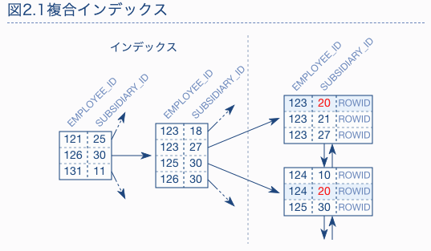

# 課題1

## Table of Contents
<!-- START doctoc generated TOC please keep comment here to allow auto update -->
<!-- DON'T EDIT THIS SECTION, INSTEAD RE-RUN doctoc TO UPDATE -->
<details>
<summary>Details</summary>

- [質問1](#%E8%B3%AA%E5%95%8F1)
  - [回答](#%E5%9B%9E%E7%AD%94)
- [質問2](#%E8%B3%AA%E5%95%8F2)
  - [回答](#%E5%9B%9E%E7%AD%94-1)
- [参考](#%E5%8F%82%E8%80%83)

</details>
<!-- END doctoc generated TOC please keep comment here to allow auto update -->

## 質問1

> 複合インデックスの仕組みを説明してください

### 回答

- 複合インデックスとは、複数の列にまたがる一つのインデックスのこと。
- 複合インデックスを作成する際は、指定する順番が重要で、指定された順序にしたがって列を識別、並び替えの際に優先される。最初の列に同じ値が複数ある時に限り、2番目の列でも並べ替えがされる
  - > 複合インデックスを定義する際に考えるべき最も重要なのは、そのインデックスを使えるSQL文ができるだけ多くなるように、列の順番を決めること



## 質問2

> 姓名を組み合わせた検索、または姓のみの検索が多いサービスの場合、以下の複合インデックスではどのような問題があるでしょうか？

```sql
CREATE INDEX employees_name ON employees (first_name, last_name)
```

### 回答

- 複合インデックスでは、指定した順番によって並び替えの優先度が変わる。先に指定したカラムの方が優先度が高いため、上記のインデックスでは「名」の方が先にソートされる。
- 「姓」は「名」が同じだった場合に昇順にソートされるため、「姓」のみで検索された場合は、インデックスが有効に働かない。
  - （疑問）課題説明には、フルテーブルスキャンとなってしまうとあるが、以下で実験した結果、「type」は「ALL」にはなっていなかった。
- 以下の通り修正する必要がある

```sql
CREATE INDEX employees_name ON employees (last_name, first_name);
```

- また、上記の内容を試してみる。
- 以下のクエリで、インデックスの指定順番による実行時間の比較を行う。

```sql
SELECT
  first_name,
  last_name
FROM
  employees
WHERE
  last_name = 'Facello';
```

- 以下2つのインデックスを作成した際の、実行計画と実行時間を比較する

```sql
-- ①
CREATE INDEX employees_name ON employees (first_name, last_name);
```

```sql
-- ②
CREATE INDEX employees_name ON employees (last_name, first_name);
```

- 実行計画

```sql
-- ①の場合
mysql> explain SELECT   first_name,   last_name FROM   employees WHERE   last_name = 'Facello'\G
*************************** 1. row ***************************
           id: 1
  select_type: SIMPLE
        table: employees
   partitions: NULL
         type: index
possible_keys: NULL
          key: employees_name
      key_len: 34
          ref: NULL
         rows: 299866
     filtered: 10.00
        Extra: Using where; Using index
1 row in set, 1 warning (0.00 sec)

-- ②の場合
mysql> explain SELECT   first_name,   last_name FROM   employees WHERE   last_name = 'Facello'\G
*************************** 1. row ***************************
           id: 1
  select_type: SIMPLE
        table: employees
   partitions: NULL
         type: ref
possible_keys: employees_name
          key: employees_name
      key_len: 18
          ref: const
         rows: 186
     filtered: 100.00
        Extra: Using index
1 row in set, 1 warning (0.00 sec)
```

- 実行時間の確認

```bash
# cat 0771bb71246a-slow.log
mysqld, Version: 5.7.24 (MySQL Community Server (GPL)). started with:
Tcp port: 3306  Unix socket: /var/run/mysqld/mysqld.sock
Time                 Id Command    Argument
# Time: 2021-04-05T13:09:11.839848Z
# User@Host: root[root] @ localhost []  Id:    22
# Query_time: 0.060134  Lock_time: 0.000141 Rows_sent: 186  Rows_examined: 300024
SET timestamp=1617628151;
SELECT
  first_name,
  last_name
FROM
  employees
WHERE
  last_name = 'Facello';
mysqld, Version: 5.7.24 (MySQL Community Server (GPL)). started with:
Tcp port: 3306  Unix socket: /var/run/mysqld/mysqld.sock
Time                 Id Command    Argument

# Time: 2021-04-05T13:12:56.628509Z
# User@Host: root[root] @ localhost []  Id:    22
# Query_time: 0.000431  Lock_time: 0.000116 Rows_sent: 186  Rows_examined: 186
SET timestamp=1617628376;
SELECT   first_name,   last_name FROM   employees WHERE   last_name = 'Facello';
```

- 以下は比較結果のサマリ
  - インデックス作成時の、カラムの順番を逆にすることによって、実行時間が短縮されていることがわかる

|インデックスの指定順番|実行時間（s）|
|---|---|
|(first_name, last_name)|0.060134|
|(last_name, first_name)|0.000431|

## 参考

- [開発者のためのSQLのチューニングガイド 複合インデックス](https://use-the-index-luke.com/ja/sql/where-clause/the-equals-operator/concatenated-keys)
- [DBのインデックスと複合インデックス](https://qiita.com/towtow/items/4089dad004b7c25985e3)