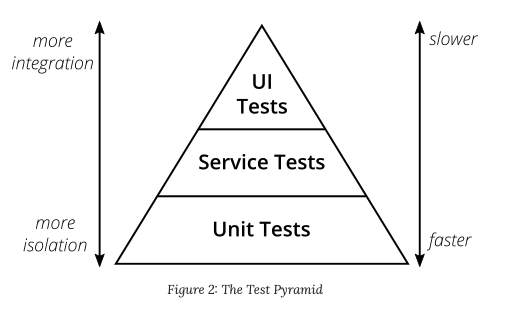

# 課題

## Table of Contents
<!-- START doctoc generated TOC please keep comment here to allow auto update -->
<!-- DON'T EDIT THIS SECTION, INSTEAD RE-RUN doctoc TO UPDATE -->

<!-- END doctoc generated TOC please keep comment here to allow auto update -->

## 質問1

> E2Eテストのメリットとデメリットを挙げてください

### 回答

- メリット
  - 手動でテストを行う手間を省くことができる
    - 手動でテストを行うと、以下のようなデメリットが考えられる
      - 細かいUIや挙動のテストを行うことを忘れてしまう
      - 手動のため、時間がかかる
- デメリット
  - ユーザーが操作するのと同じ環境でテストを行うため、以下のデメリットが考えられる
    - 実際にユーザーが使用する環境と同様の環境を準備するため、テスト実行に時間がかかる（ただそれでも、手動よりは早く終わるはず）
    - テスト失敗しやすい
      - ネットワークアクセスなど外部通信が発生するため、その影響を受ける
      - テストが壊れやすいため、メンテナンスコストが高い

## 質問2

> テスト手法（単体、統合、E2Eなど）を選択する際、どのような基準で選ぶと良いでしょうか？

### 回答

- テストピラミッドについて
  
  - 以下2つが重要
    - 異なる粒度でテストを作成すること
    - ピラミッドの高レベルになるほど、必要なテストは少なくなること
  - 上にいくほど、より統合されたテストで、実行に時間がかかる

- テスト手法の選択の基準
  - 規模が大きい場合、長期間使用されるアプリケーションの場合
    - どのレベルのテストも行う
    - ただし、高レベルなテストほど、テストが壊れやすい、実行に時間がかかるといった特徴があるため、低レベルなテストの質と量を増やし、高レベルなテストは少なくする
  - 短期間で仕様が変化するアプリケーションの場合
    - 低レベルなテストのコードを書いても、仕様の変更によって今後意味を生さなくなる可能性が高いため、E2Eテストなど、テストピラミッドの高レベルのテストを重視する

## 参考
- [The Practical Test Pyramid](https://martinfowler.com/articles/practical-test-pyramid.html)
- [E2Eテストの導入から学んだこと](https://qiita.com/mt0m/items/7e18d8802843d9f60d28)