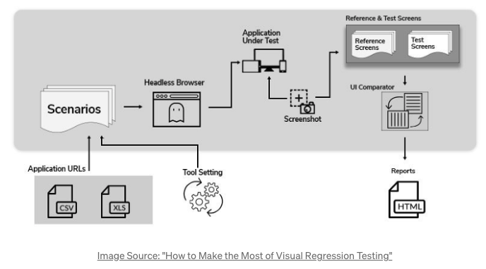

# 課題2

## Table of Contents
<!-- START doctoc generated TOC please keep comment here to allow auto update -->
<!-- DON'T EDIT THIS SECTION, INSTEAD RE-RUN doctoc TO UPDATE -->

Details

- [質問](#%E8%B3%AA%E5%95%8F)
  - [回答](#%E5%9B%9E%E7%AD%94)

<!-- END doctoc generated TOC please keep comment here to allow auto update -->

## 質問

> ビジュアルリグレッションテストとスナップショットテストを比較した時、それぞれにどのようなメリット・デメリットがあると感じましたか？

### 回答

- スナップショットテスト
  - メリット
    - エンジニアのみでUIのリグレッションテストが容易にできるようになり、修正箇所もわかりやすいため、UIのデグレードが発生しづらい
    - 意図しないデザインの崩れを自動で検出することができる
    - 手動でUIの状態を再現したり、撮影することが不要になる
    - UIのテストのみを集中して行うことができる
      - 実際のブラウザやスマホなどの画面ではなく、コマンドラインで実行されるため、ビルドを待ったり、ページを読み込むなどを行う必要がない。そのようなUI以外の不安定な要素にUIのテストが左右されることがない
  - デメリット
    - 仕様が未確定や高頻度で変わる場合
      - デザインに意図的な変更を加えた場合、スナップショットテストは失敗してしまうため、その時は再度、スナップショットテストでリファレンス画像を生成し直したり、スタブを修正するなどの工数がかかる
    - 状態再現のための修正コストが高い場合
      - スナップショットテストは、アプリケーションのアウトプットと緊密に紐づいているため、非常に壊れやすい。重要でない部分のどんな変更があったとしてもスナップショットテストは失敗してしまう。そのため、開発者は全てが正常に機能していることを手動で確認し、スナップショットテストを更新する必要がある
      - スナップショットテストは、期待値やアサーションなどが含まれていないため、期待している状態かどうかは判断できない
    - スナップショットを保存するためのストレージが十分ではない場合
      - スナップショットテストはどこかに保存する必要があるが、スクリーンショットベースのスナップショットはストレージを簡単に消費してしまう可能性があるため

- ビジュアルリグレッションテスト
  - メリット
    - 意図しないデザインの崩れを自動で検出することができる
      - スナップショットテストでは、機能的に問題なく動作しているかをテストするのに対し、ビジュアルリグレッションテストでは外観に注視して視覚的なテストを行う
        - 例えば、以下のアプリケーションの画像では、フォームとドロップダウンの矢印ボタンがあるが、そのボタンはテキストに被ってしまっていて、機能しない状態となっている。こういったものがビジュアルバグ。

        
    - 多様なデバイスサイズのテストを手動で行う手間が減る
      - 例えばレスポンシブ対応している場合
      - ただ、多様な解像度のデバイスごとの比較を厳密に行うことは難しい。ビジュアルリグレッションテストでは、人間の目では識別できないマイナーなUIの問題を検知することはなく、より大きなバグのみ識別される。
    - 視覚的な変更ログを蓄積することができる
    - ビジュアルリグレッションてすとにより、視覚的なエビデンスを残しておくことで、設計者やPMなど関係者間からのフィードバックの共有などが容易になる可能性がある
  - デメリット
    - コードレベルの差分の指摘とは異なるため、どこを修正すべきかがすぐに判断できない
    - スナップショットテストと同じく、少しの変更でテストが壊れる可能性があるため、メンテナンスコストがかかる
    - スナップショットテストと同じく、動的なコンテンツのテストには不向きと考えられる
    - （デメリットというよりも注意）テストされる環境によって、テスト結果が異なる場合がある
      - 時間、ネットワーク、デバイスなどの多様な要因で結果が変化する可能性があるため、原因の切り分けの際には注意が必要

## 参考
- ビジュアルリグレッションテストとは
  - アプリケーション実行時の画面のスナップショットを撮影し、正となるスナップショットと比較して、差分を検出するテスト
  - 以下はビジュアルリグレッションテストのワークフロー
  
  
- [Visual Regression Testing](https://medium.com/loftbr/visual-regression-testing-eb74050f3366)
- [制作現場におけるビジュアルリグレッションテストの導入 – 「LINEのお年玉」4年目の挑戦](https://engineering.linecorp.com/ja/blog/visual-regression-otoshidama/)
- [Visual Testing](https://www.educba.com/visual-testing/)