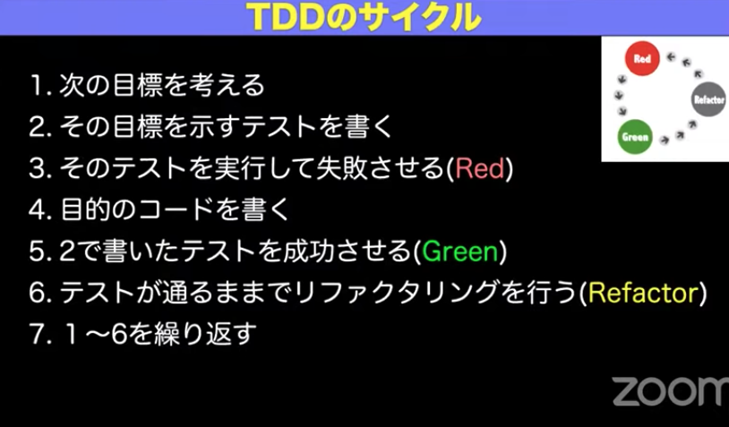

# 課題1

## Table of Contents
<!-- START doctoc generated TOC please keep comment here to allow auto update -->
<!-- DON'T EDIT THIS SECTION, INSTEAD RE-RUN doctoc TO UPDATE -->

Details

- [質問1](#%E8%B3%AA%E5%95%8F1)
  - [回答](#%E5%9B%9E%E7%AD%94)
- [質問2](#%E8%B3%AA%E5%95%8F2)
  - [回答](#%E5%9B%9E%E7%AD%94-1)
- [テスト駆動開発(TDD)に関する整理](#%E3%83%86%E3%82%B9%E3%83%88%E9%A7%86%E5%8B%95%E9%96%8B%E7%99%BAtdd%E3%81%AB%E9%96%A2%E3%81%99%E3%82%8B%E6%95%B4%E7%90%86)
- [参考](#%E5%8F%82%E8%80%83)

<!-- END doctoc generated TOC please keep comment here to allow auto update -->

## 質問1

> テスト駆動開発のメリットと、デメリット

### 回答

- 

## 質問2

> TDDにおける以下の用語の意味を説明してください

### 回答

## テスト駆動開発(TDD)に関する整理

- テスト駆動開発の発案者
  - Kent Beckさん

- テスト駆動開発とは

  - まずTODOリストを作る
    - タスク分解や整理の良い練習方法
      - テスト容易性が高いものがどのようなものかをわかるようになること（経験）
        - 最初はできなくても良いので、まずはやってみるとわかるようになってくる
      - また、設計について勉強すると良い（理論）
        - 例えばClean Architecture

  - 3のテストを実行して失敗させる
    - Javaであれば、`fail()`メソッドを使ってメッセージが表示されることを確認する
      - 表示されない場合は、そもそも事前準備に問題があるとわかる
    - コンパイルエラーであっても、Redに数える
      - 静的であっても動的であっても目の前のエラーはRed
    - テストの段階は代表的な3Aパターンでは以下の3つであり、TDDでは下のAssertから書く
      - 準備（Assert）
      - 実行（Act）
      - 検証（Assert）
        - 上から書くと何をやろうとしているか、忘れがち。本来の検証内容と関係ないテストをたくさん書いてしまいがち
  - 4の目的のコードを書く
    - **汚くて良い**ので成功するコードを書く
    - テストコードにバグがある場合どうするのか
      - 判別可能な誤りをいれる
      - 予想通りテストが失敗することを確認する（defect insertion）
        - これを自動でやるのが、mutation testing
  - 6のリファクタリング
    - Martin Fowlerさんのリファクタリングの定義
      - ソフトウェアの外部から見た振る舞いを変えずに、理解や保守が容易になるようにソフトウェアの内部を綺麗にしていくこと
    - Kent Beckさんのリファクタリングの定義
      - 成功しているテストが成功しているままでコードを綺麗にしていくこと
      - ソフトウェアの外部から見た振る舞い、とは少し定義が曖昧なので、Kentさんはそれを言い換えた
    - リファクタは永遠にやりがち
      - 案1：時間で区切る
      - 案2：数を数える
        - 1を目指す
          - コピペすると重複したコードができてしまうが、それをなくすと1になる（重複をなくす）
  - よくある誤解
    - 設計をしない→そうではなく、常に設計し続ける（アジャイル開発も同様）
      - 設計はTODOリストとして、箇条書きで共有する
      - 粒度を最初から揃える必要はなく、まず脳内の思考をダンプすることが重要
  - 「動作する綺麗なコード」
    - まず「動作する」汚いコードを書く、次に動作しているままで、「綺麗な」コードを書く
    - 2つの方法
      - 重要なテストから取り組む
      - テストを書きやすいテストから取り組む（テスト容易性が高い）→TDDではこちらから取り組む
        - TDDはやることが多いため、1周目や2周目で重要なテストを行うと作業が重いため
          - 1周目が重いのは、何もないところから作る必要があるため。設計の色合いが強い
        - 重要なものがテスト容易性が低いわけではなく、そういうものでもテスト容易性を高くすることができる
        - テスト容易性が高いとは
          - 観測が簡単
          - 制御が簡単
          - 対象が十分小さいこと
  - TDDのスキル
    - 問題を小さく分割する
    - 歩幅を調整する
    - テストの構造化とリファクタリング
      - 構造化とリファクタまで、テスト作成者本人が行わないと、その後に直すことは本人含め非常に難しい
  - 仮実装
    - TDD開発の1周目で行われる。ひどいコードで良い。
  - 三角測量
    - 仮実装に対して、まともな方向に戻す
    - ただし、実装に不安がなくなってきたら、三角測量は飛ばして、実装を行っても良い

- 日本語でテストを共有しても問題ない場合は、日本語で書くことを推奨する
  - テストコードからテストの内容を読み取れるドキュメントとして、成立してほしい
- Assertを縦に並べず、別のテストとして切り出す
  - 理由
    - Assertion Rouletteと言われる、アンチパターン
      - 途中でAssertが失敗すると、次のAssertが実行されないので、テストされない（そのテストをしたときにどうなるかがわからない状態になってしまう）
        - どのAssertで失敗してるのかを確かめる必要がある
        - テストする際に失敗したかったときに、デバッグから始める必要がある
        - ドキュメントとして読んだときに仕様がわかりにくい
      - 理想としては、1つのテストで1つのAssertionが望ましい（One Assertion per Testと呼ばれる）
        - テストごとにAssertionが1つであれば、どこで失敗したかが自明
        - 複数のAssertionをしたい場合は、テストを分解すべきか、もしくは分解が誤ってるのか？
          - Assertionを複数OKな場合
            - まとめてAssertionしなければ意味がない場合は、複数でもOK
            - 例えばE2Eテストなどの動作が遅いテスト
          - ただし、まずは分解の方を疑って、分解できないかを考えることを推奨する！
            

## 参考

- [見てわかるテスト駆動開発](https://www.youtube.com/watch?v=Q-FJ3XmFlT8)