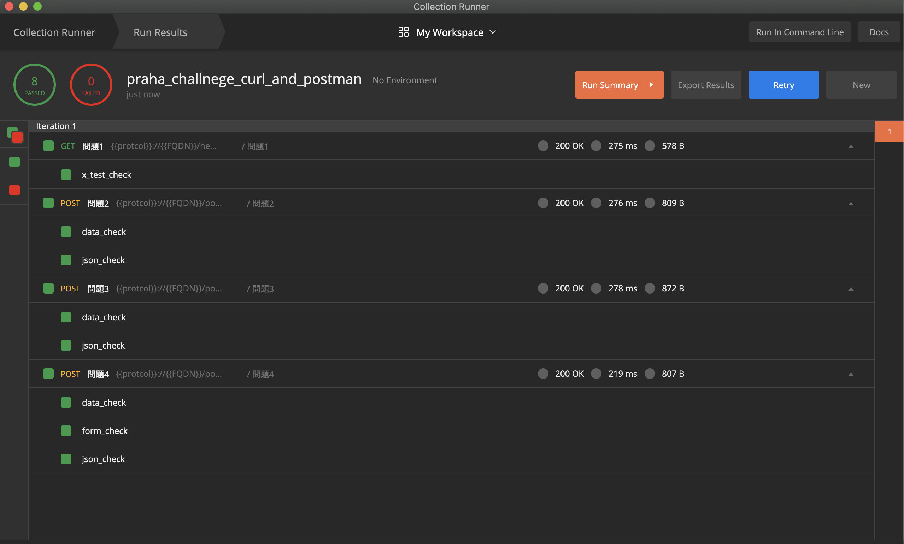
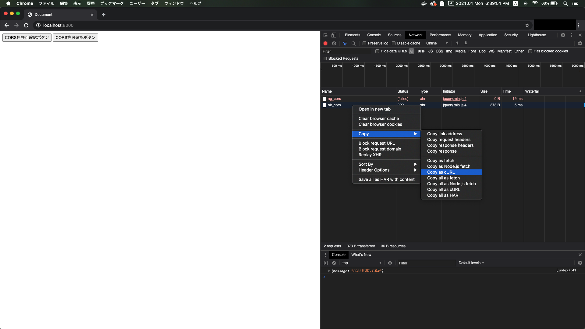

# curlとpostmanのクイズ以外の課題

## Table of Contents
<!-- START doctoc generated TOC please keep comment here to allow auto update -->
<!-- DON'T EDIT THIS SECTION, INSTEAD RE-RUN doctoc TO UPDATE -->
<details>
<summary>目次</summary>

- [curlの課題](#curl%E3%81%AE%E8%AA%B2%E9%A1%8C)
  - [問題1](#%E5%95%8F%E9%A1%8C1)
    - [回答](#%E5%9B%9E%E7%AD%94)
  - [問題2](#%E5%95%8F%E9%A1%8C2)
    - [回答](#%E5%9B%9E%E7%AD%94-1)
  - [問題3](#%E5%95%8F%E9%A1%8C3)
    - [回答](#%E5%9B%9E%E7%AD%94-2)
  - [問題4](#%E5%95%8F%E9%A1%8C4)
    - [回答](#%E5%9B%9E%E7%AD%94-3)
- [postmanの課題](#postman%E3%81%AE%E8%AA%B2%E9%A1%8C)
    - [回答](#%E5%9B%9E%E7%AD%94-4)
- [疑問（調べていてわからなかったことを記載します）](#%E7%96%91%E5%95%8F%E8%AA%BF%E3%81%B9%E3%81%A6%E3%81%84%E3%81%A6%E3%82%8F%E3%81%8B%E3%82%89%E3%81%AA%E3%81%8B%E3%81%A3%E3%81%9F%E3%81%93%E3%81%A8%E3%82%92%E8%A8%98%E8%BC%89%E3%81%97%E3%81%BE%E3%81%99)
- [メモ（回答には直接関係ないですが、調べたことを記載します）](#%E3%83%A1%E3%83%A2%E5%9B%9E%E7%AD%94%E3%81%AB%E3%81%AF%E7%9B%B4%E6%8E%A5%E9%96%A2%E4%BF%82%E3%81%AA%E3%81%84%E3%81%A7%E3%81%99%E3%81%8C%E8%AA%BF%E3%81%B9%E3%81%9F%E3%81%93%E3%81%A8%E3%82%92%E8%A8%98%E8%BC%89%E3%81%97%E3%81%BE%E3%81%99)
- [参照元](#%E5%8F%82%E7%85%A7%E5%85%83)

</details>
<!-- END doctoc generated TOC please keep comment here to allow auto update -->

## curlの課題

> 以下のリクエストをcurlコマンドでhttpbinに送信してください
> curlコマンドをペアと比較して、なぜそのような書き方をしたのか、話し合ってみましょう

### 問題1

#### 回答

以下のように書いた。

```curl
curl -Ss -H 'X-Test:hello' https://httpbin.org/headers | jq '.'
```

* 参考
  * 上記の回答のようにリクエストを送ったところ、以下のようにヘッダが返ってきた。（※一部値をマスクしている）
  
  ```json
  {
    "headers": {
      "Accept": "*/*", 
      "Host": "httpbin.org", 
      "User-Agent": "curl/7.64.1", 
      "X-Amzn-Trace-Id": "***********", 
      "X-Test": "hello"
    }
  }
  ```

  * `-H`のオプションで、リクエストヘッダを指定した（`--header`でも同様に指定可能）
  * `-H`区切りでつなげることで、以下のように複数ヘッダを指定することも可能
    * `curl -H 'X-Test:hello' -H 'X-Test-2:hello2' https://httpbin.org/headers`
  * `-Ss`のオプションで、デフォルトで出力される転送情報を非表示にし、エラーが発生した場合のみ出力されるように制御することができる。例えば取得したレスポンスのみをファイルなどに出力したい場合に役立つのではと考えられる。
  * 場合によってはjsonレスポンスが整形されないことがある。またレスポンスがハイライトされるため、`jq`コマンドを使用した。httpbinの場合は整形された状態のレスポンスが返るため、未使用でもそれほど見づらくはないと思われる。
    * 例えば、以下のコマンドを投げた場合、整形されずにレスポンスされ、見づらい
      * コマンド:`curl 'http://search.twitter.com/search.json?q=classmethod&rpp=2&include_entities=true'`
      * レスポンス：

      ```text
      {"errors":[{"message":"The Twitter REST API v1 is no longer active. Please migrate to API v1.1. https://dev.twitter.com/docs/api/1.1/overview.","code":64}]}
      ```

    * `jq`を使用することで、jsonが整形され見やすくなる
      * コマンド：`curl 'http://search.twitter.com/search.json?q=classmethod&rpp=2&include_entities=true' | jq '.'`
      * レスポンス：

      ```json
      {
        "errors": [
          {
            "message": "The Twitter REST API v1 is no longer active. Please migrate to API v1.1. https://dev.twitter.com/docs/api/1.1/overview.",
            "code": 64
          }
        ]
      }
      ```

    * 他にもレスポンスに日本語が含まれている場合、文字化けしてうまく表示されないため、`jq`をインストールして以下のようにリクエストを行うことで、文字化けが解消される。またレスポンスのjsonデータの整形や絞り込みも可能
    * 参考：[jqで簡単JSON加工](https://dev.classmethod.jp/articles/jq/)
  
  * 参考：[curl コマンド 使い方メモ](https://qiita.com/yasuhiroki/items/a569d3371a66e365316f)

### 問題2

#### 回答

以下のように書いた。

```curl
curl -Ss -X POST -H 'Content-Type: application/json' -d '{"name":"hoge"}' https://httpbin.org/post | jq '.'
```

* 参考
  * `-X`でメソッドを指定する。ただし、GETリクエストの場合は省略可能。
  * `-d`で送信するデータを指定する。（`--data`でも同様の指定が可能）

### 問題3

#### 回答

以下のように書いた。

```curl
curl -Ss -X POST -H 'Content-Type: application/json' -d '{"userA":{"name":"hoge","age":29}}' https://httpbin.org/post | jq '.'
```

### 問題4

#### 回答

```curl
curl -Ss -X POST -d 'name=taro' https://httpbin.org/post | jq '.'
```

* 参考
  * `application/x-www-form-urlencoded`とは
    * HTMLフォーム形式を表すメディアタイプ
    * `-d`オプションを使用すると、デフォルトでは`Content-Type`は、`application/x-www-form-urlencoded`となる

## postmanの課題

#### 回答
以下のように回答を確認できます。
1. [postman_collections](./postman_collections/praha_challnege_curl_and_postman.postman_collection.json)にPOSTMANのリクエストやテストスクリプトを書いたコレクションを格納済みなので、それを自分のPOSTMANにコレクションをインポートする
2. コレクションを「Run」する
3. 結果が全てOKになっていることを確認する

* 参考
  * インポート方法：[Importing data into Postman](https://learning.postman.com/docs/getting-started/importing-and-exporting-data/#importing-data-into-postman)
  * 実行方法：[[ツール] PostmanでAPI疎通試験 [試験を実行]
](https://dev.classmethod.jp/articles/api-test-with-postman-02/)

以下がテストの結果です。


## 疑問（調べていてわからなかったことを記載します）

## メモ（回答には直接関係ないですが、調べたことを記載します）
* dockerでhttpbinを起動する方法
  * `docker run -p 80:80 kennethreitz/httpbin`で起動
  * `docker container stop kennethreitz/httpbin`でストップ
  * `docker container ls -a`でコンテナの状態を確認
* curlとは
  * プロトコルの1つを使って、サーバとのデータの送受信を行うためのツール
  * 「client for URL」の略
  * 参考：
    * [curl.1 the man page](https://curl.se/docs/manpage.html)
* curlコマンドをブラウザで作成することもできる
  * 参考：[ChromeのデベロッパーモードからcURLのコマンド作成](https://masalib.hatenablog.com/entry/2018/06/05/213000)
  
* `X-Amzn-Trace-Id`とは
  * AWSのサービスの1つである「Application Load Balancer」がクライアントからのターゲットまたは他のサービスへのHTTPリクエストを追跡するために使用されるトレースID
  * 参考：[Application Load Balancer のリクエストのトレース](https://docs.aws.amazon.com/ja_jp/elasticloadbalancing/latest/application/load-balancer-request-tracing.html)

## 参照元