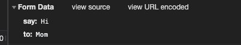

# 課題2

## Table of Contents
<!-- START doctoc generated TOC please keep comment here to allow auto update -->
<!-- DON'T EDIT THIS SECTION, INSTEAD RE-RUN doctoc TO UPDATE -->
<details>
<summary>Details</summary>

- [質問：Content-typeにapplication/x-www-form-urlencodedを指定した時と、application/jsonを指定した時で、送信されるデータ形式がどのように異なるのか説明してください。どんな時にどちらを選択するべきでしょうか？](#%E8%B3%AA%E5%95%8Fcontent-type%E3%81%ABapplicationx-www-form-urlencoded%E3%82%92%E6%8C%87%E5%AE%9A%E3%81%97%E3%81%9F%E6%99%82%E3%81%A8applicationjson%E3%82%92%E6%8C%87%E5%AE%9A%E3%81%97%E3%81%9F%E6%99%82%E3%81%A7%E9%80%81%E4%BF%A1%E3%81%95%E3%82%8C%E3%82%8B%E3%83%87%E3%83%BC%E3%82%BF%E5%BD%A2%E5%BC%8F%E3%81%8C%E3%81%A9%E3%81%AE%E3%82%88%E3%81%86%E3%81%AB%E7%95%B0%E3%81%AA%E3%82%8B%E3%81%AE%E3%81%8B%E8%AA%AC%E6%98%8E%E3%81%97%E3%81%A6%E3%81%8F%E3%81%A0%E3%81%95%E3%81%84%E3%81%A9%E3%82%93%E3%81%AA%E6%99%82%E3%81%AB%E3%81%A9%E3%81%A1%E3%82%89%E3%82%92%E9%81%B8%E6%8A%9E%E3%81%99%E3%82%8B%E3%81%B9%E3%81%8D%E3%81%A7%E3%81%97%E3%82%87%E3%81%86%E3%81%8B)
- [確認したリクエストとレスポンス](#%E7%A2%BA%E8%AA%8D%E3%81%97%E3%81%9F%E3%83%AA%E3%82%AF%E3%82%A8%E3%82%B9%E3%83%88%E3%81%A8%E3%83%AC%E3%82%B9%E3%83%9D%E3%83%B3%E3%82%B9)

</details>
<!-- END doctoc generated TOC please keep comment here to allow auto update -->

## 質問：Content-typeにapplication/x-www-form-urlencodedを指定した時と、application/jsonを指定した時で、送信されるデータ形式がどのように異なるのか説明してください。どんな時にどちらを選択するべきでしょうか？

|Content-Type|意味|送信されるデータ形式|利用シーン|データ形式の例|備考|
|----|----|----|----|----|----|
|`application/x-www-form-urlencoded`|HTMLフォーム形式。`x-`がついているが、IANAに登録された正式なメディアタイプ。|キーとバリューがその間に`=`がある組み合わせであり、`&`で区切られてエンコードされている。キーや値の英数字以外の文字は、パーセントエンコーディングされる。|HTMLのフォームデータを送信する際に使われる。|a=1&b=1|HTMLのFormの仕様では、GETとPOSTのみがサポートされているため、他のメソッドが利用できないが、リクエストデータに`_method`として使用したいメソッドを指定することで他のメソッドを指定できる。（ただし書籍では`_method`の方法は推奨されておらず、`X-HTTP-Method-Override`ヘッダの使用が推奨されている）<br>`_method`の方法では、`application/x-www-urlencoded`以外の方式でデータを送信することはできない|
|`application/json`|JSON文書|JSON(JavaScript Object Notation)という構造データ表現フォーマット|JSONを送信する場合に使用される。`application/x-www-form-urlencoded`と違い、データを階層構造で持つことができる。|{"name": "hoge"}|

* 参考
  * [POST](https://developer.mozilla.org/ja/docs/Web/HTTP/Methods/POST)(MDN Web Docs)
  * Web API The Good Part(書籍)
  * [REST API のコツ](https://www.slideshare.net/pospome/rest-api-57207424)
  * [フォームデータの送信](https://developer.mozilla.org/ja/docs/Learn/Forms/Sending_and_retrieving_form_data)
  * [Express 4.x でmethod-overrideでput / delete メソッドを使いたいにハマる。](https://chaika.hatenablog.com/entry/2015/10/06/183604)

 ## HTMLフォーム送信のサンプル

 ## 実行方法メモ
 1. `task_2`ディレクトリで、`node app.js`で3000ポートで起動
 2. `task_2`ディレクトリで、`python3 -m http.server 8000`で8000ポートで起動
 3. `http://localhost:8000/public`にブラウザでアクセス
 4. フォームの送信ボタンをおす

## 確認したリクエストとレスポンス

* リクエストボディ



* サーバー側ログ
```bash
$ node app.js
受け取ったメソッド： PUT
リクエストのContent-Type： application/x-www-form-urlencoded
リクエストボディ： { say: 'Hi', to: 'Mom' }
```