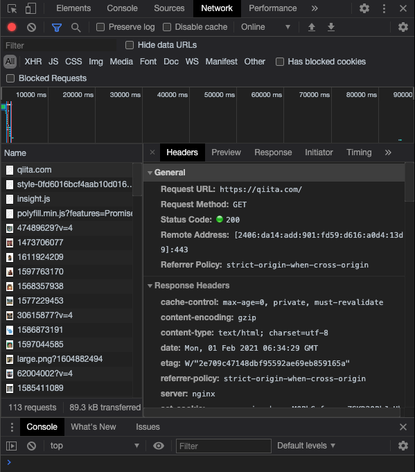
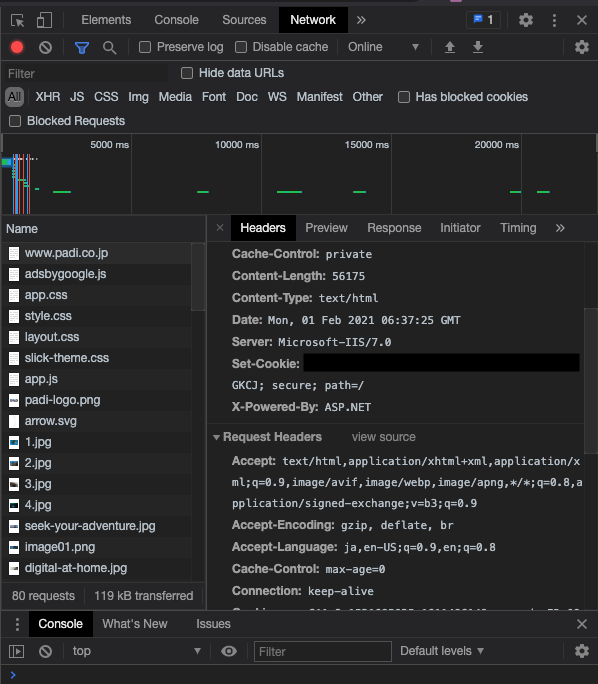
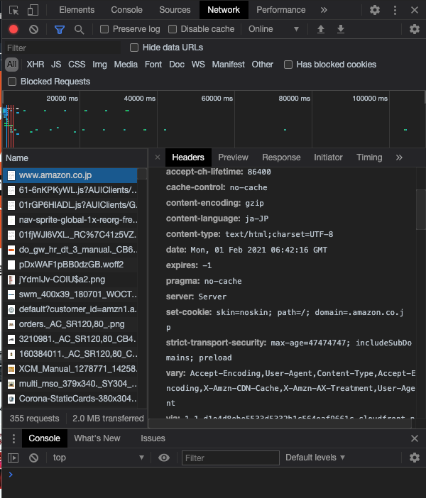
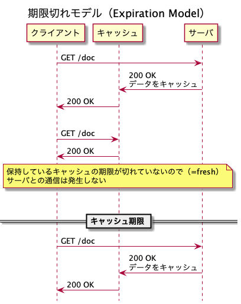
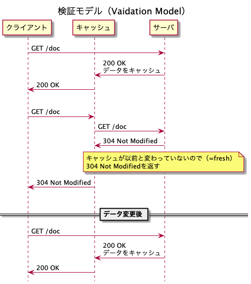
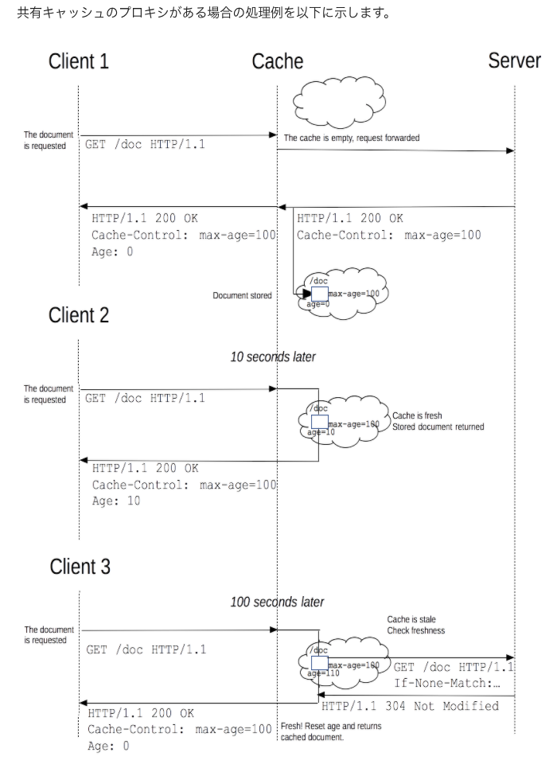
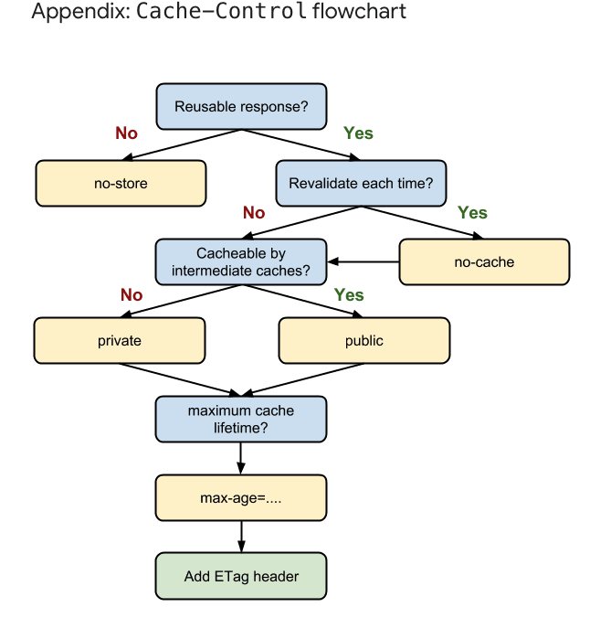

# 課題 1

## Table of Contents

<!-- START doctoc generated TOC please keep comment here to allow auto update -->
<!-- DON'T EDIT THIS SECTION, INSTEAD RE-RUN doctoc TO UPDATE -->

Details

  - [質問 1](#%E8%B3%AA%E5%95%8F-1)
    - [回答](#%E5%9B%9E%E7%AD%94)
  - [質問 2](#%E8%B3%AA%E5%95%8F-2)
    - [回答](#%E5%9B%9E%E7%AD%94-1)
  - [質問 3](#%E8%B3%AA%E5%95%8F-3)
    - [回答](#%E5%9B%9E%E7%AD%94-2)
  - [質問 4](#%E8%B3%AA%E5%95%8F-4)
    - [回答](#%E5%9B%9E%E7%AD%94-3)
  - [質問5](#%E8%B3%AA%E5%95%8F5)
    - [回答](#%E5%9B%9E%E7%AD%94-4)
  - [質問6](#%E8%B3%AA%E5%95%8F6)
    - [回答](#%E5%9B%9E%E7%AD%94-5)
- [キャッシュに関する調査内容](#%E3%82%AD%E3%83%A3%E3%83%83%E3%82%B7%E3%83%A5%E3%81%AB%E9%96%A2%E3%81%99%E3%82%8B%E8%AA%BF%E6%9F%BB%E5%86%85%E5%AE%B9)
  - [キャッシュについて](#%E3%82%AD%E3%83%A3%E3%83%83%E3%82%B7%E3%83%A5%E3%81%AB%E3%81%A4%E3%81%84%E3%81%A6)
  - [キャッシュの方法](#%E3%82%AD%E3%83%A3%E3%83%83%E3%82%B7%E3%83%A5%E3%81%AE%E6%96%B9%E6%B3%95)
    - [期限切れモデル（Expiration Model）](#%E6%9C%9F%E9%99%90%E5%88%87%E3%82%8C%E3%83%A2%E3%83%87%E3%83%ABexpiration-model)
      - [キャッシュ用のヘッダ](#%E3%82%AD%E3%83%A3%E3%83%83%E3%82%B7%E3%83%A5%E7%94%A8%E3%81%AE%E3%83%98%E3%83%83%E3%83%80)
    - [検証モデル（Validation Model）](#%E6%A4%9C%E8%A8%BC%E3%83%A2%E3%83%87%E3%83%ABvalidation-model)
      - [条件付きGETに関わるヘッダ](#%E6%9D%A1%E4%BB%B6%E4%BB%98%E3%81%8Dget%E3%81%AB%E9%96%A2%E3%82%8F%E3%82%8B%E3%83%98%E3%83%83%E3%83%80)
        - [ETagについて](#etag%E3%81%AB%E3%81%A4%E3%81%84%E3%81%A6)
          - [ETagの計算](#etag%E3%81%AE%E8%A8%88%E7%AE%97)
          - [強い検証と弱い検証](#%E5%BC%B7%E3%81%84%E6%A4%9C%E8%A8%BC%E3%81%A8%E5%BC%B1%E3%81%84%E6%A4%9C%E8%A8%BC)
    - [期限切れモデルと検証モデルの比較](#%E6%9C%9F%E9%99%90%E5%88%87%E3%82%8C%E3%83%A2%E3%83%87%E3%83%AB%E3%81%A8%E6%A4%9C%E8%A8%BC%E3%83%A2%E3%83%87%E3%83%AB%E3%81%AE%E6%AF%94%E8%BC%83)
    - [キャッシュの単位の指定](#%E3%82%AD%E3%83%A3%E3%83%83%E3%82%B7%E3%83%A5%E3%81%AE%E5%8D%98%E4%BD%8D%E3%81%AE%E6%8C%87%E5%AE%9A)
    - [参考](#%E5%8F%82%E8%80%83)

<!-- END doctoc generated TOC please keep comment here to allow auto update -->

## 質問 1

> なぜキャッシュが必要なのか、説明してください

### 回答

- キャッシュとは、サーバから取得したリソースをローカルストレージ（ハードディスクなど）に蓄積し、再利用する手法のこと。
- 以下のようなメリットがある
  - ユーザ側のメリット
    - サーバへの通信を減らすことができるため、ユーザーの体感速度をあげることができる
    - サーバへの通信回数、転送量を減らすことでユーザーの通信コストを下げることができる
  - 開発者側のメリット
    - ネットワーク接続が切れた状態でもある程度サービスを継続できる
    - サーバへのアクセス回数が減ることで、サーバの維持費用を抑えることができる

## 質問 2

> キャッシュには様々な種類があります。いくつか例を挙げてそれぞれのキャッシュの違いを説明してください（「ブラウザキャッシュ」「プロキシキャッシュ」など）

### 回答

|ブラウザの種類|概要|備考|
|------------|--------------|--------------|
|プライベートキャッシュ（ブラウザキャッシュ/ローカルキャッシュ）|ひとり一人のユーザのためのキャッシュで、ユーザエージェントのコンポーネントとして設置される。||
|共有キャッシュ（プロキシキャッシュ）|複数ユーザによって再使用されるレスポンスを保存するキャッシュ。プロキシサーバなどの[中継者](https://triple-underscore.github.io/RFC7230-ja.html#intermediary)を介する。||

## 質問 3

> HTTP通信における、ブラウザがキャッシュを制御するために存在するヘッダーを3つ以上挙げて、それぞれの役割を説明してください

### 回答

- キャッシュの処理モデルとして、期限切れモデルと検証モデルが存在し、それぞれ以下のヘッダを使用する。

  - 期限切れモデル
    - [キャッシュ用のヘッダ](#キャッシュ用のヘッダ)参照
  - 検証モデル
    - [条件付きgetに関わるヘッダ](#条件付きgetに関わるヘッダ)参照

## 質問 4

> ブラウザのキャッシュの最大容量はどの程度でしょうか？（ブラウザを複数調べて比較してみましょう）
> 上限を超えると何が起きるでしょうか？

### 回答

|ブラウザ|最大容量|備考|
|-------|---------------|------------------|
|Chrome|デフォルトの最大キャッシュサイズは具体的な数値として定められているわけではなく、`kDefaultCacheSize = 80 * 1024 * 1024`バイトとディスク容量を元に動的に決定される。（Chroniumのソースを見て判断）|・参考:[Chromiumのソースコード58行目](https://chromium.googlesource.com/chromium/src/+/master/net/disk_cache/cache_util.cc#58)|
|Firefox|デフォルトの最大キャッシュサイズは、Firefoxで`about:config`をアドレスバーに打ち、`browser.cache.disk.capacity`を検索すると確認可能。 ストレージ全体という意味だと、ディスク容量の50%まで設定可能で、eTLD+1のドメインの場合は2GBまで設定可能。|kamimi01のPCでは、`1048576`KB（=約1GB）となっていた。|
|Safari|ストレージ全体という意味だと、1GBまで利用可能。ただし制限に達した場合、ユーザに通知して、200MBずつ制限を増やす。 キャッシュのみに言及した記述は見当たらなかった。|Safariではキャッシュサイズを変更することはできない模様。（サードパーティ製品を使用して、キャッシュを行わない方法は考案されている）|

- 参考
  - [Storage for the web](https://web.dev/storage-for-the-web/#how-much)（web.dev）
    - 疑問
      - わかりやすいドキュメントだが、ストレージ全体の上限であって、キャッシュのみに言及しているわけではない？
  - [What is Chrome default cache size limit?](https://superuser.com/questions/378991/what-is-chrome-default-cache-size-limit)
  - [Macブラウザのキャッシュサイズ変更方法とキャッシュの場所](https://infornography.blue/mac/macos-browser-cache-size/)

## 質問5

> 先輩エンジニアに「動的なサイトをキャッシュするなら、expiresは使わない方が良いよ」と言われました。なぜでしょうか？どうすれば良いのでしょうか？

### 回答

- `Expires`を使用した期限切れモデルでのキャッシュ処理を行っていた場合、`Expires`の値の日付になるまで、サーバへの通信が行われずデータが更新されない。そのため、データが頻繁に変化する動的サイトのキャッシュには不向きである。

## 質問6

> ブラウザのキャッシュがWEBサービスに用いられている実例を、3つ以上見つけて共有してください。どのような仕組みで対象がキャッシュされているのか、技術的な流れを説明してみてください

### 回答

- [Qiita](https://qiita.com/)
  - `etag: W/"2e709c47148dbf95592ae69eb859165a"`
    - データに変更があるかをサーバに検証しにいく、検証モデルによるキャッシュの仕組みを導入していると考えられる。
    - `W/`がついているため、弱い検証を利用している

- [PADI](https://www.padi.co.jp/)
  - `Cache-Control: max-age=0`
    - `max-age=0`のため、キャッシュは行わずにリクエストごとにサーバと通信していると考えられる。

- [Amazon](https://www.amazon.co.jp/)
  - `expires: -1`
    - `Expires`の値は`HTTP-date timestamp`とされているので、正しい値の設定方法ではないように思われるが、詳細は不明...
  - `pragma: no-cache`
    - キャッシュするが、検証が必要
  - `vary: Accept-Encoding,User-Agent,Content-Type,Accept-Encoding,X-Amzn-CDN-Cache,X-Amzn-AX-Treatment,User-Agent`
    - リクエストヘッダの値によって、レスポンスデータが変化するために、`vary`ヘッダを使用していると考えられる。

---

# キャッシュに関する調査内容

## キャッシュについて

- サーバから取得したリソースをローカルストレージ（ハードディスクなど）に蓄積し、再利用する手法
- サーバへのアクセス頻度や通信量を減らすために使用される
- キャッシュの種類に関しては、[質問2の回答](#質問-2)参照

## キャッシュの方法

### 期限切れモデル（Expiration Model）

- 予めレスポンスデータに保存期限を決めておき、期限が切れたら再度アクセスをして取得を行う

#### キャッシュ用のヘッダ

|ヘッダ名|概要|値の例|備考|
|--------|-----------------------------|---------|-----------|
|`Pragma`|リソースをキャッシュするが検証が必要|[draft-ietf-httpbis-cache-latest](https://httpwg.org/http-core/draft-ietf-httpbis-cache-latest.html#field.pragma)では非推奨とされている。`no-cache`|HTTP/1.0クライアントとの後方互換用に限り使用する。それ以外の場合は`Cache-Control`ヘッダを使用|
|`Expires`|キャッシュの有効期限を示す。絶対時間で指定する。|`Thu, 11 May 2010 16:00:00 GMT`|1年以上の日時を設定することは推奨されていない|
|`Cache-Control`|キャッシュをするか否か、有効期限などのキャッシュに関する複雑な設定を行う。時間は相対時間を秒で指定する。|`no-cache`、`max-age: 86400`|`Pragma`ヘッダと`Expires`ヘッダの機能の上位互換とも言われるが、絶対時間を指定したい場合は`Expires`を使用する。`Expires`と`Cache-Control`の両方が指定されていた場合は、より新しい仕様の後者が優先される。  `max-age`の計算には、`Date`ヘッダの値が使用される。|

- `no-cache`は、キャッシュしないわけではない！キャッシュするが、検証モデルによる検証が必要なことを表す（キャッシュしない場合は`no-store`を指定する）

### 検証モデル（Validation Model）

- 現在保持しているキャッシュが最新であるかを問い合わせて、データが更新されていた場合のみ取得を行う

#### 条件付きGETに関わるヘッダ

- キャッシュ用のヘッダを検証した結果、ローカルのキャッシュをそのまま利用できない場合でも、条件付きGETでキャッシュを再利用できる可能性がある
- 以下のヘッダを保持している場合に条件付きGETを利用できる

|ヘッダ名|概要|値の例|備考|
|--------|-------|--------|----------|
|`If-Modified-Since`|ローカルキャッシュの更新日時を示す。  サーバ上のリソースがこれ以降変更されていなければ、304 Not Modifiedで`Last-Modified`を返却する。|`Thu, 11 May 2010 16:00:00 GMT`|304のレスポンスにはボディが存在しないため、その分ネットワーク帯域を節約可能。|
|`If-None-Match`|キャッシュしてあるリソースのETagヘッダの値。 サーバ上のリソースが変更されていなければ、304 Not ModifiedでEtagの値を返却する。|`ab3322028`|`ETag`はリソースの更新状態を比較するためだけに使用する文字列のため、リソースを更新した時に別の値になるのであればどのような文字列もOK。 |

- より正確に比較できるため、`If-None-Match`ヘッダを使用する方が良い

##### ETagについて

###### ETagの計算

|計算する方法|計算元になる値|備考|
|----------|------------|------------|
|静的ファイルの場合|Apacheのデフォルトでは、  ・ inode番号（`ls -i`でinodeを確認可能）  ・ファイルサイズ   ・更新日時  から自動計算する   ※ただしinodeは同一内容のファイルでもファイルシステムが異なると別の値となるので、サーバを分散させている場合は注意。ファイルサイズと更新日時からETagの値を計算するよう設定することもできる||
|動的ページの場合|一般的には、  ・リソースのメタデータから生成（更新日時、サイズ）   ・リソースの更新カウンタ|ApacheなどのwebサーバはデフォルトではETagを自動計算しない。またリソース内容のハッシュ値を計算に使用する方法は、データが巨大である場合やDBヘの複雑なクエリが発生するリソースの場合は現実的ではないため、推奨されない|

###### 強い検証と弱い検証

|検証方法|概要|値の例|備考|
|-------|---------|--------------|--------------|
|強い検証|サーバ側とクライアント側でデータが1バイトも違わない完全一致の状態||HTTPは既定では強い検証を使用する|
|弱い検証|データは完全一致していないが、リソースの意味合いとしては変化しておらず同じとみなせる状態||webページなどで広告などの情報がアクセスのたびに指し変わるもののリソース的には同じ場合などに利用|

### 期限切れモデルと検証モデルの比較

- 期限切れモデルは、期限が切れるまでサーバとの通信は行わず、期限が切れたらサーバとの通信を行ってデータを取得する。

- 検証モデルは、サーバに毎回通信を行い、データの更新が発生した場合のみデータを取得する

- 疑問
  - 実際は、期限切れモデルと検証モデルを組み合わせた処理を行うことが多いのだろうか？
  - MDN Web Docsのシーケンス図は、組み合わせてあったように見える
  - 参考
    - [HTTP キャッシュ](https://developer.mozilla.org/ja/docs/Web/HTTP/Caching)

### キャッシュの単位の指定

- `Vary`ヘッダ：キャッシュを行う際に、URI以外にどのリクエストヘッダ項目をデータを一意に特定するために利用するかを指定する
  - `Accept-`で始まるリクエストヘッダの値によって、レスポンスの内容が変更される場合（＝「サーバ駆動型コンテントネゴシエーション（Server Driven Content Negotiation）」の場合）
  - 例えば`Accept-Language`の値により、レスポンスデータの内容を言語ごとに切り替えている場合、同じURIでもレスポンスデータは異なるので、URIのみを見て例えば`ja`（日本語）のキャッシュしか存在しないのにキャッシュを返してしまうと、英語を表示したいのに、日本語が返されるといった問題が起きてしまう
  - 指定方法：`Vary: Accept-Language, User-agent`

### 参考

- Webを支える技術（書籍）
- Web API The Good Part（書籍）
- [HTTP 条件付きリクエスト](https://developer.mozilla.org/ja/docs/Web/HTTP/Conditional_requests)
- [HTTP キャッシュ](https://developer.mozilla.org/ja/docs/Web/HTTP/Caching)
- [RFC 7234, Caching（非公式日本語訳）](https://triple-underscore.github.io/RFC7234-ja.html)
- [Prevent unnecessary network requests with the HTTP Cache](https://web.dev/http-cache/#defining-optimal-cache-control-policy)

