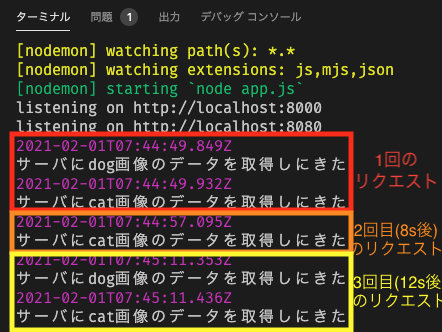

# 課題2

## 動作環境

- `node`：v12.20.1
- `npm`：6.14.10
- Chromeブラウザ

## 確認手順

1. VSCodeで、Remote Containerの拡張機能で、[task_2](../task_2)フォルダを「Open Folder in Container...」から開く
2. 以下のコマンドを実行して、必要なモジュールをインストールする（node_modulesフォルダをgitignoreしているため）

   `npm install`
3. 以下のコマンドを実行する

   `npm run dev`
4. 以下のURLにブラウザでアクセスする

   `http://localhost:8080`
5. Developer Toolsを開く

## 確認結果

> 1つ目のエンドポイントでは、同じクライアントによるアクセスの場合ブラウザのキャッシュを使うことで、アクセス負荷を減らしましょう

- `max-age=10`に設定しており、10秒以内にリクエストすると、サーバ側の`/use_cache`エンドポイントの処理内の標準出力が行われない

> 2つ目のエンドポイントではブラウザキャッシュを使わず画像を返すようにしてください

- `no-store`を設定しており、何度リクエストしても必ずサーバ側の`/nouse_cache`エンドポイント処理内の標準出力が行われている

