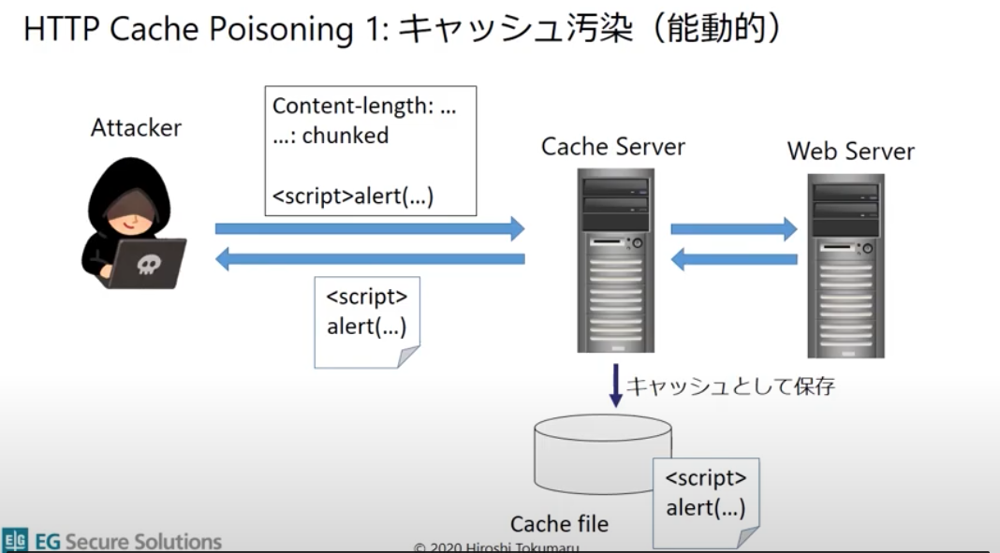
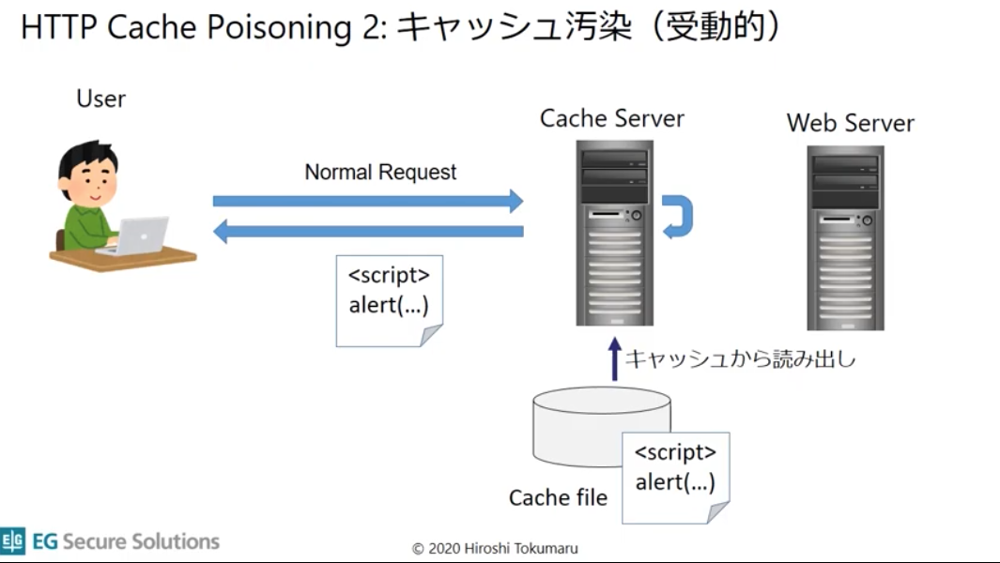

# 課題4

## Table of Contents
<!-- START doctoc generated TOC please keep comment here to allow auto update -->
<!-- DON'T EDIT THIS SECTION, INSTEAD RE-RUN doctoc TO UPDATE -->

Details

- [クイズ1](#%E3%82%AF%E3%82%A4%E3%82%BA1)
- [クイズ2](#%E3%82%AF%E3%82%A4%E3%82%BA2)

<!-- END doctoc generated TOC please keep comment here to allow auto update -->

## クイズ1

- [共有キャッシュ](https://developer.mozilla.org/ja/docs/Web/HTTP/Caching#shared_proxy_caches)の一つとして、CDN(Content Delivery Network)がありますが、これを導入するメリットとはなんでしょうか？

<detail>

想定回答

- 帯域制限を気にしなくていい
  - アクセスが集中し、帯域を圧迫するとタイムアウトが発生してしまう
- サーバのCPU負荷を低減できる
  - オリジンサーバへのアクセスが集中してしまう
- 転送容量を気にしなくて良い
  - １日の転送容量などが決まっていることが一般的なため、オリジンサーバからの転送が多くなるとその分課金される。
  - CDNからの転送などCDN関連のコストは発生するが、オリジンサーバと直接通信するよりも安価に設定されていることも多い。
- 運用コストを抑えることができる

- 参考
  - [CDNってそもそも何？なんかサーバの負荷が下がるって聞いたんだけど！〜Web制作/運営の幅が広がるCDNを知ろう第1回〜](https://knowledge.sakura.ad.jp/19191/)
  - [CDNのメリットとデメリット〜Web制作/運営の幅が広がるCDNを知ろう第2回〜](https://knowledge.sakura.ad.jp/19825/)
  - [CDNとは？概要からメリット・デメリット、セキュリティ対策としての利用方法まで解説](https://wpmake.jp/contents/knowledge/about_cdn/#CDN-3)
  - [Amazon CloudFront を利用するメリットとS3との違いについて](https://www.acrovision.jp/service/aws/?p=1441)
  - [Hosting Static Websites on AWS](https://d1.awsstatic.com/whitepapers/Building%20Static%20Websites%20on%20AWS.pdf?did=wp_card&trk=wp_card)

</detail>

## クイズ2

- キャッシュに関して発生しうるセキュリティの問題として、キャッシュ汚染があります。これは何かを説明してください。

<detail>

想定回答

- Webアプリケーションに対して、偽のHTTPレスポンスを発生させ、キャッシュにそのレスポンスを記録させる（=キャッシュ汚染）ことによって、次にそのキャッシュを取得したユーザに対して悪意ある攻撃を行うことができる。

- 対策
  - Webアプリケーション側で、不正なHTTPレスポンスを発生させるリクエストを検知、排除する仕組みが必要
  - プロキシサーバやキャッシュサーバのキャッシュを定期的にクリアする（万一キャッシュが汚染された場合でも、被害をできるだけ小さく抑える）

- 参考
  - [HTTPレスポンスによるキャッシュ偽造攻撃対策](https://www.ipa.go.jp/security/awareness/vendor/programmingv2/contents/603.html)
  - [CVE-2018-17082に学ぶHTTPキャッシュ汚染攻撃](https://www.youtube.com/embed/jhyB5bcrdyo)

</detail>