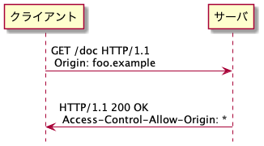
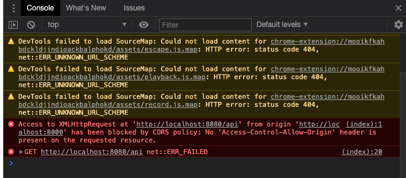
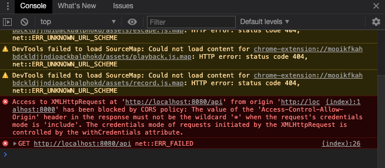

# 課題1

## Table of Contents
<!-- START doctoc generated TOC please keep comment here to allow auto update -->
<!-- DON'T EDIT THIS SECTION, INSTEAD RE-RUN doctoc TO UPDATE -->
<details>
<summary>Details</summary>

- [質問1](#%E8%B3%AA%E5%95%8F1)
  - [回答](#%E5%9B%9E%E7%AD%94)
- [質問2](#%E8%B3%AA%E5%95%8F2)
  - [回答](#%E5%9B%9E%E7%AD%94-1)
- [質問3](#%E8%B3%AA%E5%95%8F3)
  - [回答](#%E5%9B%9E%E7%AD%94-2)
- [質問4](#%E8%B3%AA%E5%95%8F4)
  - [回答](#%E5%9B%9E%E7%AD%94-3)
- [質問5](#%E8%B3%AA%E5%95%8F5)
  - [回答](#%E5%9B%9E%E7%AD%94-4)
- [参考](#%E5%8F%82%E8%80%83)

</details>
<!-- END doctoc generated TOC please keep comment here to allow auto update -->

## 質問1

> 以下の単語を使ってCORSの仕組みを説明してください

### 回答

- CORS（オリジン間リソース共有）とは、あるオリジンで動作しているアプリケーションに、異なるオリジンのリソースへのアクセスを許可するようブラウザに指示するための仕組み。
  - オリジンは、**ドメイン、プロトコル、ポート番号**で構成され、これら全てが同じ場合に同一オリジンとなる
- CORSには、**simple request**と**preflight request**という2種類のリクエストが存在している。
- まずクライアントが`Origin`というリクエストヘッダに、アクセス元のオリジンを指定して送る。サーバ側は、アクセスを許可する一覧を保持しており、`Origin`ヘッダの値がその一覧に含まれていれば、`Access-Control-Allow-Origin`のレスポンスヘッダ に`Origin`の値を入れて返すことで、アクセスを許可する。（以下の図は、MDN Web Docsと全く同じ）



- 参考
  - [オリジン間リソース共有 (CORS)](https://developer.mozilla.org/ja/docs/Web/HTTP/CORS)(MDN Web Docs)
  - Web API The Good Parts 4.5 同一生成元ポリシーとクロスオリジンリソース共有（書籍）
  - 体系的に学ぶ 安全なWebアプリケーションの作り方 3.2 受動的攻撃と同一オリジンポリシー 3.3 CORS（書籍）
  - [RFC 6454 The Web Origin Concept（非公式日本語訳）](https://triple-underscore.github.io/RFC6454-ja.html)

## 質問2

> Access-Control-Allow-Origin: *
> この設定が問題となるケースを1つ挙げて、なぜ設定するべきではないのか、説明してください

### 回答

- `Access-Control-Allow-Origin`の値を`*`にすることで、全てのドメインからのアクセスを許可することになるため、非公開情報を扱い場合は`*`を指定すべきではない。（ただし、連携先が多い場合は、敢えて`*`をしてし、別の方法で情報漏洩を防ぐという実装も存在する）
  - 例えば、クライアントとドメインが異なり、`Access-Control-Allow-Origin`を`*`としているAPIが存在しているとする。そのAPIは、異なるドメインからのリクエストでも許可してしまうため、クライアントに非公開の情報が渡ってしまうなどが考えられる。

## 質問3

> preflight requestが送信されない「シンプルなリクエスト」に該当するための条件を説明してください

### 回答

- 以下の条件を満たす場合は、シンプルリクエストとなる（1つでも満たさない場合は、preflight requestとなる）
  - 利用するHTTPメソッドが`GET`、`POST`、`HEAD`である
  - 以下のヘッダを送信しようとしている
    - `Accept`
    - `Accept-Language`
    - `Content-Language`
    - `DPR`
    - `Downlink`
    - `Save-Data`
    - `Viewport-Width`
    - `Width`
    - `Content-Type`（ただし以下の値のみ）
      - `application/x-www-form-urlencoded`
      - `multipart/form-data`
      - `text/plain`
- リクエストに使用されるどの`XMLHttpRequestUpload`にもイベントリスナーが登録されていないこと
  - `XMLHttpRequest`とは：ページを更新することなしに、データを受け取ることができる。AJAXプログラミングで多用される。`upload`プロパティは、アップロードプロセスを表す。
- リクエストに`ReadableStream`オブジェクトが使用されていないこと
  - `ReadableStream`とは：バイトデータを読み取り可能なストリームを表す。

- 参考
  - [XMLHttpRequest](https://developer.mozilla.org/ja/docs/Web/API/XMLHttpRequest)(MDN Web Docs)
  - [ReadableStream](https://developer.mozilla.org/ja/docs/Web/API/ReadableStream)(MDN Web Docs)
  - [JavaScriptのStreams APIで細切れのデータを読み書きする](https://sbfl.net/blog/2018/05/26/javascript-streams-api/)

## 質問4

> シンプルなリクエストの場合はpreflightリクエストが送信されず、そのままリクエストがサーバに到達します。サーバからのレスポンスのAccess-Control-Allow-Originヘッダーに、リクエスト送信元のオリジンが含まれない場合、ブラウザはどのような挙動を取るでしょうか？

### 回答

- リクエストは送信されるが、以下のようなエラーが表示される。（サーバからのレスポンスデータはクライアントへは送られていない）
  - [cors_basic](./cors_basic)フォルダで確認



## 質問5

> XMLHttpRequestを使ってクロスオリジンリクエストを発行する際、デフォルトの挙動だとリクエストにクッキーが含まれません。クッキー情報を含むためには、何をする必要があるでしょうか？

### 回答

- クライアントとサーバ側でそれぞれ以下の対応を行う必要がある
  - [cors_basic](./cors_basic)フォルダで確認

  - クライアント側
    - `XMLHttpRequest`の`withCredentials`プロパティを`true`に設定する
      
      ```javascript
      req.withCredentials = true
      ```
  - サーバ側
    - `Access-Control-Allow-Credentials`ヘッダを`true`として返す

      ```javascript
      res.header("Access-Control-Allow-Credentials", true)
      ```
    - `Access-Control-Allow-Origin`ヘッダを`*`以外の具体的なドメイン名を指定して返す

      ```javascript
      res.header('Access-Control-Allow-Origin', "http://localhost:8000");
      ```

      - `*`に設定していた場合、以下のようなエラーが発生する
        
        

## 参考