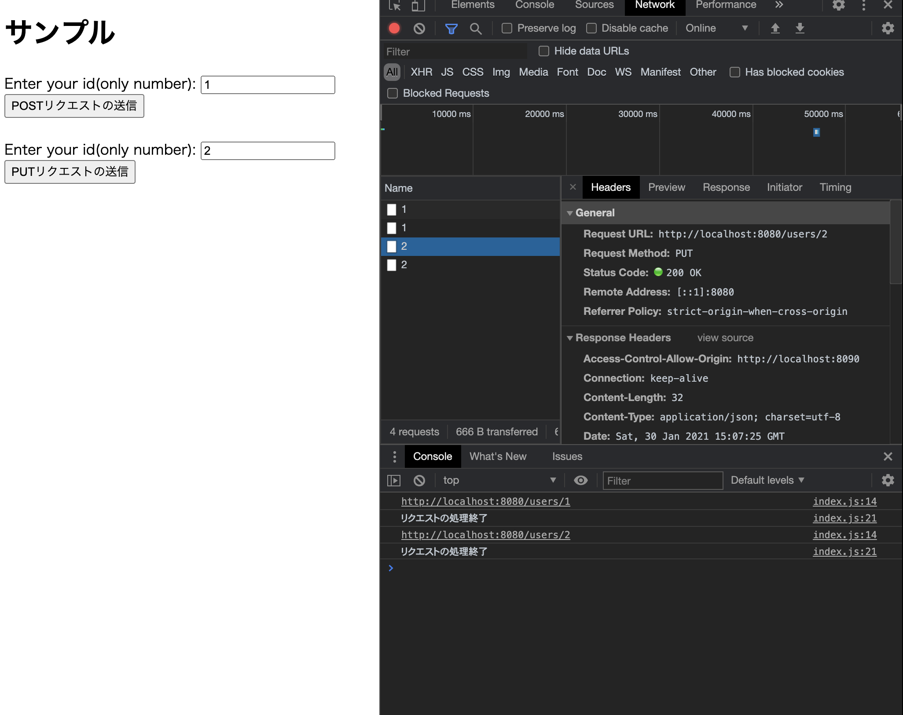

<!-- START doctoc generated TOC please keep comment here to allow auto update -->
<!-- DON'T EDIT THIS SECTION, INSTEAD RE-RUN doctoc TO UPDATE -->

Details

- [ペアのクイズ1,2](#%E3%83%9A%E3%82%A2%E3%81%AE%E3%82%AF%E3%82%A4%E3%82%BA12)
  - [クイズ1,2](#%E3%82%AF%E3%82%A4%E3%82%BA12)
    - [確認手順](#%E7%A2%BA%E8%AA%8D%E6%89%8B%E9%A0%86)
    - [確認結果](#%E7%A2%BA%E8%AA%8D%E7%B5%90%E6%9E%9C)

<!-- END doctoc generated TOC please keep comment here to allow auto update -->

# ペアのクイズ1,2

## クイズ1,2

Express のエコシステムには CORS の設定を簡単にできるミドルウェアが存在している。

- [https://github.com/expressjs/cors](https://github.com/expressjs/cors)

このミドルウェアを使用して、以下の条件を満たすような CORS を実装してみましょう。

- 許可する Origin は `http://loclahost:8090`
- OPTIONS メソッドに対してステータスコードを 204 で返す
- 許可する HTTP メソッドは `PUT` と `POST`
- 許可する HTTP ヘッダは `Content-Type`
- 上記の CORS は `/users/:id` のAPIに対して実装する

### 確認手順

1. VSCodeで、Remote Containerの拡張機能で、[pair_quiz_1](../pair_quiz_1)フォルダを「Open Folder in Container...」から開く
2. 以下のコマンドを実行して、必要なモジュールをインストールする（node_modulesフォルダをgitignoreしているため）

   `npm install`
3. 以下のコマンドを実行する

   `npm run dev`
4. 以下のURLにブラウザでアクセスする

   `http://localhost:8090/index.html?`
5. Developer Toolsを開く

### 確認結果

- 「POSTリクエストの送信」ボタンを押すと、POSTメソッドでプリフライトリクエストが発生するクロスドメインアクセスを行う
- 「PUTリクエストの送信」ボタンを押すと、PUTメソッドでプリフライトリクエストが発生するクロスドメインアクセスを行う

- OPTIONSメソッドのリクエスト結果のスクショは省略するが、問題なくリクエストできていた