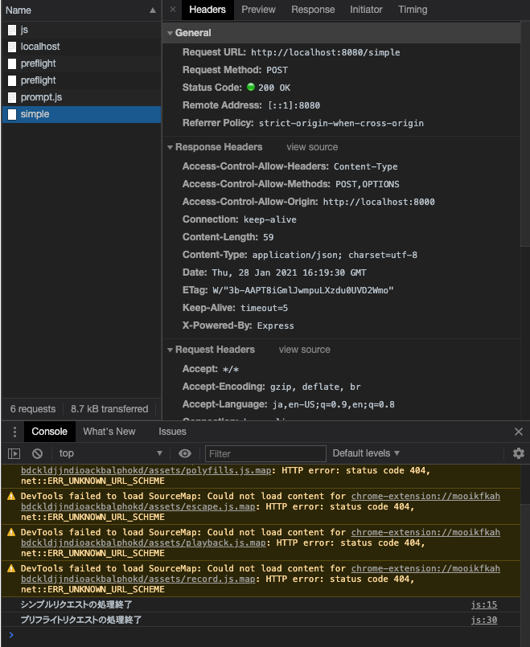
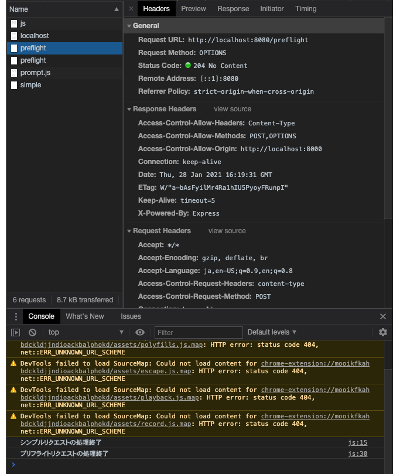

# 課題3

## Table of Contents
<!-- START doctoc -->
<!-- END doctoc -->

## 動作環境

- `node`バージョン：`v12.20.1`
- `npm`バージョン：`6.14.10`
- Chromeバージョン: 88.0.4324.96（Official Build） （x86_64）

## 確認手順

1. VSCodeで、Remote Containerの拡張機能で、[cors_mock](../cors_mock)フォルダを「Open Folder in Container...」から開く
2. 以下のコマンドを実行して、必要なモジュールをインストールする（node_modulesフォルダをgitignoreしているため）
   `npm install`
3. 以下のコマンドを実行する
   `npm run dev`
4. 以下のURLにブラウザでアクセスする
   `http://localhost:8000`
5. Developer Toolsを開く

## 確認結果

- `/simple`がシンプルリクエスト想定のパスですが、プリフライトリクエストにはなっていないことがわかります（OPTIONSメソッドによるリクエストが存在しない）

- `/preflight`がプリフライトリクエスト想定のパスですが、シンプルリクエストではなく、プリフライトリクエストになっていることがわかります（OPTIONSメソッドによるリクエストとPOSTメソッドによるリクエストが存在する）

- 今回ngrokは使用せず、ポートを変更することでクロスドメインアクセスの実装を行っています（ngrokだと毎回URLが変わるので、書き換えが手間だからです...）