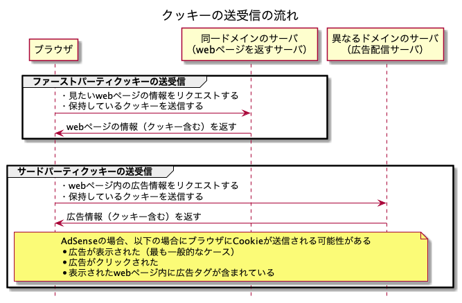
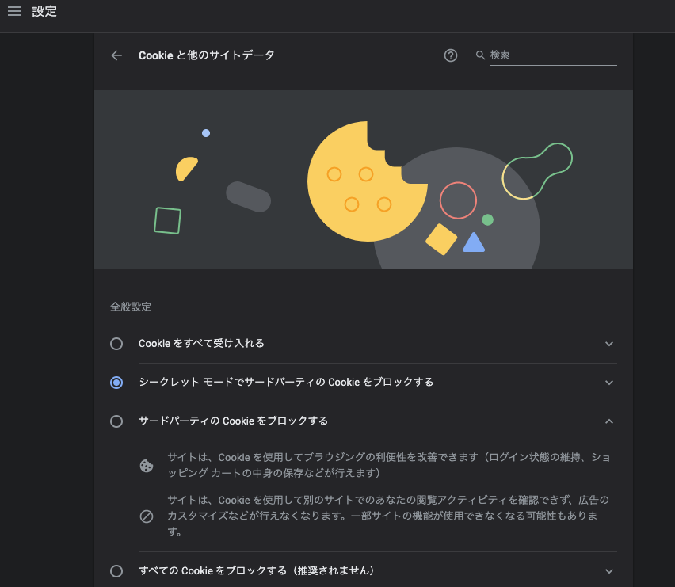
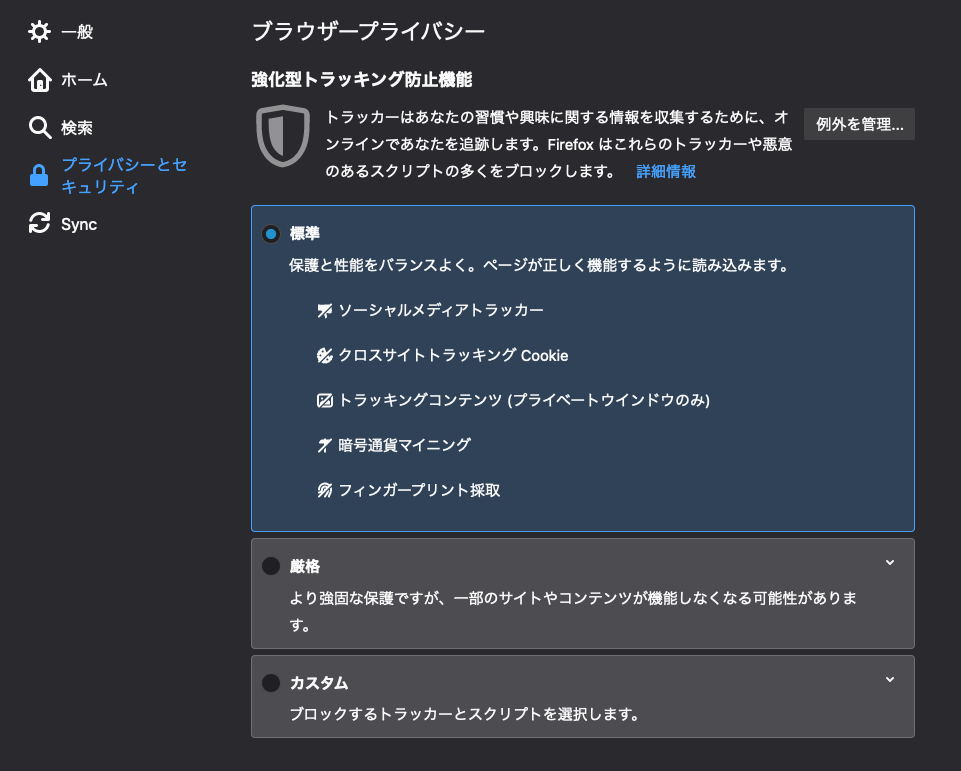

# 課題1（質問）

## Table of Contents
<!-- START doctoc generated TOC please keep comment here to allow auto update -->
<!-- DON'T EDIT THIS SECTION, INSTEAD RE-RUN doctoc TO UPDATE -->
<details>
<summary>Details</summary>

- [質問1](#%E8%B3%AA%E5%95%8F1)
  - [回答](#%E5%9B%9E%E7%AD%94)
- [質問2](#%E8%B3%AA%E5%95%8F2)
  - [回答](#%E5%9B%9E%E7%AD%94-1)
- [質問3](#%E8%B3%AA%E5%95%8F3)
  - [回答](#%E5%9B%9E%E7%AD%94-2)
- [質問4](#%E8%B3%AA%E5%95%8F4)
  - [回答](#%E5%9B%9E%E7%AD%94-3)
- [質問5](#%E8%B3%AA%E5%95%8F5)
  - [回答](#%E5%9B%9E%E7%AD%94-4)
- [参考](#%E5%8F%82%E8%80%83)

</details>
<!-- END doctoc generated TOC please keep comment here to allow auto update -->

## 質問1

> サードパーティクッキーとファーストパーティクッキーの違いを説明してください

### 回答

|クッキーの種類|概要|備考|
|----|----|----|
|ファーストパーティクッキー|クッキーに紐づいているドメインが、閲覧しているページのドメインと同じである場合|webページをホスティングしているサーバは、ファーストパーティクッキーを設定する|
|サードパーティクッキー|クッキーに紐づいているドメインが、閲覧しているページのドメインと異なる場合|そのページに他のドメインのサーバに保存されている画像やその他のコンポーネント（例えば広告バナー）が含まれている場合に、サードパーティクッキーが設定されることがある。<br>主に、web広告やトラッキングに使用される。<br> ブラウザの設定や拡張機能によって、ブロックされる場合がある。|

* 参考
  * [サードパーティのCookie](https://developer.mozilla.org/ja/docs/Web/HTTP/Cookies#third-party_cookies)
  * [GOOGLE が使用している COOKIE の種類](https://policies.google.com/technologies/cookies#types-of-cookies)
  * [Chrome で Cookie の削除、有効化、管理を行う](https://support.google.com/chrome/answer/95647?co=GENIE.Platform%3DDesktop&hl=ja#zippy=%2C%E7%89%B9%E5%AE%9A%E3%81%AE%E3%82%B5%E3%82%A4%E3%83%88%E3%81%AE-cookie-%E3%82%92%E8%A8%B1%E5%8F%AF%E3%81%BE%E3%81%9F%E3%81%AF%E3%83%96%E3%83%AD%E3%83%83%E3%82%AF%E3%81%99%E3%82%8B%2Cchrome-%E3%82%92%E7%B5%82%E4%BA%86%E3%81%97%E3%81%9F%E5%BE%8C%E3%81%AB-cookie-%E3%82%92%E5%89%8A%E9%99%A4%E3%81%99%E3%82%8B)

## 質問2

> サードパーティ Cookie を用いて広告配信ネットワーク（例えばGoogle AdSense など）がどのようにユーザの訪問履歴を把握しているのか、説明してください

### 回答

* 以下のようにユーザの訪問履歴を把握しており、AdSenseの場合の最も一般的なケースとしては広告が表示されたタイミングに、サーバからブラウザへクッキーを送信する。広告配信サーバは、この訪問履歴を元に、ユーザの嗜好などに沿ったターゲティング広告を行う。
 
  

* 参考
  * Google AdSenseとは：
    * オンラインコンテンツから収益を得ることができるサイト運営者向けのサービス
    * 参考
      * [AdSense の仕組み](https://support.google.com/adsense/answer/6242051?hl=ja)

  * [AdSense が Cookie を使用する仕組み](https://support.google.com/adsense/answer/7549925?hl=ja)
  * [サイトに配信される広告のターゲティング手法](https://support.google.com/adsense/answer/9713)
    * Google AdSenseでは、以下のターゲティング手法が存在する
      * コンテンツターゲティング
      * プレースメントターゲティング
      * パーソナライズドターゲティング
      * ネットワーク掲載ターゲティング
  * [Google マーケティング プラットフォームの広告サービスと Google アド マネージャーでの Cookie の使用について](https://support.google.com/campaignmanager/answer/2839090?hl=ja)
  * [ネット広告配信事業者はCookieをいかに利用しているか](https://xtrend.nikkei.com/atcl/contents/technology/00005/00012/)
  * [サードパーティクッキーとは? 基本の仕組みを解説(3rd party cookie)](https://webtan.impress.co.jp/e/2017/10/03/27016)

## 質問3

> そもそもサードパーティークッキーはどのように生成されるのでしょうか？画像埋め込みやスクリプト埋め込みなど、様々な手法を説明してください

### 回答

* `<script>`タグによる、外部スクリプトの呼び出し
  * 現在表示しているWebページが、外部のサービスを要求する場合に、外部スクリプトを呼び出す

  ```html
  <script src="https://example.com/example.js"></script>
  ```

* ``タグによる、外部サーバへのリクエスト
  * 現在表示しているWebページが、外部ドメインの画像を表示する場合に、外部サーバへリクエストを投げる

  ```html
  <a href="example.com/this-ad" target="_blank" rel="noopener">  </a>
  ```
* 参考
  * [What’s the Difference Between First-Party and Third-Party Cookies?](https://clearcode.cc/blog/difference-between-first-party-third-party-cookies/)
  * [All you need to know about Third-Party Cookies](https://cookie-script.com/all-you-need-to-know-about-third-party-cookies.html)

## 質問4

> サードパーティクッキーの扱いはブラウザによってどのような差があるのでしょうか？（特にsafariは他のブラウザと挙動が異なるので、ぜひ調べてみてください！）

### 回答

* 現時点ではGoogle以外は、デフォルトでサードパーティクッキーがブロックされている。ただし、Googleも2022年までに廃止することを発表している。
* また、対応の厳格さを比較すると、Safari > Firefox > Google （左にいくほど厳格）となる。

|ブラウザ(提供元)|サードパーティクッキーの扱い|備考|
|----|----|----|
|Chrome(Google)|サードパーティクッキーはデフォルトではブロックされない。ただし設定からブロックすることが可能。2022年までにサードパーティクッキーを廃止することが発表されている。<br> 代替手段として、Privacy SandBoxを提案している。|
|Firefox(Mozilla)|サードパーティクッキーをデフォルトでブロックする。それ以外はデフォルトではブロックしないが、ユーザ設定を変更することにより、より強固なブロック設定に変更加納。<br> サードパーティクッキーに関して、Enhanced Tracking Protectionの設定として以下３つの選択肢を用意した。<br>・Standard<br>・Strict<br>・Custom||
|Safari(Apple)|サードパーティクッキーをデフォルトでブロックする。クッキーを制御するための機能として、Intelligent Tracking Prevention（ITP）を導入している。|Appleは広告収入による影響を受けないため、ユーザのプライバシーを優先して、他企業よりも厳格な方針を取っている。|

* Google


* Firefox



* 参考
  * [How Different Browsers Handle First-Party and Third-Party Cookies](https://clearcode.cc/blog/browsers-first-third-party-cookies/)
  * [Safariがサードパーティクッキーをデフォルトでブロック](https://www.infoq.com/jp/news/2020/06/safari-third-party-cookies-block/)
  * [What Is Intelligent Tracking Prevention and How Does It Work? [versions 1.0 – 2.3]](https://clearcode.cc/blog/intelligent-tracking-prevention/#:~:text=Intelligent%20Tracking%20Prevention%20is%20a,Safari%20handles%20first%2Dparty%20cookies.)
  * [ITP（Intelligent Tracking Prevention）とは](https://dmlab.jp/words/e057.html)
  * [Intelligent Tracking Prevention 2.3](https://webkit.org/blog/9521/intelligent-tracking-prevention-2-3/)

## 質問5

> ドメインは同一で、ポートが異なるクッキーはファーストパーティクッキーでしょうか？サードパーティクッキーでしょうか？（hoge.com:8080とhoge.com:8081など）

### 回答

* クッキーはドメインに紐付き、ドメインが同一であればファーストパーティクッキー。ただ、異なるオリジン間のクッキーの送受信を行うためには、`SameSite`や`Domain`といった属性を付与する必要がある。

## 参考

---

## クッキーに関する調査事項

### `sameSite`属性に関して

* 以下の場合に、ドメインが異なるクッキー（サードパーティクッキー）は送信されるのか
  * `strict`に設定した場合
  * `lax`に設定した場合
  * `None`（`Secure`属性も付与）に設定した場合


### 各タグによるサードパーティクッキーの受け取り

* `sameSite`属性が`Lax`と`None`の場合でどういった挙動になるのか（他の場合も、送信されるパターンがあるが、今回はHTMLタグのみの調査をする）
  * `<a>`タグで別ページに遷移した場合
  * `<script>`タグで別ページに遷移した場合
  * `<form>`タグで別ページに遷移した場合
  * `img`タグで別ページに遷移した場合

### `Domain`属性と`sameSite`属性の違い

### ブラウザによる挙動の違い

* 各ブラウザによるサードパーティクッキーの挙動の違いを調査したい

### サードパーティクッキー設定の実装方法

* `express.static()`メソッドを使用した方法
  * [task_2](../task_2)ディレクトリで課題2として実装済み
* `app.get()`メソッドを使用した方法
  * 未実装（やり方がすぐにわからなかったため、未実装）

### 参考

* [CookieのSameSite=Laxデフォルト化 アクセスログで影響調査](https://techblog.raccoon.ne.jp/archives/1580347125.html)