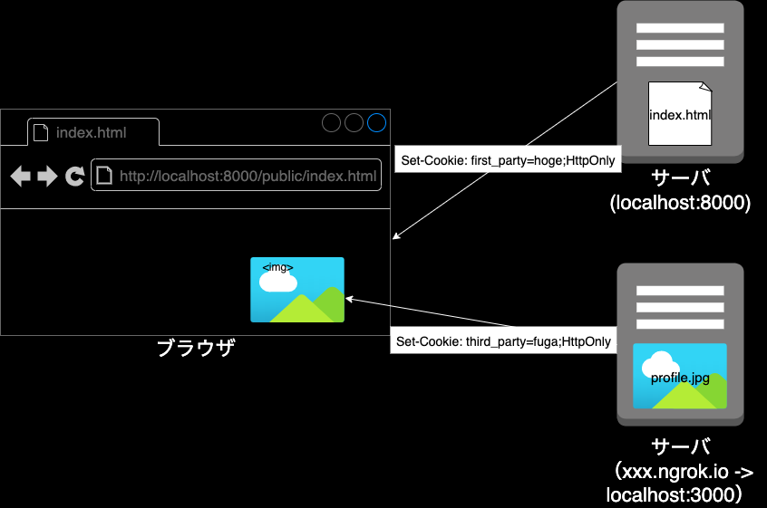

# 課題2

## Table of Contents
<!-- START doctoc generated TOC please keep comment here to allow auto update -->
<!-- DON'T EDIT THIS SECTION, INSTEAD RE-RUN doctoc TO UPDATE -->

Details

- [動作環境](#%E5%8B%95%E4%BD%9C%E7%92%B0%E5%A2%83)
- [実装イメージ](#%E5%AE%9F%E8%A3%85%E3%82%A4%E3%83%A1%E3%83%BC%E3%82%B8)
- [確認方法](#%E7%A2%BA%E8%AA%8D%E6%96%B9%E6%B3%95)
- [確認結果](#%E7%A2%BA%E8%AA%8D%E7%B5%90%E6%9E%9C)
- [参考](#%E5%8F%82%E8%80%83)

<!-- END doctoc generated TOC please keep comment here to allow auto update -->

## 動作環境

* `node`のバージョン：`v15.5.1`
* `npm`のバージョン：`6.14.11`

## 実装イメージ

## 確認方法

1. [third_party](./third_party)ディレクトリで、`node app.js`を実行する
   * ローカルサーバを3000番ポートで起動する
2. 別のターミナルで、`ngrok http 3000`を実行する
   * ngrokが`localhost:3000`向けにリクエストを転送するための外部公開用のURLを払い出す
     * HTTPとHTTPSの２つのURLが払い出されるが、今回使用するのはHTTPSの方
3. 2で払い出された`**HTTPS**のngrok.ioのURL + /img/profile.jpg`（e.g. https://xxxx.ngrok.io/img/profile.jpg ）を、[first_partyディレクトリのindex.html](./first_party/public/index.html)の``の`src`属性の値に設定する
4. [first_pary](./first_party)ディレクトリで、`node app.js`を実行する

## 確認結果

* `Application`タブを見ると、`Domain`が異なるクッキーが2つ表示されている

* 疑問
  * Developer ToolsのCookiesの下には、なぜngrokのURL（https://xxxx.ngrok.io）は表示されないのか？ドメインは異なっているので、サードパーティクッキーをブラウザに設定すること自体はできていると思うのだが。。

## 参考

* ngrokについて
  * [開発環境用のトンネリングツールとそのしくみ（ngrok編）](https://speakerdeck.com/gishi_yama/mild-web-sap06)
  * [ngrok](https://ngrok.com/)