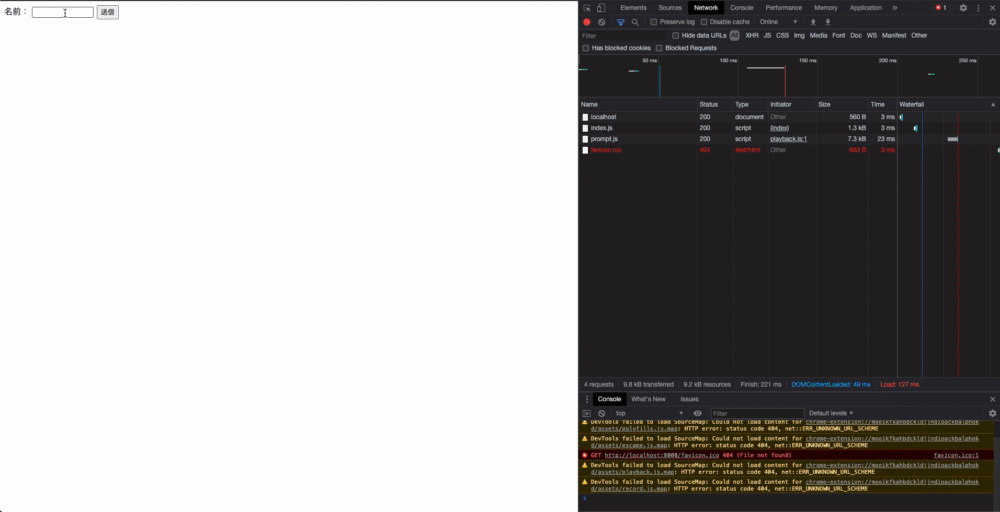

# 非同期通信（Ajax）の動作検証

## Table of Contents
<!-- START doctoc generated TOC please keep comment here to allow auto update -->
<!-- DON'T EDIT THIS SECTION, INSTEAD RE-RUN doctoc TO UPDATE -->
<details>
<summary>Details</summary>

- [動作バージョン](#%E5%8B%95%E4%BD%9C%E3%83%90%E3%83%BC%E3%82%B8%E3%83%A7%E3%83%B3)
- [確認方法](#%E7%A2%BA%E8%AA%8D%E6%96%B9%E6%B3%95)
- [確認結果](#%E7%A2%BA%E8%AA%8D%E7%B5%90%E6%9E%9C)

</details>
<!-- END doctoc generated TOC please keep comment here to allow auto update -->

## 動作バージョン

- PHP：`7.2.33`
- Chrome

## 確認方法

1. [asynchronous_traffic](../asynchronous_traffic)のディレクトリに移動する
2. 以下のコマンドを実行する

```bash
php -S localhost:8080
```

3. 別のターミナルを開き、同じく[asynchronous_traffic](../asynchronous_traffic)のディレクトリに移動する
4. 以下のコマンドを実行する

```bash
python3 -m http.server 8000
```

5. `http://localhost:8000`をブラウザで開く

## 確認結果

- 送信を押下した際の通信Sizeは、228B
  - 同期通信の場合は、584Bだったので、こちらの方がSizeが小さいことがわかる

- 同期通信の場合のように画面のチラつきは発生していない

