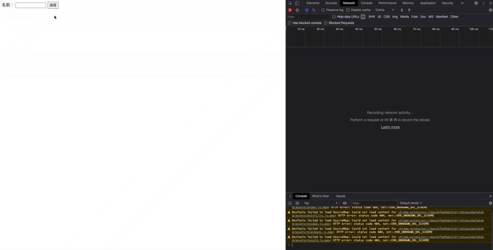

# 非同期通信（Ajax）の動作検証

## Table of Contents
<!-- START doctoc -->
<!-- END doctoc -->

## 動作バージョン

- PHP：`7.2.33`
- Chrome

## 確認方法

1. [synchronous_traffic](../synchronous_traffic)のディレクトリに移動する
2. 以下のコマンドを実行する

```bash
php -S localhost:8080
```

3. `http://localhost:8000`をブラウザで開く

## 確認結果

- 送信を押下した際の通信Sizeは、584B
  - 非同期通信の場合は、228Bだったので、こちらの方がSizeが大きいことがわかる

- 画面のチラつきが発生した

