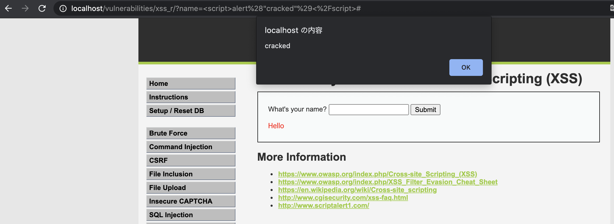
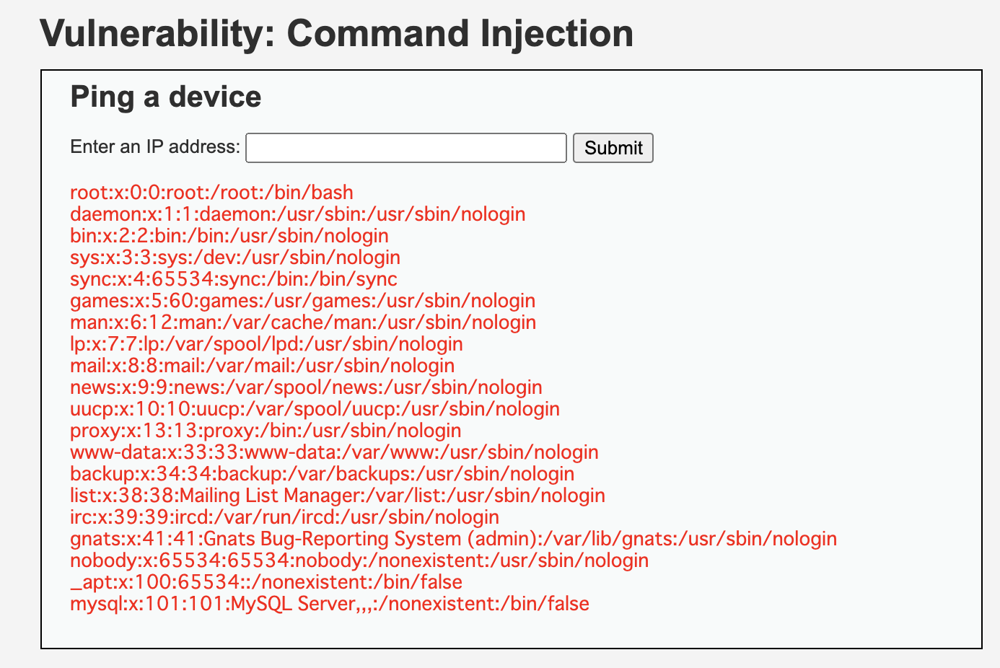
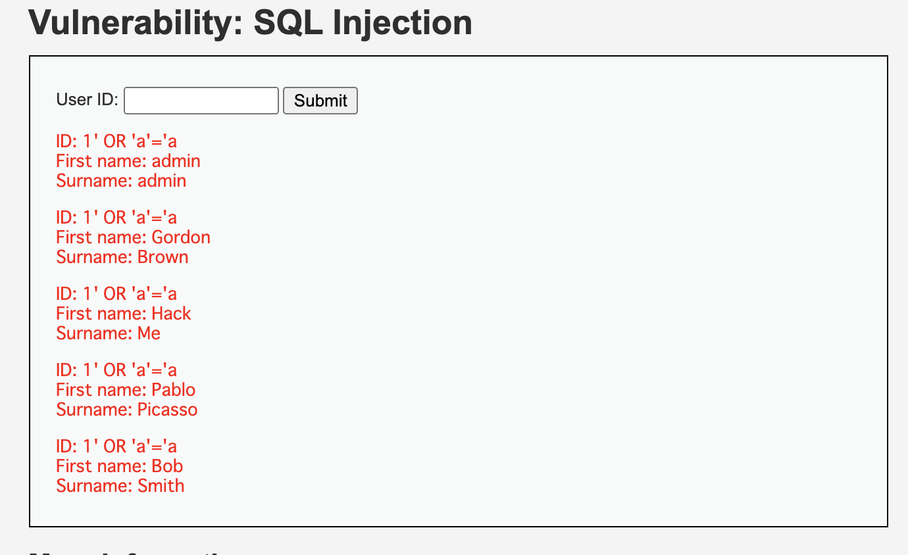
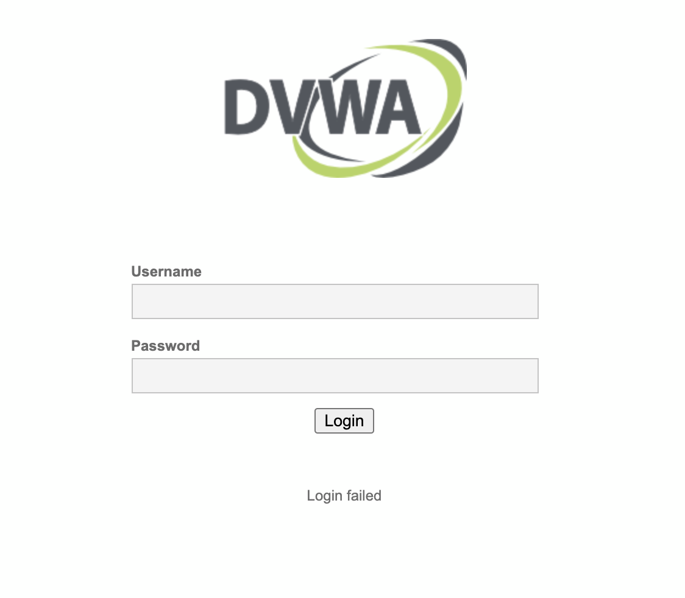
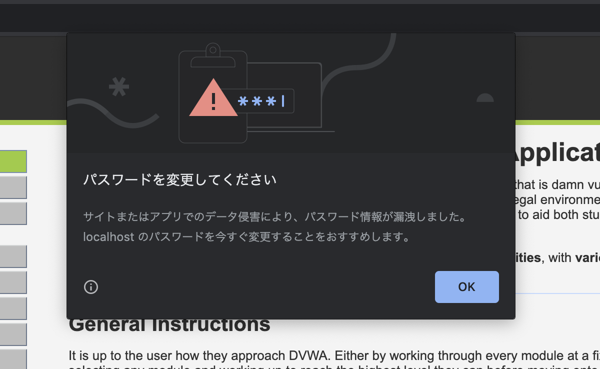

# 課題3

## Table of Contents
<!-- START doctoc generated TOC please keep comment here to allow auto update -->
<!-- DON'T EDIT THIS SECTION, INSTEAD RE-RUN doctoc TO UPDATE -->
<details>
<summary>Details</summary>

- [XSS](#xss)
  - [対策](#%E5%AF%BE%E7%AD%96)
- [コマンドインジェクション](#%E3%82%B3%E3%83%9E%E3%83%B3%E3%83%89%E3%82%A4%E3%83%B3%E3%82%B8%E3%82%A7%E3%82%AF%E3%82%B7%E3%83%A7%E3%83%B3)
  - [対策](#%E5%AF%BE%E7%AD%96-1)
- [SQLインジェクション](#sql%E3%82%A4%E3%83%B3%E3%82%B8%E3%82%A7%E3%82%AF%E3%82%B7%E3%83%A7%E3%83%B3)
  - [対策](#%E5%AF%BE%E7%AD%96-2)
- [CSRF](#csrf)
  - [対策](#%E5%AF%BE%E7%AD%96-3)
- [参考](#%E5%8F%82%E8%80%83)

</details>
<!-- END doctoc generated TOC please keep comment here to allow auto update -->

## XSS

- 入力値
  - `<script>alert("cracked")</script>`
  - フォームに入力された文字列を何の対策もせずにそのまま実行した結果、JavaScriptが実行されてしまっている

- 結果



### 対策

- 対策は基本的に、[課題1](../task_1)にまとめているため、代表的と思われる対策のみを記載する
- 対策
  - ウェブページに出力する全ての要素に対して、エスケープ処理を施す
  - HTTPレスポンスヘッダのContent-Typeフィールドに文字コード（charset）を指定する
  - Cookie情報の漏えい対策として、発行するCookieにHttpOnly属性を加える
  - クロスサイト・スクリプティングの潜在的な脆弱性対策として有効なブラウザの機能を有効にするレスポンスヘッダを返す（ただし、OWASPでは`X-XSS-Protection`ではなく`Content Security Policy`を使用することが望ましいとされている）

## コマンドインジェクション

- 入力値
  - `|| cat /etc/passwd`
  - `||`：OR演算子（前のコマンドが失敗した場合に、この後のコマンドが実行される）

- 結果



### 対策

- 対策は基本的に、[課題1](../task_1)にまとめているため、代表的と思われる対策のみを記載する
- 対策
  - 入力値をホワイトリスト形式で検証する（許可されたコマンドのみ実行するなど） 

## SQLインジェクション

- 入力値
  - `1' OR 'a'='a`
  - プレースホルダなどなしで、入力値をそのままSELECT文に挿入した結果、以下のようなSQLを実行した結果を返していると考えられる。OR後の`'a' = 'a'`は正しいので、結果的にテーブル内のユーザ名が全て表示されてしまっている。

```sql
SELECT first_name, surname FROM <テーブル名> WHERE userid = 1 OR 'a' = 'a';
```

- 結果



### 対策

- 対策は基本的に、[課題1](../task_1)にまとめているため、代表的と思われる対策のみを記載する
- 対策
  - 静的プレースホルダを利用し、文字連結によるSQL文の組み立てを避ける

## CSRF

- 実施すること
  1. DVMAのサイトで、パスワードをadmin以外に変更して、ログアウトする（Dockerで起動することを想定しています）
  2. [csrf.html](../task_3/csrf.html)をブラウザで開く
  3. Changeボタンを押下してパスワードを変更する
  4. DVMAのサイトのログイン画面を開き、adminの前のパスワードでログインする

- 結果
  - admin前のパスワードでログインできなくなっており、adminではログインできる
    - つまりCSRF攻撃によりパスワードが変更されてしまった。



- 参考
  - [DVWAでCSRF(Low)](https://cysec148.hatenablog.com/entry/2019/11/05/173122)
  - CSRF攻撃を実行後、Chromeブラウザでは、以下のポップアップが表示された



### 対策

- 対策は基本的に、[課題1](../task_1)にまとめているため、代表的と思われる対策のみを記載する
- 対策
  - CSRFトークンを発行し、リクエスト時に含めて送信する。サーバ側でそれを検証し、有効なトークンだった場合にリクエストの処理を行うようにする
  - `Referer`や`Origin`ヘッダの値を検証する

## 参考

- DVWAのサーバサイドのコードを確認する方法
  1. DVWAのページの右下にある「View Source」を押下する
  2. 以下のコマンドでコンテナのシェルに入る（DockerでDVWAを起動している場合）

  ```bash
  docker exec -i -t <コンテナID> /bin/bash
  ```

  3. 以下のディレクトリまで移動する
   
  `/var/www/html/vulnerabilities`

  - CSRFトークンの生成やトークンのチェックのメソッドは以下のファイルを確認

  `/var/www/html/dvwa/includes/dvwaPage.inc.php`